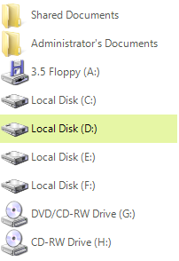
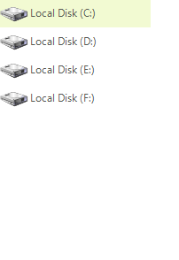
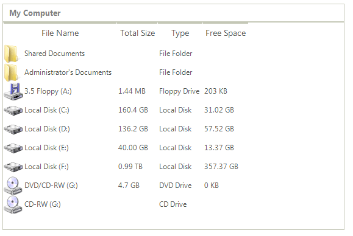
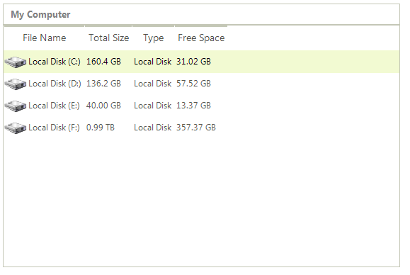
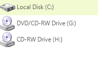

# Filtering

__RadListView__ allows filtering operations in all views. To enable filtering operations use the __EnableFiltering__ property of the control: 

#### Enable filtering

{{source=..\SamplesCS\ListView\Features\ListViewFiltering.cs region=EnableFiltering}} 
{{source=..\SamplesVB\ListView\Features\ListViewFiltering.vb region=EnableFiltering}} 

````C#
radListView1.EnableFiltering = true;

````
````VB.NET
RadListView1.EnableFiltering = True

````

{{endregion}} 

Once the filtering is enabled, we have to create a new __FilterDescriptor__ and assign its __PropertyName__, __FilterOperator__ and __SearchCriteria__. First, let’s filter the items by their value and look for items starting with *“Local”*.

#### Filter by value

{{source=..\SamplesCS\ListView\Features\ListViewFiltering.cs region=FilterDescriptor}} 
{{source=..\SamplesVB\ListView\Features\ListViewFiltering.vb region=FilterDescriptor}} 

````C#
FilterDescriptor valueFilter = new FilterDescriptor("Value", FilterOperator.StartsWith, "Local");
radListView1.FilterDescriptors.Add(valueFilter);

````
````VB.NET
Dim valueFilter As New FilterDescriptor("Value", FilterOperator.StartsWith, "Local")
RadListView1.FilterDescriptors.Add(valueFilter)

````

{{endregion}} 

|Before filtering|After filtering|
|----|----|
|||
 
When a column name is specified as __PropertyName__ of the filter descriptor, **RadListView** will filter by the values of the specified column:

#### Filter by type

{{source=..\SamplesCS\ListView\Features\ListViewFiltering.cs region=FilterDescriptor1}} 
{{source=..\SamplesVB\ListView\Features\ListViewFiltering.vb region=FilterDescriptor1}} 

````C#
FilterDescriptor typeFilter = new FilterDescriptor("Type", FilterOperator.Contains, "Disk");
radListView1.FilterDescriptors.Add(typeFilter);

````
````VB.NET
Dim typeFilter As New FilterDescriptor("Type", FilterOperator.Contains, "Disk")
RadListView1.FilterDescriptors.Add(typeFilter)

````

{{endregion}} 

|Before|After|
|----|----|
|||

## Custom Filtering

**RadListView** provides a flexible mechanism for defining a custom filtering logic by using a custom filter predicate. The following example demonstartes how to apply a FilterPredicate in order to filter all items which contain "C":

#### Custom FilterPredicate 

{{source=..\SamplesCS\ListView\Features\ListViewFiltering.cs region=CustomFilterPredicate}} 
{{source=..\SamplesVB\ListView\Features\ListViewFiltering.vb region=CustomFilterPredicate}} 

````C#
private bool MyFilter(ListViewDataItem item)
{
    if (item.Value.ToString().Contains("C"))
    {
        return true;
    }
    return false;
}

````
````VB.NET
Private Function MyFilter(item As ListViewDataItem) As Boolean
    If item.Value.ToString().Contains("C") Then
        Return True
    End If
    Return False
End Function

````

{{endregion}} 

#### Apply the custom FilterPredicate 

{{source=..\SamplesCS\ListView\Features\ListViewFiltering.cs region=ApplyCustomFilterPredicate}} 
{{source=..\SamplesVB\ListView\Features\ListViewFiltering.vb region=ApplyCustomFilterPredicate}} 

````C#
this.radListView1.ListViewElement.DataView.Filter = MyFilter;

````
````VB.NET
Me.RadListView1.ListViewElement.DataView.Filter = AddressOf MyFilter

````

{{endregion}} 

>caption Figure 3: Custom filtering



# See Also

* [Grouping]()	
* [Sorting]()

