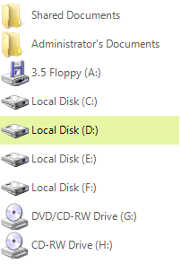
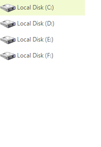
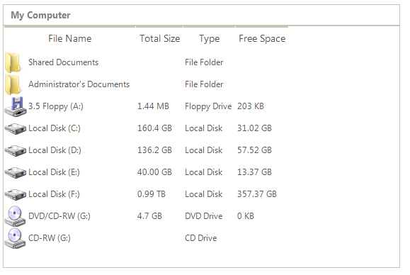
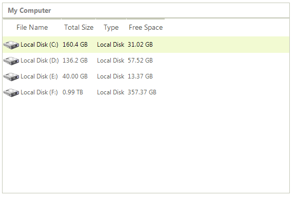
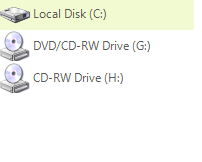

# Filtering

__RadListView__ allows filtering operations in all views. To enable filtering operations use the __EnableFiltering__ property of the control: 

#### Enable Filtering

<snippet id='listview-listviewfiltering-enablefiltering-cs' />
<snippet id='listview-listviewfiltering-enablefiltering-vb' />

Once the filtering is enabled, we have to create a new __FilterDescriptor__ and assign its __PropertyName__, __FilterOperator__ and __SearchCriteria__. First, let’s filter the items by their value and look for items starting with *“Local”*.

#### Filter by Value

<snippet id='listview-listviewfiltering-filterdescriptor-cs' />
<snippet id='listview-listviewfiltering-filterdescriptor-vb' />

|Before Filtering|After Filtering|
|----|----|
|||
 
When a column name is specified as __PropertyName__ of the filter descriptor, **RadListView** will filter by the values of the specified column:

#### Filter by type

<snippet id='listview-listviewfiltering-filterdescriptor1-cs' />
<snippet id='listview-listviewfiltering-filterdescriptor1-vb' />

|Before|After|
|----|----|
|||

## Custom Filtering

**RadListView** provides a flexible mechanism for defining a custom filtering logic by using a custom filter predicate. The following example demonstartes how to apply a FilterPredicate in order to filter all items which contain "C":

#### Custom FilterPredicate 

<snippet id='listview-listviewfiltering-customfilterpredicate-cs' />
<snippet id='listview-listviewfiltering-customfilterpredicate-vb' />

#### Apply the custom FilterPredicate 

<snippet id='listview-listviewfiltering-applycustomfilterpredicate-cs' />
<snippet id='listview-listviewfiltering-applycustomfilterpredicate-vb' />

>caption Figure 3: Custom Filtering

# See Also

* [Grouping]()	
* [Sorting]()

