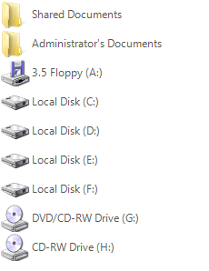
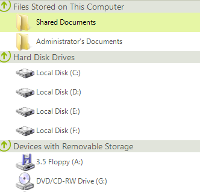
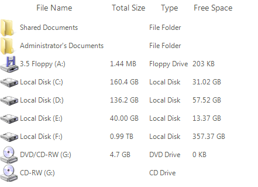
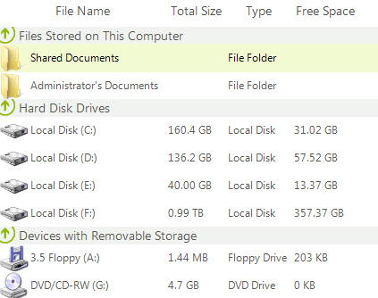
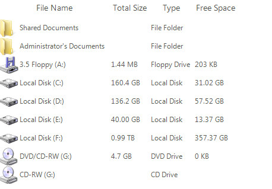
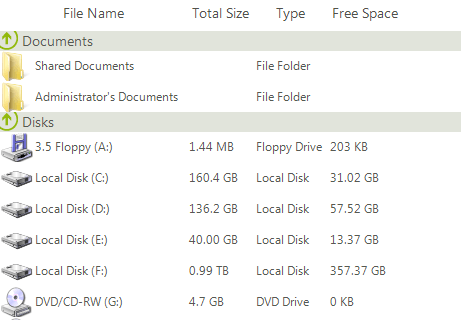

# Grouping

**RadListView** supports both custom grouping and automatic grouping based on a certain property. 

## Basic Grouping

The basic grouping is achievable by enabling the __EnableGrouping__ and __ShowGroups__ properties and then adding the desired __GroupDescriptors__ to the __GroupDescriptors__ collection of the control. The following code will group the items according to their __Value__ property:

#### Group by value

<snippet id='listview-listviewgrouping-groupbyvalue-cs' />
<snippet id='listview-listviewgrouping-groupbyvalue-vb' />

|Before Grouping|After Grouping|
|----|----|
|||

And here is how you can group by a certain column when __DetailsView__ is used:

#### Group by column "Type"

<snippet id='listview-listviewgrouping-groupbycolumn-cs' />
<snippet id='listview-listviewgrouping-groupbycolumn-vb' />

|Before Grouping|After Grouping|
|----|----|
||| 

## Custom Grouping

To take advantage of the custom grouping feature of **RadListView**, just enable the __EnableCustomGrouping__ property and specify the **Group** for each item. Here is an example for custom grouping:

#### Custom Grouping

<snippet id='listview-listviewgrouping-customgrouping-cs' />
<snippet id='listview-listviewgrouping-customgrouping-vb' />

>important Items in a certain group are sorted in the order of setting the **Group** property of each **ListViewDataItem**.

Please note, that if you are using data binding, you can use the __ItemDataBound__ event,  to assign certain item to a certain group.

|Before grouping|After grouping|
|----|----|
|||
 
When grouping is enabled you have the option to quickly expand or collapse all groups in __RadListView__ throught the __ExpandAll__ and __CollapseAll__ methods:

#### Expand and Collapse All Groups

<snippet id='listview-listviewgrouping-expandcollapseall-cs' />
<snippet id='listview-listviewgrouping-expandcollapseall-vb' />

# See Also

* [Filtering]()	 
* [Sorting]()
* [Move ListView Items Between Groups in Unbound Mode]()

