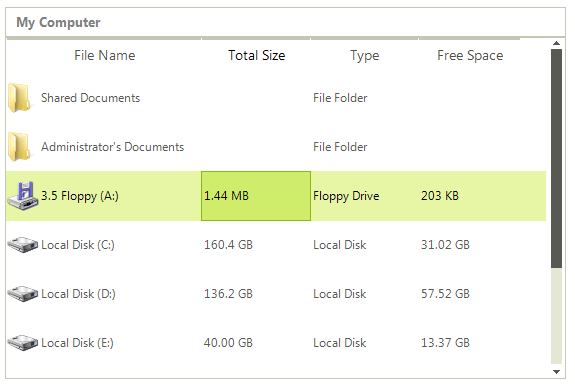
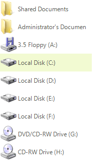
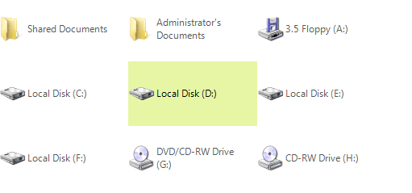
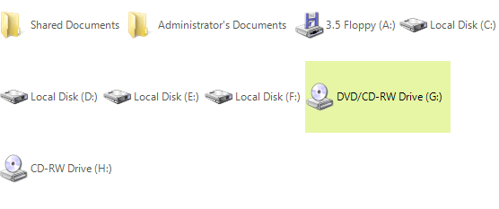
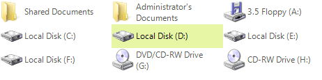
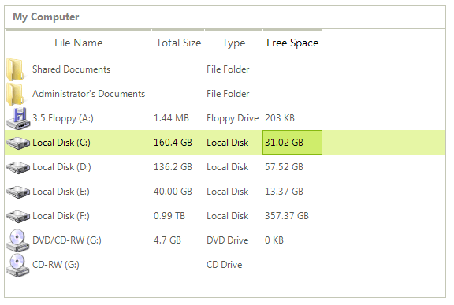
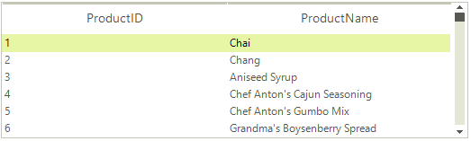

# Item Sizing

By default, items in **RadListView** have width *200* and height *20*. This can be controlled by the **ItemSize** property which gets or sets the default item size.

In *DetailsView* the **ItemSize** property sets only the **Height** of the item, since the **Width** is determined by the **Width** of the columns. Here is a sample code snippet demonstrating how to set *50* pixels height of the items and different widths for the columns:

#### Item's height in DetailsView

{{source=..\SamplesCS\ListView\Features\ListViewWorkingWithItems.cs region=itemSizing}} 
{{source=..\SamplesVB\ListView\Features\ListViewWorkingWithItems.vb region=itemSizing}} 

````C#
radListView1.ItemSize = new Size(0, 50);
radListView1.Columns[0].Width = 50;
radListView1.Columns[1].Width = 75;
radListView1.Columns[2].Width = 100;

````
````VB.NET
RadListView1.ItemSize = New Drawing.Size(0, 50)
RadListView1.Columns(0).Width = 50
RadListView1.Columns(1).Width = 75
RadListView1.Columns(2).Width = 100

````

{{endregion}} 

>caption Figure 1: Item sizing in DetailsView



In ViewType.*ListView*, when the __FullRowSelect__ property is set to *false*, the __ItemSize__ sets the __Item__ size accordingly:

#### Item sizing in ListView

{{source=..\SamplesCS\ListView\Features\ListViewWorkingWithItems.cs region=fullRowSelect}} 
{{source=..\SamplesVB\ListView\Features\ListViewWorkingWithItems.vb region=fullRowSelect}} 

````C#
radListView1.FullRowSelect = false;
radListView1.ItemSize = new Size(180, 35);

````
````VB.NET
RadListView1.FullRowSelect = False
RadListView1.ItemSize = New Drawing.Size(180, 35)

````

{{endregion}} 

>caption Figure 2: Item sizing in ListView



There are two more properties that provide additional customization options for all views –  __AllowArbitraryItemWidth__ and __AllowArbitraryItemHeight__. When both of these are set to *false*, the __ItemSize__ is the one that determines the size of the items:

#### Item sizing when arbitrary height/width is disabled

{{source=..\SamplesCS\ListView\Features\ListViewWorkingWithItems.cs region=arbitrarySizes}} 
{{source=..\SamplesVB\ListView\Features\ListViewWorkingWithItems.vb region=arbitrarySizes}} 

````C#
radListView1.ItemSize = new Size(160, 80);
radListView1.AllowArbitraryItemHeight = false;
radListView1.AllowArbitraryItemWidth = false;

````
````VB.NET
RadListView1.ItemSize = New Drawing.Size(160, 80)
RadListView1.AllowArbitraryItemHeight = False
RadListView1.AllowArbitraryItemWidth = False

````

{{endregion}} 

>caption Figure 3: Item sizing when arbitrary height/width is disabled



If the __AllowArbitraryItemWidth__ property is set to *true*, the item will size horizontally as much as it needs to fit its content:

>caption Figure 4: Enable AllowArbitraryItemWidth



Respectively, the __AllowArbitraryItemHeight__ property sizes the item in height in order to fit its content.

>caption Figure 5: AllowArbitraryItemHeight


## Best fit columns

When using *DetailsView*, **RadListView** provides a grid-like interface for displaying items with more than one data fields. **RadListView** has a built-in mechanism to increase or decrease the width of one or all columns in a way that makes all the text inside that column cells visible. You can trigger this mechanism by using DetailListViewElement.**BestFitColumns** or ListViewDetailColumn.**BestFitColumn** methods. The end-user can perform the best fit by double clicking on the right edge of a header cell.

|Before best-fitting columns|After best-fitting columns|
|----|----|
|||

You can customize the execution of the algorithm of a concrete column by setting its **AutoSizeMode** property if the desired column. There are the following options:

* BestFitColumnMode.*None* - The column width does not automatically adjust.

* BestFitColumnMode.*AllCells* - The column width adjusts to fit the contents all cells in the column.

* BestFitColumnMode.*DataCells* - The column width adjusts to fit the contents of the data cells.

* BestFitColumnMode.*HeaderCells* - The column width adjusts to fit the contents of the header cell.

## AutoSizeColumnsMode

As of **R3 2020** RadListView offers the **AutoSizeColumnsMode** property which controls how the column widths in DetailsView are determined. The available options are:

* ListViewAutoSizeColumnsMode.None: The column widths do not automatically adjust.
* ListViewAutoSizeColumnsMode.Fill: The column widths adjust so that the widths of all columns exactly fill the display area of the control.

|ListViewAutoSizeColumnsMode.None|ListViewAutoSizeColumnsMode.Fill|
|----|----|
|||

         
# See Also

* [Filtering]()	
* [Grouping]()	
* [Sorting]()
