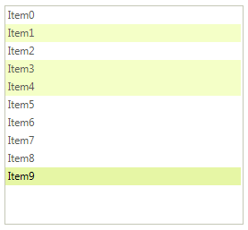
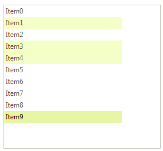
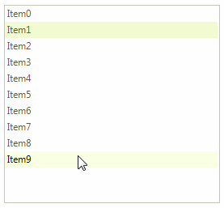

# Selection

**RadListView** supports both *single* and *multiple* selection. The selection mode is determined by the **MultiSelect** property of the control. The selected item in single selection mode can be accessed from the **SelectedItem** property and in multiple selection mode from the **SelectedItems** collection of **RadListView**.

Multiple items can be selected in code as well. This can be achieved by using the **Select** method. This method takes an array of **ListViewDataItem** as parameter.

#### Programmatically Select Items

{{source=..\SamplesCS\ListView\Features\ListViewWorkingWithItems.cs region=itemSelect}} 
{{source=..\SamplesVB\ListView\Features\ListViewWorkingWithItems.vb region=itemSelect}} 

````C#
radListView1.MultiSelect = true;
ListViewDataItem[] itemsToSlelct = new ListViewDataItem[3];
itemsToSlelct[0] = radListView1.Items[1];
itemsToSlelct[1] = radListView1.Items[3];
itemsToSlelct[2] = radListView1.Items[4];
radListView1.Select(itemsToSlelct);

````
````VB.NET
RadListView1.MultiSelect = True
Dim itemsToSlelct(2) As ListViewDataItem
itemsToSlelct(0) = RadListView1.Items(1)
itemsToSlelct(1) = RadListView1.Items(3)
itemsToSlelct(2) = RadListView1.Items(4)
RadListView1.Select(itemsToSlelct)

````

{{endregion}} 

The **FullRowSelect** property controls whether the full row should be selected or not.

|FullRowSelect=*true*|FullRowSelect=*false*|
|----|----|
|||

By default, when you add items programmatically, the last added item is selected. This is controlled by the **SelectLastAddedItem** property and if you don't want **RadListView** to select the last inserted item, set the mentioned property to *false*.

## Lasso Selection

**RadListView** provides lasso selection functionality by selecting a rectangle on the surface of the control. As a result multiple items are selected if multiple selection is enabled. 

>caption Figure 1: Lasso selection


## Selection Events

When the selection in **RadListView** is changed, the following events are fired:

* **SelectedIndexChanged**: Occurs when the **SelectedIndex** has changed.
* **SelectedItemChanging**: Occurs when a **ListViewDataItem** is about to be selected. It is a cancelable event. hence, you can prevent an item from being selected by setting ListViewItemCancelEventArgs.**Cancel* argument to *true*.
* **SelectedItemChanged**: Occurs when the **SelectedItem** has changed.
* **SelectedItemsChanged**: Occurs when the content of the **SelectedItems** collection has changed.
        
# See Also

* [Filtering]()	
* [Grouping]()	
* [Sorting]()
