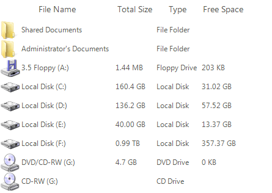
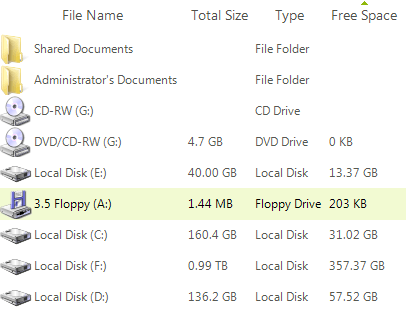
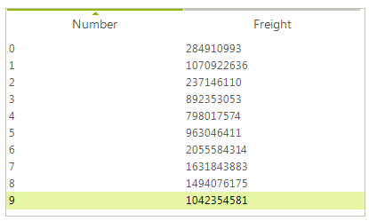
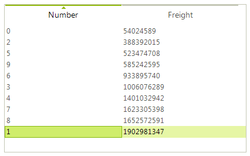

# Sorting
 
Sorting is possible in two ways either programmatically by adding the appropriate __SortDescriptor__ to the __SortDescriptors__ collection of **RadListView**, or by enabling the user to sort by clicking a column header in __DetailsView__.
        
Enabling sorting on header click is done by setting both __EnableSorting__ and __EnableColumnSort__ property to *true*.

#### Enable column sorting

{{source=..\SamplesCS\ListView\Features\ListViewSorting.cs region=EnableColumnSort}} 
{{source=..\SamplesVB\ListView\Features\ListViewSorting.vb region=EnableColumnSort}} 

````C#
radListView1.EnableSorting = true;
radListView1.EnableColumnSort = true;

````
````VB.NET
RadListView1.EnableColumnSort = True
RadListView1.EnableSorting = True

````

{{endregion}} 

The following code snippet demonstrates how to add a __SortDescriptor__ to **RadListView**:

#### Adding SortDescriptors

{{source=..\SamplesCS\ListView\Features\ListViewSorting.cs region=SortDescriptor}} 
{{source=..\SamplesVB\ListView\Features\ListViewSorting.vb region=SortDescriptor}} 

````C#
radListView1.EnableSorting = true;
SortDescriptor sort = new SortDescriptor("Free Space", ListSortDirection.Ascending);
radListView1.SortDescriptors.Add(sort);

````
````VB.NET
RadListView1.EnableSorting = True
Dim sort = New SortDescriptor("Free Space", ListSortDirection.Ascending)
RadListView1.SortDescriptors.Add(sort)

````

{{endregion}} 

Here is the sorted data:

|Before sorting|After sorting|
|----|----|
|||

## Custom sorting

**RadListView** provides a flexible mechanism for achieving custom sorting by creating a custom comparer. The following code snippet demonstrates this. Although a **SortDescriptor** for the *Number* column is added, the items are sorted considering the *Freight* value:

#### Custom sorting

{{source=..\SamplesCS\ListView\Features\ListViewSorting.cs region=CustomSorting}} 
{{source=..\SamplesVB\ListView\Features\ListViewSorting.vb region=CustomSorting}} 

````C#
        
private void Form_Load(object sender, EventArgs e)
{
    this.radListView1.ViewType = ListViewType.DetailsView;
    this.radListView1.Columns.Add("Number");
    this.radListView1.Columns.Add("Freight");
    Random rand = new Random();
    for (int i = 0; i < 10; i++)
    {
        ListViewDataItem item = new ListViewDataItem();
        this.radListView1.Items.Add(item);
        item[0] = i;
        item[1] = (decimal)(rand.NextDouble() * Int32.MaxValue);
    }
    
    this.radListView1.SortDescriptors.Add(new Telerik.WinControls.Data.SortDescriptor("Number", ListSortDirection.Ascending));
    this.radListView1.ListViewElement.DataView.Comparer = new ListViewCustomComparer(this.radListView1.ListViewElement);
    this.radListView1.EnableSorting = true;
}
        
public class ListViewCustomComparer : IComparer<ListViewDataItem>
{
    RadListViewElement listViewElement;
    
    public ListViewCustomComparer(RadListViewElement listViewElement)
    {
        this.listViewElement = listViewElement;
    }
    
    public int Compare(ListViewDataItem x, ListViewDataItem y)
    {
        decimal row1Freight = (decimal)x["Freight"];
        decimal row2Freight = (decimal)y["Freight"];
        if (row1Freight > row2Freight)
        {
            return 1;
        }
        else if (row1Freight < row2Freight)
        {
            return -1;
        }
        else
        {
            return 0;
        }
    }
}

````
````VB.NET
Private Sub Form_Load(sender As Object, e As EventArgs)
    Me.RadListView1.ViewType = ListViewType.DetailsView
    Me.RadListView1.Columns.Add("Number")
    Me.RadListView1.Columns.Add("Freight")
    Dim rand As New Random()
    For i As Integer = 0 To 9
        Dim item As New ListViewDataItem()
        Me.RadListView1.Items.Add(item)
        item(0) = i
        item(1) = CDec(rand.NextDouble() * Int32.MaxValue)
    Next
    Me.RadListView1.SortDescriptors.Add(New Telerik.WinControls.Data.SortDescriptor("Number", ListSortDirection.Ascending))
    Me.RadListView1.ListViewElement.DataView.Comparer = New ListViewCustomComparer(Me.RadListView1.ListViewElement)
    Me.RadListView1.EnableSorting = True
End Sub
Public Class ListViewCustomComparer
Implements IComparer(Of ListViewDataItem)
    Private listViewElement As RadListViewElement
    Public Sub New(listViewElement As RadListViewElement)
        Me.listViewElement = listViewElement
    End Sub
    Public Function [Compare](x As ListViewDataItem, y As ListViewDataItem) As Integer Implements IComparer(Of ListViewDataItem).[Compare]
        Dim row1Freight As Decimal = CDec(x("Freight"))
        Dim row2Freight As Decimal = CDec(y("Freight"))
        If row1Freight > row2Freight Then
            Return 1
        ElseIf row1Freight < row2Freight Then
            Return -1
        Else
            Return 0
        End If
    End Function
End Class

````

{{endregion}} 

|Basic sorting|Custom sorting|
|----|----|
|||

Note that the entire sort operation is defined by this comparer. This means that you should take into account the contents of the **SortDescriptors** collection the **RadListView** when implementing this custom comparer (that is why the **RadListViewElement** is passed as an argument to the constructor of the above comparer). 

# See Also

* [Filtering]()	
* [Grouping]()	 
