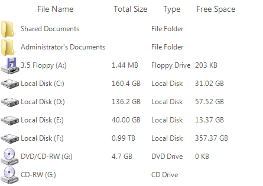
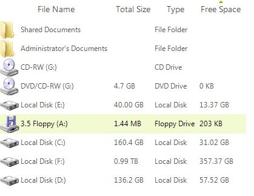
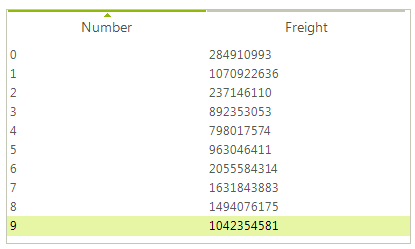
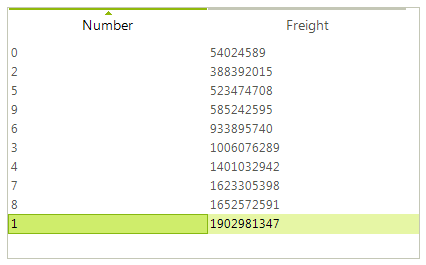

# Sorting
 
Sorting is possible in two ways either programmatically by adding the appropriate __SortDescriptor__ to the __SortDescriptors__ collection of **RadListView**, or by enabling the user to sort by clicking a column header in __DetailsView__.
        
Enabling sorting on header click is done by setting both __EnableSorting__ and __EnableColumnSort__ property to *true*.

#### Enable column sorting

<snippet id='listview-listviewsorting-enablecolumnsort-cs' />
<snippet id='listview-listviewsorting-enablecolumnsort-vb' />

The following code snippet demonstrates how to add a __SortDescriptor__ to **RadListView**:

#### Adding SortDescriptors

<snippet id='listview-listviewsorting-sortdescriptor-cs' />
<snippet id='listview-listviewsorting-sortdescriptor-vb' />

Here is the sorted data:

|Before Sorting|After Sorting|
|----|----|
|||

## Custom sorting

**RadListView** provides a flexible mechanism for achieving custom sorting by creating a custom comparer. The following code snippet demonstrates this. Although a **SortDescriptor** for the *Number* column is added, the items are sorted considering the *Freight* value:

#### Custom sorting

<snippet id='listview-listviewsorting-customsorting-cs' />
<snippet id='listview-listviewsorting-customsorting-vb' />

|Basic Sorting|Custom Sorting|
|----|----|
|||

Note that the entire sort operation is defined by this comparer. This means that you should take into account the contents of the **SortDescriptors** collection the **RadListView** when implementing this custom comparer (that is why the **RadListViewElement** is passed as an argument to the constructor of the above comparer). 

# See Also

* [Filtering]()	
* [Grouping]()	 
