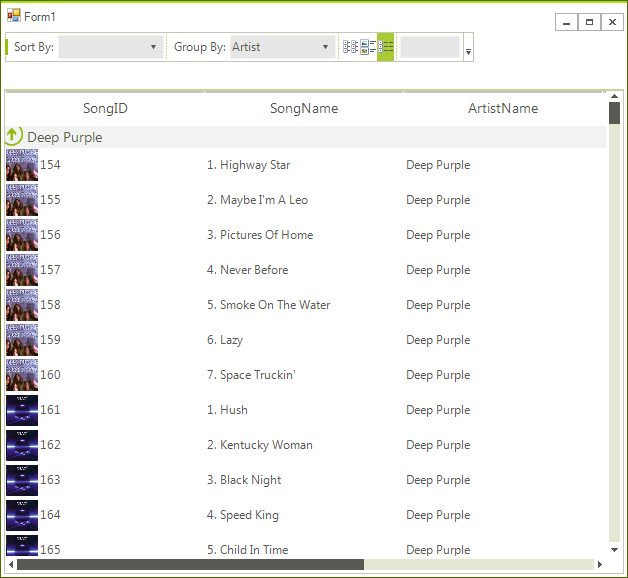
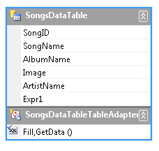
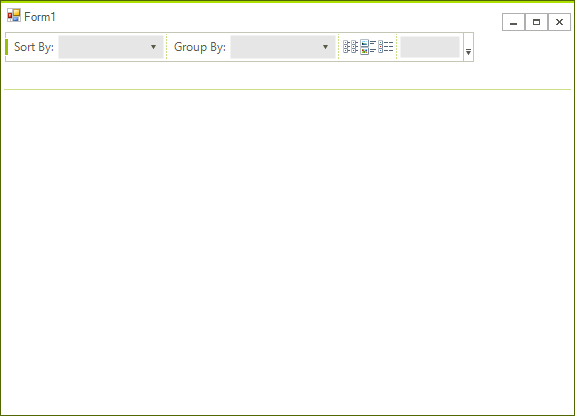
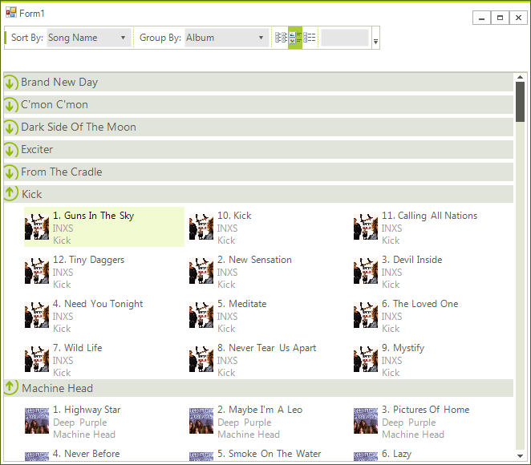

# Getting Started with WinForms ListView
 
This article will demonstrate the basic capabilities of **RadListView**, like filtering, grouping, sorting, customizing items, etc. and it will show you in a step-by-step manner how to start creating applications with **RadListView**. 

>caption Figure 1: Getting started with RadListView



For the sake of this example, we are going to use a DataTable containing data about Artists, Albums, Songs and Image. 

>caption Figure 2: Songs DataTable



1\. First let’s create a form with [RadCommandBar]() docked *Top* and **RadListView** docked *Fill*. Add a __Strip__ to [RadCommandBar]() and populate it with the following items:

|   |   |
|---|---|
| __CommandBarLabel__ |<ul><li>Text: “Sort By:”</li><ul>|
| __CommandBarDropDownList__ |<ul><li>Name: commandBarDropDownSort</li><li>Text: ""</li><li>Items: None, Song Name, Artist, Album</li></ul>|
| __CommandBarSeparatorItem__ ||
| __CommandBarLabel__ |<ul><li>Text: “Group By:”</li></ul>|
| __CommandBarDropDownList__ |<ul><li>Name: commandBarDropDownGroup</li><li>Text: ""</li><li>Items: None, Album, Artist</li></ul>|
| __CommandBarSeparatorItem__ ||
| __CommandBarToggleButton__ |<ul><li>Name: commandBarToggleButtonList</li><li>ToolTipText: “ListView”</li><li>Image: Some image representing ListView</li></ul>|
| __CommandBarToggleButton__ |<ul><li>Name: commandBarToggleButtonTiles</li><li>ToolTipText: “IconsView”</li><li>Image: Some image representing IconsView</li></ul>|
| __CommandBarToggleButton__ |<ul><li>Name: commandBarToggleButtonDetails</li><li>ToolTipText: “DetailsView”</li><li>Image: Some image representing DetailsView</li></ul>|
| __CommandBarSeparatorItem__ ||
| __CommandBarTextBox__ |<ul><li>Name: commandBarTextBoxFilter</li><li>Text: “”</li></ul>|

At this point the form should like something similar to this:



2\. Now, lets continue with setting the control __DataSource__, allow edit and remove operations and subscribe to the events that we are going to use in this example.

#### Initial settings

{{source=..\SamplesCS\ListView\ListViewGettingStarted.cs region=initialSettings}} 
{{source=..\SamplesVB\ListView\ListViewGettingStarted.vb region=initialSettings}} 

````C#
this.radListView1.ItemDataBound += new Telerik.WinControls.UI.ListViewItemEventHandler(radListView1_ItemDataBound);
this.radListView1.VisualItemFormatting += new Telerik.WinControls.UI.ListViewVisualItemEventHandler(radListView1_VisualItemFormatting);
this.radListView1.CellFormatting += new Telerik.WinControls.UI.ListViewCellFormattingEventHandler(radListView1_CellFormatting);
this.radListView1.ColumnCreating += new ListViewColumnCreatingEventHandler(radListView1_ColumnCreating);
this.radListView1.ViewTypeChanged += new EventHandler(radListView1_ViewTypeChanged);
this.radListView1.AllowEdit = false;
this.radListView1.AllowRemove = false;
this.radListView1.DataSource = this.songsDataTableBindingSource;
this.radListView1.DisplayMember = "SongName";
this.radListView1.ValueMember = "SongID";
this.radListView1.ViewType = ListViewType.IconsView;

````
````VB.NET
AddHandler Me.RadListView1.ItemDataBound, AddressOf radListView1_ItemDataBound
AddHandler Me.RadListView1.VisualItemFormatting, AddressOf radListView1_VisualItemFormatting
AddHandler Me.RadListView1.ViewTypeChanged, AddressOf radListView1_ViewTypeChanged
AddHandler Me.RadListView1.CellFormatting, AddressOf radListView1_CellFormatting
AddHandler Me.RadListView1.ColumnCreating, AddressOf radListView1_ColumnCreating
Me.RadListView1.AllowEdit = False
Me.RadListView1.AllowRemove = False
Me.RadListView1.DataSource = Me.SongsDataTableBindingSource
Me.RadListView1.DisplayMember = "SongName"
Me.RadListView1.ValueMember = "SongID"

````

{{endregion}} 

3\. Now, lets handle those events. In the event handler for the __ItemDataBound__ event, we will take the corresponding item image from the data source and we will assign it to the **ListViewDataItem**.

#### Set the item image to the data item

{{source=..\SamplesCS\ListView\ListViewGettingStarted.cs region=ItemDataBound}} 
{{source=..\SamplesVB\ListView\ListViewGettingStarted.vb region=ItemDataBound}} 

````C#
void radListView1_ItemDataBound(object sender, Telerik.WinControls.UI.ListViewItemEventArgs e)
{
    DataRowView row = e.Item.DataBoundItem as DataRowView;
    MusicCollectionDataSet.SongsDataTableRow songRow = row.Row as MusicCollectionDataSet.SongsDataTableRow;
    e.Item.Image = Image.FromStream(new MemoryStream(songRow.Image), false, false);
}

````
````VB.NET
Private Sub radListView1_ItemDataBound(sender As Object, e As Telerik.WinControls.UI.ListViewItemEventArgs)
    Dim row As DataRowView = TryCast(e.Item.DataBoundItem, DataRowView)
    Dim songRow As MusicCollectionDataSet.SongsDataTableRow = TryCast(row.Row, MusicCollectionDataSet.SongsDataTableRow)
    e.Item.Image = Image.FromStream(New MemoryStream(songRow.Image), False, False)
End Sub

````

{{endregion}} 

4\. Next, lets handle the __VisualItemFormatting__ event, where we will set the visual item image. Additionally, for *IconsView* we will set the visual item text to a html-like combination of the *AlbumName*, *ArtistName* and *SongName*.

#### Customize visual item

{{source=..\SamplesCS\ListView\ListViewGettingStarted.cs region=VisualItemFormatting}} 
{{source=..\SamplesVB\ListView\ListViewGettingStarted.vb region=VisualItemFormatting}} 

````C#
void radListView1_VisualItemFormatting(object sender, Telerik.WinControls.UI.ListViewVisualItemEventArgs e)
{
    if (e.VisualItem.Data.Image != null)
    {
        e.VisualItem.Image = e.VisualItem.Data.Image.GetThumbnailImage(32, 32, null, IntPtr.Zero);
        e.VisualItem.Layout.RightPart.Margin = new Padding(2, 0, 0, 0);
    }
    if (this.radListView1.ViewType == Telerik.WinControls.UI.ListViewType.IconsView && e.VisualItem.Data.DataBoundItem != null)
    {
        string albumName = ((MusicCollectionDataSet.SongsDataTableRow)(((System.Data.DataRowView)(e.VisualItem.Data.DataBoundItem)).Row)).AlbumName;
        string artisName = ((MusicCollectionDataSet.SongsDataTableRow)(((System.Data.DataRowView)(e.VisualItem.Data.DataBoundItem)).Row)).ArtistName;
        string songName = ((MusicCollectionDataSet.SongsDataTableRow)(((System.Data.DataRowView)(e.VisualItem.Data.DataBoundItem)).Row)).SongName;
        e.VisualItem.Text = "<html> " + songName + "<br><span style=\"color:#999999\"> " + artisName + "<br> " + albumName + "</span>";
    }
}

````
````VB.NET
Private Sub radListView1_VisualItemFormatting(sender As Object, e As Telerik.WinControls.UI.ListViewVisualItemEventArgs)
    If e.VisualItem.Data.Image IsNot Nothing Then
        e.VisualItem.Image = e.VisualItem.Data.Image.GetThumbnailImage(32, 32, Nothing, IntPtr.Zero)
        e.VisualItem.Layout.RightPart.Margin = New Windows.Forms.Padding(2, 0, 0, 0)
    End If
    If Me.RadListView1.ViewType = Telerik.WinControls.UI.ListViewType.IconsView AndAlso e.VisualItem.Data.DataBoundItem IsNot Nothing Then
        Dim albumName As String = DirectCast(DirectCast(e.VisualItem.Data.DataBoundItem, System.Data.DataRowView).Row, MusicCollectionDataSet.SongsDataTableRow).AlbumName
        Dim artisName As String = DirectCast(DirectCast(e.VisualItem.Data.DataBoundItem, System.Data.DataRowView).Row, MusicCollectionDataSet.SongsDataTableRow).ArtistName
        Dim songName As String = DirectCast(DirectCast(e.VisualItem.Data.DataBoundItem, System.Data.DataRowView).Row, MusicCollectionDataSet.SongsDataTableRow).SongName
        e.VisualItem.Text = "<html> " + songName + "<br><span style=""color:#999999""> " + artisName + "<br> " + albumName + "</span>"
    End If
End Sub

````

{{endregion}} 

The __CellFormatting__ event is handled in order to customize the appearance of the cells, when **RadListView** is in __DetailsView__. Here we will set the cell image.

#### Set the cell image

{{source=..\SamplesCS\ListView\ListViewGettingStarted.cs region=CellFormatting}} 
{{source=..\SamplesVB\ListView\ListViewGettingStarted.vb region=CellFormatting}} 

````C#
void radListView1_CellFormatting(object sender, ListViewCellFormattingEventArgs e)
{
    if (e.CellElement.Image != null)
    {
        e.CellElement.Image = e.CellElement.Image.GetThumbnailImage(32, 32, null, IntPtr.Zero);
    }
}

````
````VB.NET
Private Sub radListView1_CellFormatting(sender As Object, e As ListViewCellFormattingEventArgs)
    If e.CellElement.Image IsNot Nothing Then
        e.CellElement.Image = e.CellElement.Image.GetThumbnailImage(32, 32, Nothing, IntPtr.Zero)
    End If
End Sub

````

{{endregion}} 

The __ColumnCreating__ event is fired when a column is being created. This is convenient event to hide unwanted columns. Additionally, we will use this event to set some more user friendly column headers.

#### Customize columns

{{source=..\SamplesCS\ListView\ListViewGettingStarted.cs region=ColumnCreating}} 
{{source=..\SamplesVB\ListView\ListViewGettingStarted.vb region=ColumnCreating}} 

````C#
void radListView1_ColumnCreating(object sender, ListViewColumnCreatingEventArgs e)
{
    if (e.Column.FieldName == "SongID" || e.Column.FieldName == "Image")
    {
        e.Column.Visible = false;
    }
    if (e.Column.FieldName == "SongName")
    {
        e.Column.HeaderText = "Song Title";
    }
    if (e.Column.FieldName == "ArtistName")
    {
        e.Column.HeaderText = "Artist";
    }
    if (e.Column.FieldName == "AlbumName")
    {
        e.Column.HeaderText = "Album";
    }
}

````
````VB.NET
Private Sub radListView1_ColumnCreating(sender As Object, e As ListViewColumnCreatingEventArgs)
    If e.Column.FieldName = "SongID" OrElse e.Column.FieldName = "Image" Then
        e.Column.Visible = False
    End If
    If e.Column.FieldName = "SongName" Then
        e.Column.HeaderText = "Song Title"
    End If
    If e.Column.FieldName = "ArtistName" Then
        e.Column.HeaderText = "Artist"
    End If
    If e.Column.FieldName = "AlbumName" Then
        e.Column.HeaderText = "Album"
    End If
End Sub

````

{{endregion}} 

5\. The last event of **RadListView**, which we are going to handle is the **ViewTypeChanged** event - fired when the **ViewType** of the control is changed. This event is convenient to set view specific settings. To handle the event, we will create three helper methods:

* __SetupDetailsView__ - here we will set the __AllowArbitraryItemHeight__,  property to *true*, in order to allow the items to size themselves in height, according to their content.

* __SetupIconsView__ - here we will define a custom size for the items, set some spacing between the items and again set the __AllowArbitraryItemHeight__, property to *true*.

* __SetupSimpleListView__ - in this method we will only set the __AllowArbitraryItemHeight__, property to *true*.

In the **ViewTypeChanged** event handler, we will simply check which is the new view and call the corresponding setup method.

#### Handling view type changes

{{source=..\SamplesCS\ListView\ListViewGettingStarted.cs region=ViewTypeChanged}} 
{{source=..\SamplesVB\ListView\ListViewGettingStarted.vb region=ViewTypeChanged}} 

````C#
private void SetupDetailsView()
{
    this.radListView1.AllowArbitraryItemHeight = true;
}
private void SetupIconsView()
{
    this.radListView1.ItemSize = new Size(200, 64);
    this.radListView1.ItemSpacing = 5;
    this.radListView1.AllowArbitraryItemHeight = true;
}
private void SetupSimpleListView()
{
    this.radListView1.AllowArbitraryItemHeight = true;
}
void radListView1_ViewTypeChanged(object sender, EventArgs e)
{
    switch (radListView1.ViewType)
    {
        case ListViewType.ListView:
            SetupSimpleListView();
            break;
        case ListViewType.IconsView:
            SetupIconsView();
            break;
        case ListViewType.DetailsView:
            SetupDetailsView();
            break;
    }
}

````
````VB.NET
Private Sub SetupDetailsView()
    Me.RadListView1.AllowArbitraryItemHeight = True
End Sub
Private Sub SetupIconsView()
    Me.RadListView1.ItemSize = New Size(200, 64)
    Me.RadListView1.ItemSpacing = 5
    Me.RadListView1.AllowArbitraryItemHeight = True
End Sub
Private Sub SetupSimpleListView()
    Me.RadListView1.AllowArbitraryItemHeight = True
End Sub
Private Sub radListView1_ViewTypeChanged(sender As Object, e As EventArgs)
    Select Case RadListView1.ViewType
        Case ListViewType.ListView
            SetupSimpleListView()
            Exit Select
        Case ListViewType.IconsView
            SetupIconsView()
            Exit Select
        Case ListViewType.DetailsView
            SetupDetailsView()
            Exit Select
    End Select
End Sub

````

{{endregion}} 
 
6\. Now, we only need to fill up the __RadCommandBar__ elements functionality.  First, we are going to handle the view changing buttons. For this purpose, subscribe for the __ToggleStateChanged__ and __ToggleStateChanging__ events of all the __CommandBarToggleButtons__ that we have added earlier. In the **ToggleStateChanged** event handler, check which is the clicked button, and set the rest of the buttons to *Off*. Additionally, set the RadListView.**ViewType** according to the pressed button.

#### Handle the toggle buttons

{{source=..\SamplesCS\ListView\ListViewGettingStarted.cs region=toggleButtons}} 
{{source=..\SamplesVB\ListView\ListViewGettingStarted.vb region=toggleButtons}} 

````C#
private bool updatingToggleState = false;
private void ViewToggleButton_ToggleStateChanged(object sender, StateChangedEventArgs args)
{
    if (updatingToggleState)
    {
        return;
    }
    this.updatingToggleState = true;
    if (this.commandBarToggleButtonDetails != sender)
    {
        this.commandBarToggleButtonDetails.ToggleState = ToggleState.Off;
    }
    if (this.commandBarToggleButtonList != sender)
    {
        this.commandBarToggleButtonList.ToggleState = ToggleState.Off;
    }
    if (this.commandBarToggleButtonTiles != sender)
    {
        this.commandBarToggleButtonTiles.ToggleState = ToggleState.Off;
    }
    this.updatingToggleState = false;
    if (this.commandBarToggleButtonDetails.ToggleState == ToggleState.On)
    {
        this.radListView1.ViewType = ListViewType.DetailsView;
    }
    if (this.commandBarToggleButtonList.ToggleState == ToggleState.On)
    {
        this.radListView1.ViewType = ListViewType.ListView;
    }
    if (this.commandBarToggleButtonTiles.ToggleState == ToggleState.On)
    {
        this.radListView1.ViewType = ListViewType.IconsView;
    }
 }
private void ViewToggleButton_ToggleStateChanging(object sender, StateChangingEventArgs args)
{
    if (!updatingToggleState && args.OldValue == ToggleState.On)
    {
        args.Cancel = true;
    }
}

````
````VB.NET
Private updatingToggleState As Boolean = False
Private Sub ViewToggleButton_ToggleStateChanged(sender As Object, args As StateChangedEventArgs) Handles commandBarToggleButtonTiles.ToggleStateChanged, commandBarToggleButtonList.ToggleStateChanged, commandBarToggleButtonDetails.ToggleStateChanged
    If updatingToggleState Then
        Return
    End If
    Me.updatingToggleState = True
    If Me.commandBarToggleButtonDetails IsNot sender Then
        Me.commandBarToggleButtonDetails.ToggleState = ToggleState.Off
    End If
    If Me.commandBarToggleButtonList IsNot sender Then
        Me.commandBarToggleButtonList.ToggleState = ToggleState.Off
    End If
    If Me.commandBarToggleButtonTiles IsNot sender Then
        Me.commandBarToggleButtonTiles.ToggleState = ToggleState.Off
    End If
    Me.updatingToggleState = False
    If Me.commandBarToggleButtonDetails.ToggleState = ToggleState.[On] Then
        Me.RadListView1.ViewType = ListViewType.DetailsView
    End If
    If Me.commandBarToggleButtonList.ToggleState = ToggleState.[On] Then
        Me.RadListView1.ViewType = ListViewType.ListView
    End If
    If Me.commandBarToggleButtonTiles.ToggleState = ToggleState.[On] Then
        Me.RadListView1.ViewType = ListViewType.IconsView
    End If
End Sub
Private Sub ViewToggleButton_ToggleStateChanging(sender As Object, args As StateChangingEventArgs) Handles commandBarToggleButtonTiles.ToggleStateChanging, commandBarToggleButtonList.ToggleStateChanging, commandBarToggleButtonDetails.ToggleStateChanging
    If Not updatingToggleState AndAlso args.OldValue = ToggleState.[On] Then
        args.Cancel = True
    End If
End Sub

````

{{endregion}} 

7\. Next, subscribe to the __SelectedIndexChanged__ event of *commandBarDropDownSort*__CommandBarDropDownList__. In the event handler, we are going to add the desired __SortDescriptors__, according to the selected item in the drop down.

#### Handle sorting functionality

{{source=..\SamplesCS\ListView\ListViewGettingStarted.cs region=sort}} 
{{source=..\SamplesVB\ListView\ListViewGettingStarted.vb region=sort}} 

````C#
private void commandBarDropDownSort_SelectedIndexChanged(object sender, Telerik.WinControls.UI.Data.PositionChangedEventArgs e)
{
    this.radListView1.SortDescriptors.Clear();
    switch (this.commandBarDropDownSort.Text)
    {
        case "Song Name":
            this.radListView1.SortDescriptors.Add(new SortDescriptor("SongName", ListSortDirection.Ascending));
            this.radListView1.EnableSorting = true;
            break;
        case "Album":
            this.radListView1.SortDescriptors.Add(new SortDescriptor("AlbumName", ListSortDirection.Ascending));
            this.radListView1.EnableSorting = true;
            break;
        case "Artist":
            this.radListView1.SortDescriptors.Add(new SortDescriptor("ArtistName", ListSortDirection.Ascending));
            this.radListView1.EnableSorting = true;
            break;
    }
}

````
````VB.NET
Private Sub commandBarDropDownSort_SelectedIndexChanged(sender As Object, e As Telerik.WinControls.UI.Data.PositionChangedEventArgs) Handles commandBarDropDownSort.SelectedIndexChanged
    Me.RadListView1.SortDescriptors.Clear()
    Select Case Me.commandBarDropDownSort.Text
        Case "Song Name"
            Me.RadListView1.SortDescriptors.Add(New SortDescriptor("SongName", ListSortDirection.Ascending))
            Me.RadListView1.EnableSorting = True
            Exit Select
        Case "Album"
            Me.RadListView1.SortDescriptors.Add(New SortDescriptor("AlbumName", ListSortDirection.Ascending))
            Me.RadListView1.EnableSorting = True
            Exit Select
        Case "Artist"
            Me.RadListView1.SortDescriptors.Add(New SortDescriptor("ArtistName", ListSortDirection.Ascending))
            Me.RadListView1.EnableSorting = True
            Exit Select
    End Select
End Sub

````

{{endregion}} 

To add the grouping functionality, subscribe to the __SelectedIndexChanged__ event of *commandBarDropDownGroup*, __CommandBarDropDownList__. Similar to the sorting functionality, add the desired __GroupDescriptors__ according to the selected item.

#### Handle grouping functionality

{{source=..\SamplesCS\ListView\ListViewGettingStarted.cs region=group}} 
{{source=..\SamplesVB\ListView\ListViewGettingStarted.vb region=group}} 

````C#
private void commandBarDropDownGroup_SelectedIndexChanged(object sender, Telerik.WinControls.UI.Data.PositionChangedEventArgs e)
{
    this.radListView1.GroupDescriptors.Clear();
    switch (this.commandBarDropDownGroup.Text)
    {
        case "None":
            this.radListView1.EnableGrouping = false;
            this.radListView1.ShowGroups = false;
            break;
        case "Album":
            this.radListView1.GroupDescriptors.Add(new GroupDescriptor(
                new SortDescriptor[] { new SortDescriptor("AlbumName", ListSortDirection.Ascending) }));
            this.radListView1.EnableGrouping = true;
            this.radListView1.ShowGroups = true;
            break;
        case "Artist":
            this.radListView1.GroupDescriptors.Add(new GroupDescriptor(
                new SortDescriptor[] { new SortDescriptor("ArtistName", ListSortDirection.Ascending) }));
            this.radListView1.EnableGrouping = true;
            this.radListView1.ShowGroups = true;
            break;
    }
}

````
````VB.NET
Private Sub commandBarDropDownGroup_SelectedIndexChanged(sender As Object, e As Telerik.WinControls.UI.Data.PositionChangedEventArgs) Handles commandBarDropDownGroup.SelectedIndexChanged
    Me.RadListView1.GroupDescriptors.Clear()
    Select Case Me.commandBarDropDownGroup.Text
        Case "None"
            Me.RadListView1.EnableGrouping = False
            Me.RadListView1.ShowGroups = False
            Exit Select
        Case "Album"
            Me.RadListView1.GroupDescriptors.Add(New GroupDescriptor(New SortDescriptor() {New SortDescriptor("AlbumName", ListSortDirection.Ascending)}))
            Me.RadListView1.EnableGrouping = True
            Me.RadListView1.ShowGroups = True
            Exit Select
        Case "Artist"
            Me.RadListView1.GroupDescriptors.Add(New GroupDescriptor(New SortDescriptor() {New SortDescriptor("ArtistName", ListSortDirection.Ascending)}))
            Me.RadListView1.EnableGrouping = True
            Me.RadListView1.ShowGroups = True
            Exit Select
    End Select
End Sub

````

{{endregion}} 
 
8\. Lastly, lets subscribe ot the __TextChanged__ event of *commandBarTextBoxFilter*__CommandBarTextBox__. Here we will  add __FilterDescriptor__ according to the text entered in the text box:

#### Handle filtering functionality

{{source=..\SamplesCS\ListView\ListViewGettingStarted.cs region=filter}} 
{{source=..\SamplesVB\ListView\ListViewGettingStarted.vb region=filter}} 

````C#
private void commandBarTextBoxFilter_TextChanged(object sender, EventArgs e)
{
    this.radListView1.FilterDescriptors.Clear();
    if (String.IsNullOrEmpty(this.commandBarTextBoxFilter.Text))
    {
        this.radListView1.EnableFiltering = false;
    }
    else
    {
        this.radListView1.FilterDescriptors.LogicalOperator = FilterLogicalOperator.Or;
        this.radListView1.FilterDescriptors.Add("SongName", FilterOperator.Contains, this.commandBarTextBoxFilter.Text);
        this.radListView1.FilterDescriptors.Add("AlbumName", FilterOperator.Contains, this.commandBarTextBoxFilter.Text);
        this.radListView1.FilterDescriptors.Add("ArtistName", FilterOperator.Contains, this.commandBarTextBoxFilter.Text);
        this.radListView1.EnableFiltering = true;
    }
}

````
````VB.NET
Private Sub commandBarTextBoxFilter_TextChanged(sender As Object, e As EventArgs) Handles commandBarTextBoxFilter.TextChanged
    Me.RadListView1.FilterDescriptors.Clear()
    If [String].IsNullOrEmpty(Me.commandBarTextBoxFilter.Text) Then
        Me.RadListView1.EnableFiltering = False
    Else
        Me.RadListView1.FilterDescriptors.LogicalOperator = FilterLogicalOperator.[Or]
        Me.RadListView1.FilterDescriptors.Add("SongName", FilterOperator.Contains, Me.commandBarTextBoxFilter.Text)
        Me.RadListView1.FilterDescriptors.Add("AlbumName", FilterOperator.Contains, Me.commandBarTextBoxFilter.Text)
        Me.RadListView1.FilterDescriptors.Add("ArtistName", FilterOperator.Contains, Me.commandBarTextBoxFilter.Text)
        Me.RadListView1.EnableFiltering = True
    End If
End Sub

````

{{endregion}} 

9\. Run the application and try the different functionalities: 


