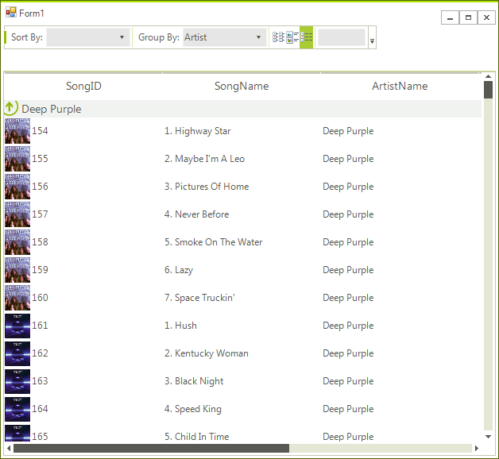
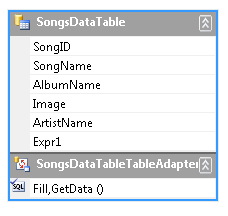
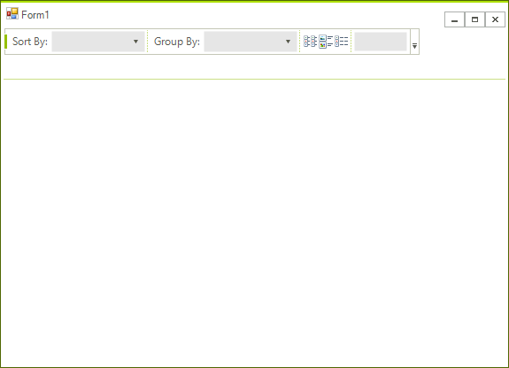
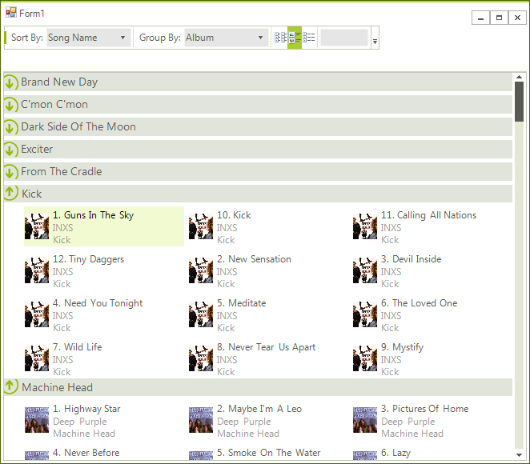

# Getting Started with WinForms ListView

This tutorial will help you to quickly get started using the __RadListView__ control.

## Adding Telerik Assemblies Using NuGet

To use `RadListView` when working with NuGet packages, install the `Telerik.UI.for.WinForms.AllControls` package. The [package target framework version may vary]().

Read more about NuGet installation in the [Install using NuGet Packages]() article.

>tip With the 2025 Q1 release, the Telerik UI for WinForms has a new licensing mechanism. You can learn more about it [here]().

## Adding Assembly References Manually

When dragging and dropping a control from the Visual Studio (VS) Toolbox onto the Form Designer, VS automatically adds the necessary assemblies. However, if you're adding the control programmatically, you'll need to manually reference the following assemblies:

* __Telerik.Licensing.Runtime__
* __Telerik.WinControls__
* __Telerik.WinControls.UI__
* __TelerikCommon__

The Telerik UI for WinForms assemblies can be install by using one of the available [installation approaches](). 

## Defining the RadListView

This article will demonstrate the basic capabilities of **RadListView**, like filtering, grouping, sorting, customizing items, etc. and it will show you in a step-by-step manner how to start creating applications with **RadListView**. 

>caption Figure 1: Getting started with RadListView

For the sake of this example, we are going to use a DataTable containing data about Artists, Albums, Songs and Image. 

>caption Figure 2: Songs DataTable

1\. First let’s create a form with [RadCommandBar]() docked *Top* and **RadListView** docked *Fill*. Add a __Strip__ to [RadCommandBar]() and populate it with the following items:

|   |   |
|---|---|
| __CommandBarLabel__ |<ul><li>Text: “Sort By:”</li><ul>|
| __CommandBarDropDownList__ |<ul><li>Name: commandBarDropDownSort</li><li>Text: ""</li><li>Items: None, Song Name, Artist, Album</li></ul>|
| __CommandBarSeparatorItem__ ||
| __CommandBarLabel__ |<ul><li>Text: “Group By:”</li></ul>|
| __CommandBarDropDownList__ |<ul><li>Name: commandBarDropDownGroup</li><li>Text: ""</li><li>Items: None, Album, Artist</li></ul>|
| __CommandBarSeparatorItem__ ||
| __CommandBarToggleButton__ |<ul><li>Name: commandBarToggleButtonList</li><li>ToolTipText: “ListView”</li><li>Image: Some image representing ListView</li></ul>|
| __CommandBarToggleButton__ |<ul><li>Name: commandBarToggleButtonTiles</li><li>ToolTipText: “IconsView”</li><li>Image: Some image representing IconsView</li></ul>|
| __CommandBarToggleButton__ |<ul><li>Name: commandBarToggleButtonDetails</li><li>ToolTipText: “DetailsView”</li><li>Image: Some image representing DetailsView</li></ul>|
| __CommandBarSeparatorItem__ ||
| __CommandBarTextBox__ |<ul><li>Name: commandBarTextBoxFilter</li><li>Text: “”</li></ul>|

At this point the form should like something similar to this:

2\. Now, lets continue with setting the control __DataSource__, allow edit and remove operations and subscribe to the events that we are going to use in this example.

#### Initial settings

<snippet id='listview-listviewgettingstarted-initialsettings-cs' />
<snippet id='listview-listviewgettingstarted-initialsettings-vb' />

3\. Now, lets handle those events. In the event handler for the __ItemDataBound__ event, we will take the corresponding item image from the data source and we will assign it to the **ListViewDataItem**.

#### Set the item image to the data item

<snippet id='listview-listviewgettingstarted-itemdatabound-cs' />
<snippet id='listview-listviewgettingstarted-itemdatabound-vb' />

4\. Next, lets handle the __VisualItemFormatting__ event, where we will set the visual item image. Additionally, for *IconsView* we will set the visual item text to a html-like combination of the *AlbumName*, *ArtistName* and *SongName*.

#### Customize visual item

<snippet id='listview-listviewgettingstarted-visualitemformatting-cs' />
<snippet id='listview-listviewgettingstarted-visualitemformatting-vb' />

The __CellFormatting__ event is handled in order to customize the appearance of the cells, when **RadListView** is in __DetailsView__. Here we will set the cell image.

#### Set the cell image

<snippet id='listview-listviewgettingstarted-cellformatting-cs' />
<snippet id='listview-listviewgettingstarted-cellformatting-vb' />

The __ColumnCreating__ event is fired when a column is being created. This is convenient event to hide unwanted columns. Additionally, we will use this event to set some more user friendly column headers.

#### Customize columns

<snippet id='listview-listviewgettingstarted-columncreating-cs' />
<snippet id='listview-listviewgettingstarted-columncreating-vb' />

5\. The last event of **RadListView**, which we are going to handle is the **ViewTypeChanged** event - fired when the **ViewType** of the control is changed. This event is convenient to set view specific settings. To handle the event, we will create three helper methods:

* __SetupDetailsView__ - here we will set the __AllowArbitraryItemHeight__,  property to *true*, in order to allow the items to size themselves in height, according to their content.

* __SetupIconsView__ - here we will define a custom size for the items, set some spacing between the items and again set the __AllowArbitraryItemHeight__, property to *true*.

* __SetupSimpleListView__ - in this method we will only set the __AllowArbitraryItemHeight__, property to *true*.

In the **ViewTypeChanged** event handler, we will simply check which is the new view and call the corresponding setup method.

#### Handling view type changes

<snippet id='listview-listviewgettingstarted-viewtypechanged-cs' />
<snippet id='listview-listviewgettingstarted-viewtypechanged-vb' />

6\. Now, we only need to fill up the __RadCommandBar__ elements functionality.  First, we are going to handle the view changing buttons. For this purpose, subscribe for the __ToggleStateChanged__ and __ToggleStateChanging__ events of all the __CommandBarToggleButtons__ that we have added earlier. In the **ToggleStateChanged** event handler, check which is the clicked button, and set the rest of the buttons to *Off*. Additionally, set the RadListView.**ViewType** according to the pressed button.

#### Handle the toggle buttons

<snippet id='listview-listviewgettingstarted-togglebuttons-cs' />
<snippet id='listview-listviewgettingstarted-togglebuttons-vb' />

7\. Next, subscribe to the __SelectedIndexChanged__ event of *commandBarDropDownSort*__CommandBarDropDownList__. In the event handler, we are going to add the desired __SortDescriptors__, according to the selected item in the drop down.

#### Handle sorting functionality

<snippet id='listview-listviewgettingstarted-sort-cs' />
<snippet id='listview-listviewgettingstarted-sort-vb' />

To add the grouping functionality, subscribe to the __SelectedIndexChanged__ event of *commandBarDropDownGroup*, __CommandBarDropDownList__. Similar to the sorting functionality, add the desired __GroupDescriptors__ according to the selected item.

#### Handle grouping functionality

<snippet id='listview-listviewgettingstarted-group-cs' />
<snippet id='listview-listviewgettingstarted-group-vb' />

8\. Lastly, lets subscribe ot the __TextChanged__ event of *commandBarTextBoxFilter*__CommandBarTextBox__. Here we will  add __FilterDescriptor__ according to the text entered in the text box:

#### Handle filtering functionality

<snippet id='listview-listviewgettingstarted-filter-cs' />
<snippet id='listview-listviewgettingstarted-filter-vb' />

9\. Run the application and try the different functionalities: 

