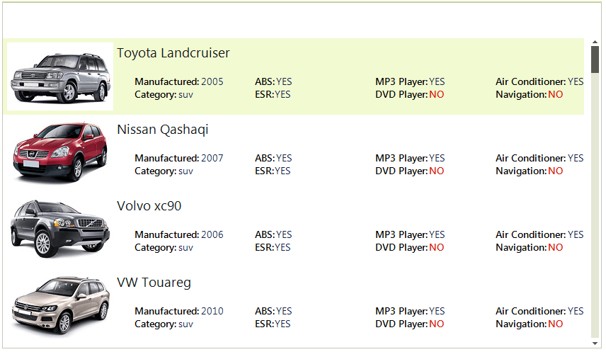

# ListView

**RadListView** is created as a result of the concord of the powerful data layer used by [RadGridView]() and [RadListControl](), together with the outstanding [Telerik Presentation Framework](). The data layer provides very high performance when working with data and also different types of binding options. Additionally, it provides features like grouping, sorting and filtering. Thanks to the [Telerik Presentation Framework](), the control customization is very flexible and intuitive.




        
**RadListView** is a bindable control for representing and editing list data with lots of customization abilities. **RadListView** will offer three different types of views, which will let you visualize your data the way that you want. You may choose between [SimpleListView](https://docs.telerik.com/devtools/winforms/controls/listview/views#listview), [IconView](https://docs.telerik.com/devtools/winforms/controls/listview/views#iconsview) or [DetailView](https://docs.telerik.com/devtools/winforms/controls/listview/views#detailsview).      

**RadListView** will also provide a rich and flexible API, which will let the developers easily customize the layout or the behavior of the control. Furthermore, the API will be similar to the API of our existing controls, so it will be easier for those who have already used our products to use the new component. The known family of items’ creating/formatting events will let you replace or style the items according to your preferences. Check boxes, re-sizing and reordering of columns, hot tracking, multiple selection and different sizing modes are another small part of the possibilities provided by the API.

You can review below the [Key Features](#key-features) that **RadListView** supports.

## Key Features

* __DataBinding__: [Data binding]() is a mechanism for automatic population of the **RadListView** with items, based on the provided data structure. **RadListView** support data binding either at design time or at run time. 

* __ViewTypes__: RadListView supports three ViewTypes – [ListView](https://docs.telerik.com/devtools/winforms/controls/listview/views#listview), [IconView](https://docs.telerik.com/devtools/winforms/controls/listview/views#iconsview) and [DetailView](https://docs.telerik.com/devtools/winforms/controls/listview/views#detailsview). With RadListView you can customize its appearance in order to fit your needs.

* __Columns__: Adding columns to the control at design time, is done by populating the [Columns]() collection of **RadListView**. This collection can be accessed either through the __Columns__ property in the property grid of the control or through the __Smart Tag__ of **RadListView**. 

* __Sorting__: [Sorting]() can be achieved in two ways. Either programmatically by adding the appropriate __SortDescriptor__ to the __SortDescriptors__ collection of **RadListView**, or by enabling the user to sort by clicking a column header in __DetailsView__.

* __Grouping__: **RadListView** supports both custom grouping and automatic grouping based on a certain property. You can read more about this [here]().

* __Filtering__: __RadListView__ allows [filtering] () operations in all views.

* __Kinetic scrolling__

* __CheckBoxes__: RadListViews' items have built-in [checkboxes]() which can be shown by setting the ShowCheckBoxes property of RadListView to true.

* __Multi selection__: RadListView supports both *single* and *multiple* selection. The selection mode is determined by the **MultiSelect** property of the control.  You can read more about this [here]().

* __Hot tracking__

>tip In the related [Getting Started](https://docs.telerik.com/devtools/winforms/controls/listview/getting-started) article you can find how to use the control with a sample scenario.

> Download and check out the online demo at [demos.telerik.com](https://telerik-winforms-demos.s3.amazonaws.com/TelerikWinFormsExamplesLauncher.exe)

# See Also

* [Getting Started]()
* [Structure]()
* [Desing Time]()
* [Demo](https://telerik-winforms-demos.s3.amazonaws.com/TelerikWinFormsExamplesLauncher.exe)
