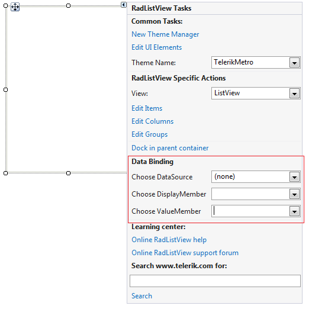
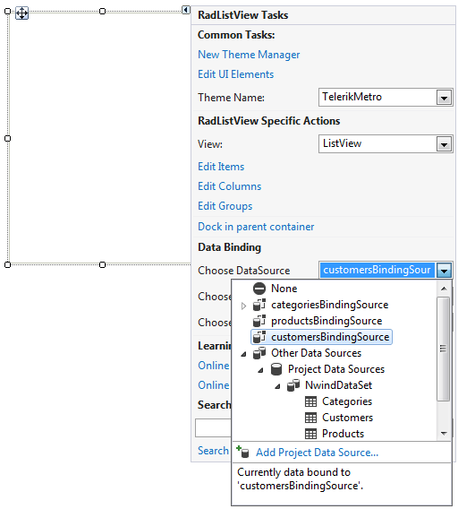
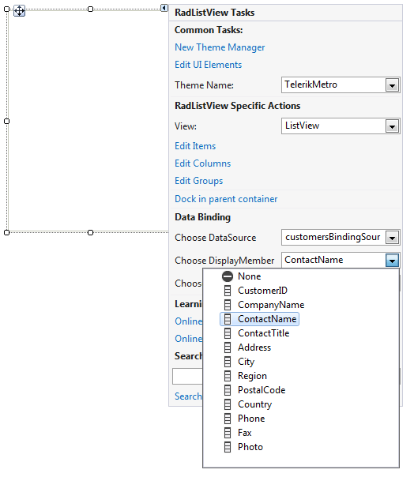
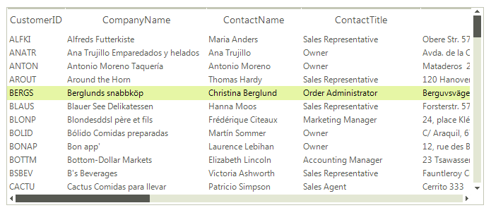
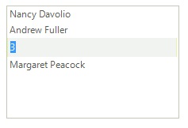
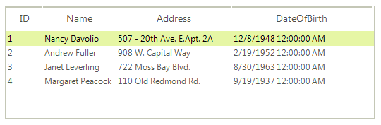

# Data Binding

Data binding is a mechanism for automatic population of the **RadListView** with items, based on the provided data structure. **RadListView** support data binding either at design time or at run time. Three properties control the data binding:

* __DataSource__ - Specifies the source of the data to be bound.

* __DisplayMember__ - Specifies the particular data to be displayed in a **RadListView**.

* __ValueMember__ - Specifies the particular data to be returned as the value of a **RadListView**.

## Data Binding at Design Time

You can bind **RadListView** at design time by specifying the **DataSource**, **ValueMember** and **DisplayMember** properties either from the **Smart Tag** or the **Properties** section in Visual Studio. 

>caption Figure 1: Data Binding at Design Time



To set the __DataSource__:

1\. Select the __DataSource__ property and click the drop-down arrow to display all existing data sources on the form.   



2\. Click the __Add Project Data Source__ link and follow the instructions in the __Data Source Configuration Wizard__ to add a data source to your project. You can use databases, web services, or objects as data sources.

3\. When you set the __DataSource__ property, you can choose a __DisplayMember__ and __ValueMember__. The __DisplayMember__ specifies the particular data to be displayed in **RadListView**’s items. The __ValueMember__ specifies the particular data to be returned by the **Value** property in **RadListView**’s items.

>caption Figure 2: Setting DisplayMember and ValueMember properties


>caption Figure 3: Data-bound RadListView


### Manipulating Columns

When you bind **RadListView** to a collection of business objects and select its __ViewType__ to be __DetailsView__, the values of all the properties of the business objects will be displayed in columns.

By handling the __ColumnCreating__ event you can manipulate the size, the visibility and other properties of the columns:

#### Columns creating

{{source=..\SamplesCS\ListView\ListViewDataBinding.cs region=ColumnCreating}} 
{{source=..\SamplesVB\ListView\ListViewDataBinding.vb region=ColumnCreating}} 

````C#
void radListView1_ColumnCreating(object sender, Telerik.WinControls.UI.ListViewColumnCreatingEventArgs e)
{
    if (e.Column.FieldName == "CustomerID" || e.Column.FieldName == "ParentID")
    {
        e.Column.Visible = false;
    }
    if (e.Column.FieldName == "CompanyName")
    {
        e.Column.HeaderText = "Company";
    }
    if (e.Column.FieldName == "ContactName")
    {
        e.Column.HeaderText = "Contact";
    }
}

````
````VB.NET
Private Sub RadListView1_ColumnCreating(ByVal sender As Object, ByVal e As ListViewColumnCreatingEventArgs) Handles RadListView1.ColumnCreating
    If e.Column.FieldName = "CustomerID" OrElse e.Column.FieldName = "ParentID" Then
        e.Column.Visible = False
    End If
    If e.Column.FieldName = "CompanyName" Then
        e.Column.HeaderText = "Company"
    End If
    If e.Column.FieldName = "ContactName" Then
        e.Column.HeaderText = "Contact"
    End If
End Sub

````

{{endregion}} 

## Data Binding at Run Time

The following tutorial will demonstrate how to bind a **RadListView** to a list of business objects.        

1\. First let's create our business object. Note that it is important that our custom object implements the **INotifyPropertyChanged** interface, since this will allow notifications between the object and the control:

#### Person Class

{{source=..\SamplesCS\ListView\ListViewDataBinding.cs region=person}} 
{{source=..\SamplesVB\ListView\ListViewDataBinding.vb region=person}} 

````C#
public class Person : INotifyPropertyChanged
{
    private int _id;
    private string _name;
    private string _address;
    private DateTime _dateOfBirth;
    private Image _picture;
    public event PropertyChangedEventHandler PropertyChanged;
    public Person(int Id, string Name, string Address, DateTime DateOfBirth, Image Picture)
    {
        this._id = Id;
        this._name = Name;
        this._address = Address;
        this._dateOfBirth = DateOfBirth;
        this._picture = Picture;
    }
    public int ID
    {
        get 
        {
            return this._id; 
        }
        set
        {
            if (this._id != value)
            {
                this._id = value;
                OnPropertyChanged("ID");
            }
        }
    }
    public string Name
    {
        get
        {
            return this._name;
        }
        set
        {
            if (this._name != value)
            {
                this._name = value;
                OnPropertyChanged("Name");
            }
        }
    }
    public string Address
    {
        get
        {
            return this._address;
        }
        set
        {
            if (this._address != value)
            {
                this._address = value;
                OnPropertyChanged("Address");
            }
        }
    }
    public DateTime DateOfBirth
    {
        get
        {
            return this._dateOfBirth;
        }
        set
        {
            if (this._dateOfBirth != value)
            {
                this._dateOfBirth = value;
                OnPropertyChanged("DateOfBirth");
            }
        }
    }
    public Image Picture
    {
        get
        {
            return this._picture;
        }
        set
        {
            if (this._picture != value)
            {
                this._picture = value;
                OnPropertyChanged("Picture");
            }
        }
    }
    protected virtual void OnPropertyChanged(string propertyName)
    {
        if (PropertyChanged != null)
        {
            PropertyChanged(this, new PropertyChangedEventArgs(propertyName));
        }
    }
}

````
````VB.NET
Public Class Person
    Private _id As Integer
    Private _name As String
    Private _address As String
    Private _dateOfBirth As DateTime
    Private _picture As Image
    Public Event PropertyChanged As PropertyChangedEventHandler
    Public Sub New(Id As Integer, Name As String, Address As String, DateOfBirth As DateTime, Picture As Image)
        Me._id = Id
        Me._name = Name
        Me._address = Address
        Me._dateOfBirth = DateOfBirth
        Me._picture = Picture
    End Sub
    Public Property ID() As Integer
        Get
            Return Me._id
        End Get
        Set(value As Integer)
            If Me._id <> value Then
                Me._id = value
                OnPropertyChanged("ID")
            End If
        End Set
    End Property
    Public Property Name() As String
        Get
            Return Me._name
        End Get
        Set(value As String)
            If Me._name <> value Then
                Me._name = value
                OnPropertyChanged("Name")
            End If
        End Set
    End Property
    Public Property Address() As String
        Get
            Return Me._address
        End Get
        Set(value As String)
            If Me._address <> value Then
                Me._address = value
                OnPropertyChanged("Address")
            End If
        End Set
    End Property
    Public Property DateOfBirth() As DateTime
        Get
            Return Me._dateOfBirth
        End Get
        Set(value As DateTime)
            If Me._dateOfBirth <> value Then
                Me._dateOfBirth = value
                OnPropertyChanged("DateOfBirth")
            End If
        End Set
    End Property
    Public Property Picture() As Image
        Get
            Return Me._picture
        End Get
        Set(value As Image)
            If Me._picture IsNot value Then
                Me._picture = value
                OnPropertyChanged("Picture")
            End If
        End Set
    End Property
    Protected Overridable Sub OnPropertyChanged(propertyName As String)
        RaiseEvent PropertyChanged(Me, New PropertyChangedEventArgs(propertyName))
    End Sub
End Class

````

{{endregion}} 

2\. Then, create a collection of our objects. The collection should implement **IBindingList** to support notifications. This, together with the **INotifyPropertyChanged** establishes a two way connection between the control and the object. In this case, we can use **BindingList** since it implements the **IBindingList** interface internally: 

#### Create a collection or person objects

{{source=..\SamplesCS\ListView\ListViewDataBinding.cs region=fillDataSource}} 
{{source=..\SamplesVB\ListView\ListViewDataBinding.vb region=fillDataSource}} 

````C#
BindingList<Person> dataSource = new BindingList<Person>()
{
    new Person(1, "Nancy Davolio","507 - 20th Ave. E.Apt. 2A", DateTime.Parse("12/8/1948"),  Resources.nancy),
    new Person(2, "Andrew Fuller","908 W. Capital Way", DateTime.Parse("2/19/1952"),  Resources.Andrew),
    new Person(3, "Janet Leverling","722 Moss Bay Blvd.", DateTime.Parse("8/30/1963"),  Resources.Janet),
    new Person(4, "Margaret Peacock","110 Old Redmond Rd.", DateTime.Parse("9/19/1937"), Resources.Margaret)
};

````
````VB.NET
Dim dataSource As New BindingList(Of Person)()
dataSource.Add(New Person(1, "Nancy Davolio", "507 - 20th Ave. E.Apt. 2A", DateTime.Parse("12/8/1948"), My.Resources.nancy))
dataSource.Add(New Person(2, "Andrew Fuller", "908 W. Capital Way", DateTime.Parse("2/19/1952"), My.Resources.Andrew))
dataSource.Add(New Person(3, "Janet Leverling", "722 Moss Bay Blvd.", DateTime.Parse("8/30/1963"), My.Resources.Janet))
dataSource.Add(New Person(4, "Margaret Peacock", "110 Old Redmond Rd.", DateTime.Parse("9/19/1937"), My.Resources.Margaret))

````

{{endregion}} 

3\. To bind our **RadListView** to this collection, simply set its __DataSource__, __DisplayMember__ and __ValueMember__ properties:

#### Bind to the collection of custom objects

{{source=..\SamplesCS\ListView\ListViewDataBinding.cs region=binding}} 
{{source=..\SamplesVB\ListView\ListViewDataBinding.vb region=binding}} 

````C#
this.radListView1.DataSource = dataSource;
this.radListView1.DisplayMember = "Name";
this.radListView1.ValueMember = "ID";

````
````VB.NET
Me.RadListView1.DataSource = dataSource
Me.RadListView1.DisplayMember = "Name"
Me.RadListView1.ValueMember = "ID"

````

{{endregion}} 

As a result you will get the **RadListView** populated with items that display the value __Name__ property of the business objects and have the __ID__ property of the business object returned as value. Opening an item for editing will display the id.



4\. We can extend this example by handling the __ItemDataBound__ event, which is fired when the __ListViewDataItem__ is assigned an object from your data source. In the event handler we can access the data bound object properties and assign an image to the item:

#### Assign an image to the item

{{source=..\SamplesCS\ListView\ListViewDataBinding.cs region=ItemDataBound}} 
{{source=..\SamplesVB\ListView\ListViewDataBinding.vb region=ItemDataBound}} 

````C#
void radListView1_ItemDataBound(object sender, Telerik.WinControls.UI.ListViewItemEventArgs e)
{
    {
        if (radListView1.ViewType == Telerik.WinControls.UI.ListViewType.ListView)
        {
            e.Item.Image = ((Person)e.Item.DataBoundItem).Picture;
        }
    }
}

````
````VB.NET
Private Sub RadListView1_ItemDataBound(ByVal sender As Object, ByVal e As Telerik.WinControls.UI.ListViewItemEventArgs)
    e.Item.Image = DirectCast(e.Item.DataBoundItem, Person).Picture
End Sub

````

{{endregion}} 

>caption Figure 4: Displying images


When **RadListView** is in __DetailView__ mode and is bound to this collection, as a result, you will get all the properties of the business object displayed in columns. In this case the **Picture** column is hidden:



# See Also

* [Unbound Mode]()	 
