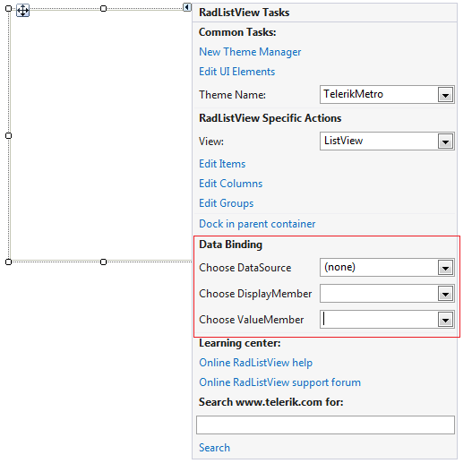
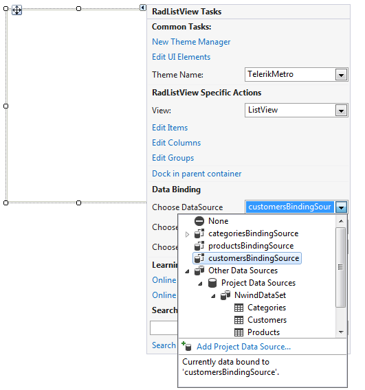
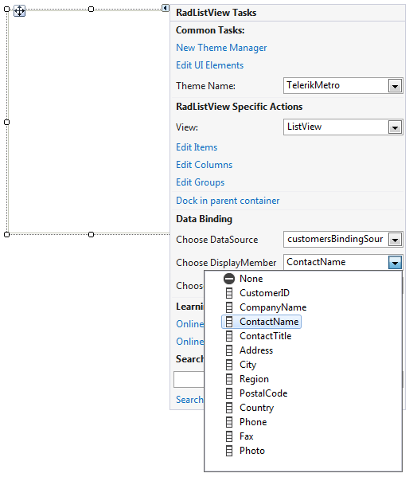
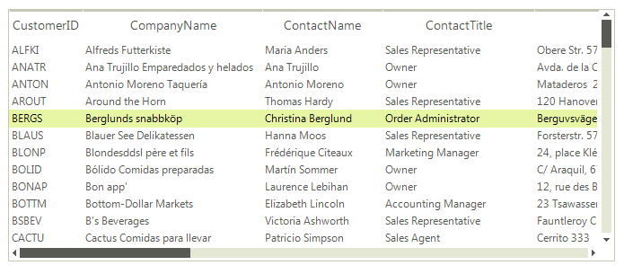
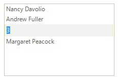
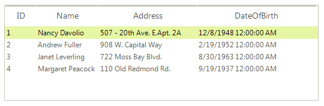

# Data Binding

Data binding is a mechanism for automatic population of the **RadListView** with items, based on the provided data structure. **RadListView** support data binding either at design time or at run time. Three properties control the data binding:

* __DataSource__ - Specifies the source of the data to be bound.

* __DisplayMember__ - Specifies the particular data to be displayed in a **RadListView**.

* __ValueMember__ - Specifies the particular data to be returned as the value of a **RadListView**.

## Data Binding at Design Time

You can bind **RadListView** at design time by specifying the **DataSource**, **ValueMember** and **DisplayMember** properties either from the **Smart Tag** or the **Properties** section in Visual Studio. 

>caption Figure 1: Data Binding at Design Time

To set the __DataSource__:

1\. Select the __DataSource__ property and click the drop-down arrow to display all existing data sources on the form.   

2\. Click the __Add Project Data Source__ link and follow the instructions in the __Data Source Configuration Wizard__ to add a data source to your project. You can use databases, web services, or objects as data sources.

3\. When you set the __DataSource__ property, you can choose a __DisplayMember__ and __ValueMember__. The __DisplayMember__ specifies the particular data to be displayed in **RadListView**’s items. The __ValueMember__ specifies the particular data to be returned by the **Value** property in **RadListView**’s items.

>caption Figure 2: Setting DisplayMember and ValueMember properties

>caption Figure 3: Data-bound RadListView

### Manipulating Columns

When you bind **RadListView** to a collection of business objects and select its __ViewType__ to be __DetailsView__, the values of all the properties of the business objects will be displayed in columns.

By handling the __ColumnCreating__ event you can manipulate the size, the visibility and other properties of the columns:

#### Columns creating

<snippet id='listview-listviewdatabinding-columncreating-cs' />
<snippet id='listview-listviewdatabinding-columncreating-vb' />

## Data Binding at Run Time

The following tutorial will demonstrate how to bind a **RadListView** to a list of business objects.        

1\. First let's create our business object. Note that it is important that our custom object implements the **INotifyPropertyChanged** interface, since this will allow notifications between the object and the control:

#### Person Class

<snippet id='listview-listviewdatabinding-person-cs' />
<snippet id='listview-listviewdatabinding-person-vb' />

2\. Then, create a collection of our objects. The collection should implement **IBindingList** to support notifications. This, together with the **INotifyPropertyChanged** establishes a two way connection between the control and the object. In this case, we can use **BindingList** since it implements the **IBindingList** interface internally: 

#### Create a collection or person objects

<snippet id='listview-listviewdatabinding-filldatasource-cs' />
<snippet id='listview-listviewdatabinding-filldatasource-vb' />

3\. To bind our **RadListView** to this collection, simply set its __DataSource__, __DisplayMember__ and __ValueMember__ properties:

#### Bind to the collection of custom objects

<snippet id='listview-listviewdatabinding-binding-cs' />
<snippet id='listview-listviewdatabinding-binding-vb' />

As a result you will get the **RadListView** populated with items that display the value __Name__ property of the business objects and have the __ID__ property of the business object returned as value. Opening an item for editing will display the id.

4\. We can extend this example by handling the __ItemDataBound__ event, which is fired when the __ListViewDataItem__ is assigned an object from your data source. In the event handler we can access the data bound object properties and assign an image to the item:

#### Assign an image to the item

<snippet id='listview-listviewdatabinding-itemdatabound-cs' />
<snippet id='listview-listviewdatabinding-itemdatabound-vb' />

>caption Figure 4: Displying images

When **RadListView** is in __DetailView__ mode and is bound to this collection, as a result, you will get all the properties of the business object displayed in columns. In this case the **Picture** column is hidden:

# See Also

* [Unbound Mode]()	 
