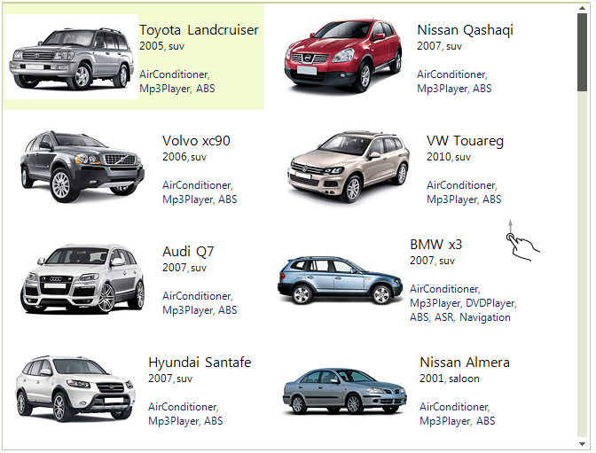
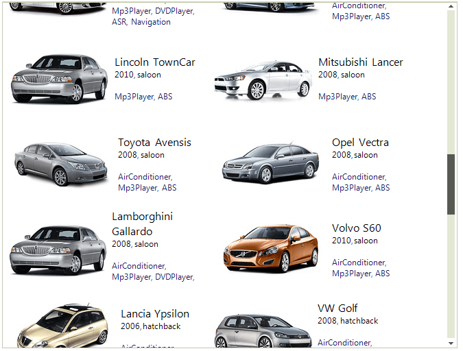
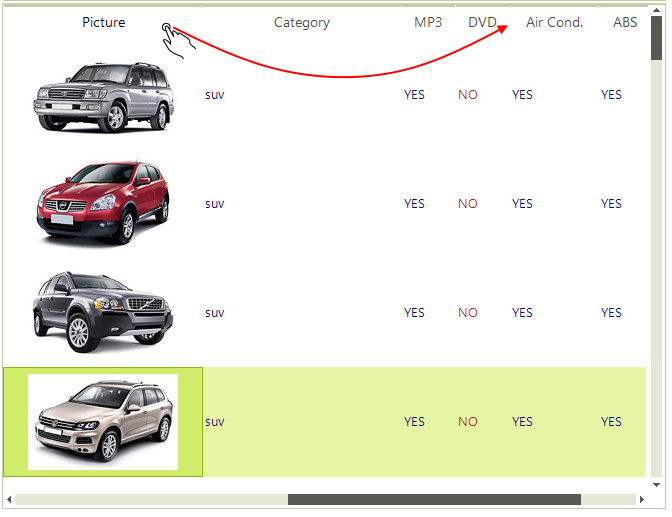
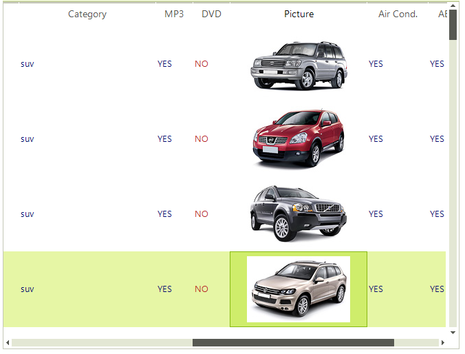
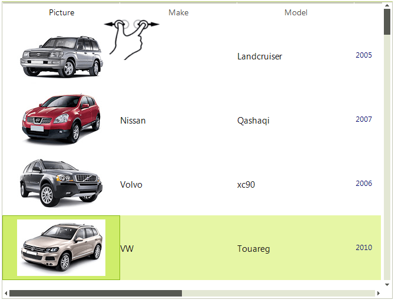
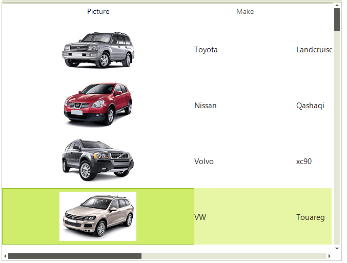

# Touch Support

RadListView supports scrolling, column reorder and column resize operations via touch interface.

## Scrolling

To scroll the control simply drag the whole control to the desired location (left, right, up, down).

>note By default, the **EnableKineticScrolling** property is set to **false**.Set it to **true** in order to benefit from the scrolling option.

Here is the result of scrolling the control down.

## Column Reorder

In order to reorder the columns, just drag the desired column title to its new location.

Here you can see the dragged "*Picture*" column from the left of the control to the right of it.

## Column Resize

Resizing the columns is achieved by the zoom gesture applied to the desired column title.

And the result is: 

# See Also

 * [Windows Touch Gestures](http://msdn.microsoft.com/en-us/library/windows/desktop/dd940543(v=vs.85).aspx)
