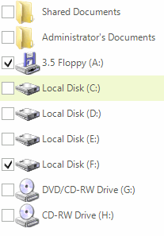
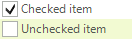

# Checkboxes

**RadListViews'** items have built-in checkboxes which can be shown by setting the __ShowCheckBoxes__ property of **RadListView** to *true*.

#### Enable Checkboxes

{{source=..\SamplesCS\ListView\ListViewCheckboxesAndEditors.cs region=EnableCheckBoxes}} 
{{source=..\SamplesVB\ListView\ListViewCheckboxesAndEditors.vb region=EnableCheckBoxes}} 

````C#
            
this.radListView1.ShowCheckBoxes = true;

````
````VB.NET
Me.RadListView1.ShowCheckBoxes = True

````

{{endregion}} 

When checkboxes are enabled, you have several options to handle the checked items:

* You can check or uncheck items via the checkbox that is shown in each item

>caption Figure 1: Toggle the item by using the mouse



* You can get or set the checked state of the __ListViewDataItem__ directly via its __CheckedState__ property:

#### Toggle an item programmatically

{{source=..\SamplesCS\ListView\ListViewCheckboxesAndEditors.cs region=ToggleItem}} 
{{source=..\SamplesVB\ListView\ListViewCheckboxesAndEditors.vb region=ToggleItem}} 

````C#
ListViewDataItem checkedItem = new ListViewDataItem("Checked item");
checkedItem.CheckState = Telerik.WinControls.Enumerations.ToggleState.On;
this.radListView1.Items.Add(checkedItem);
            
ListViewDataItem uncheckedItem = new ListViewDataItem("Unchecked item");
uncheckedItem.CheckState = Telerik.WinControls.Enumerations.ToggleState.Off;
this.radListView1.Items.Add(uncheckedItem);

````
````VB.NET
Dim checkedItem As New ListViewDataItem("Checked item")
checkedItem.CheckState = Telerik.WinControls.Enumerations.ToggleState.[On]
Me.RadListView1.Items.Add(checkedItem)
Dim uncheckedItem As New ListViewDataItem("Unchecked item")
uncheckedItem.CheckState = Telerik.WinControls.Enumerations.ToggleState.Off
Me.RadListView1.Items.Add(uncheckedItem)

````

{{endregion}} 

>caption Figure 2: Toggle items programmatically



* You can get the checked items in **RadListView** via its __CheckedItems__ collection

* The **CheckOnClickMode** property gets or sets a value indicating whether the item's check state changes whenever the item is clicked. The following values are available:

	* CheckOnClickMode.*Off*: Item's **CheckState** property is not toggled on click.
	* CheckOnClickMode.*FirstClick*: Item is selected and the **CheckState** property is toggled on first click.
	* CheckOnClickMode.*SecondClick*: Item is selected on first click. On second click the **CheckState** property is toggled.    

* You can listen for changes in the check state of the items via the following events:
	*  __ItemCheckedChanging__: Occurs when a **ListViewDataItem** is about to be checked. You can cancel this event.
	*  __ItemCheckedChanged__: Occurs when a **ListViewDataItem** is checked.

 
