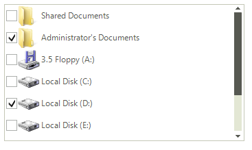
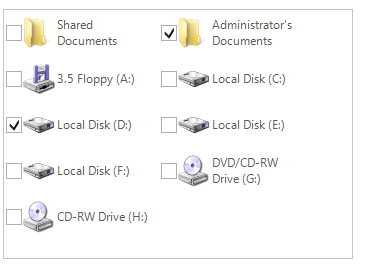
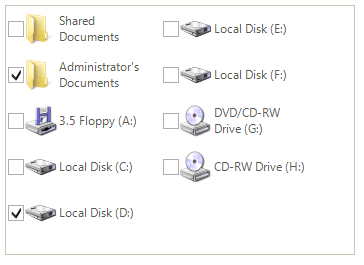
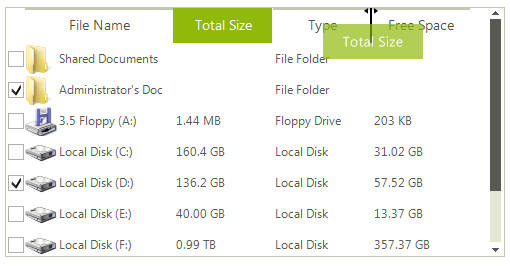

# Views
 
**RadListView** supports three __ViewTypes__ – *ListView*, *IconsView* and *DetailsView*. Those are the basic views that every Windows user is familiar with since *Windows Explorer* offers them all. With **RadListView** you can extend the view types functionality and customize its appearance in order to fit your needs.
     
## ListView

The __ListView__ view has much the same look as **RadListControl**. It uses the engine of **RadListView** and takes benefits like check boxes, editors and images from it. The __ListView__ view consists of vertically stacked list items:

>caption Figure 1: ListView

## IconsView

The __IconView__ displays the list items in icons, a manner that you surely are familiar with from the Windows Explorer. Its __Orientation__ property determines how the icons will be displayed:
        
>caption Figure 2: IconView with Vertical orientation 

>caption Figure 3: IconView with Horizontal orientation 

## DetailsView

The __DetailsView__ provides a grid-like interface for displaying items with more than one data fields. Interesting features in this view are the options to re-size columns (__AllowColumnResize__), to reorder columns  (__AllowColumnReorder__), set the columns sizes and to determine which columns will be visible and which aren’t.

>caption Figure 4: DetailView

