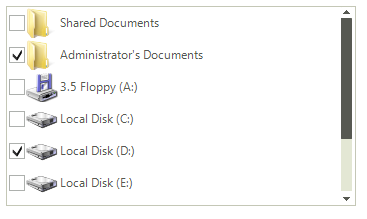
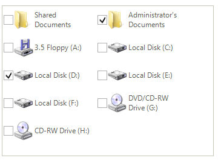
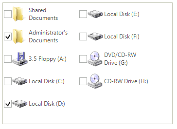
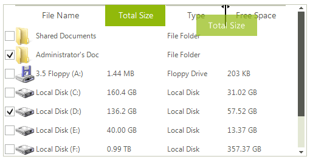

# RadListView View Types

`RadListView` supports three `ViewType` modes: `ListView`, `IconsView`, and `DetailsView`. Use these modes to present the same data as a simple list, an icon layout, or a multi-column grid, depending on what your users need to scan and edit.
     
## ListView

`ListView` looks similar to `RadListControl`, but it uses the `RadListView` engine and supports features such as checkboxes, editors, and images. This mode arranges items in a single vertical list:

>caption Figure 1: ListView

## IconsView

`IconsView` displays items as icons, similar to Windows Explorer. Use the `Orientation` property to control whether the layout flows vertically or horizontally:
        
>caption Figure 2: IconsView with vertical orientation

>caption Figure 3: IconsView with horizontal orientation

## DetailsView

`DetailsView` displays items in rows and columns. Use this mode when each item must show several values, such as a name, category, status, or date. You can let users resize columns with `AllowColumnResize`, reorder them with `AllowColumnReorder`, and choose which columns remain visible.

### Create a DetailsView

To create a `DetailsView` in `RadListView` using [unbound mode](#adding-columns):

1. Add a `RadListView` control to your form.
2. Set its `ViewType` property to `DetailsView`.
3. Add one column for each field you want to display.
4. Add items to the control and populate the remaining values as subitems.

The first value in each item appears in the first column. Each additional value appears in the next available column for that row.

### What to configure

When you set up a `DetailsView`, verify these parts:

1. Create clear column headers so users can identify the data in each column.
2. Adjust column widths to avoid clipping longer values.
3. Enable `AllowColumnResize` if users need to change widths at run time.
4. Enable `AllowColumnReorder` if users need to change the column order.
5. Hide columns that contain secondary data and show only the fields that support the main task.

If you bind the control to a data source, create a column for each field that must remain visible in the details layout.

>caption Figure 4: DetailsView

## See Also

- [Get started with RadListView]()
- [Bind RadListView to data]()
