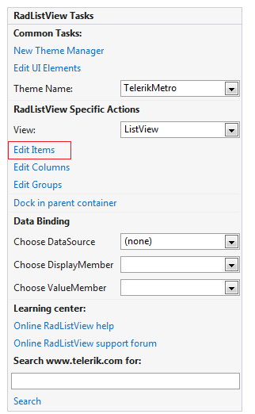
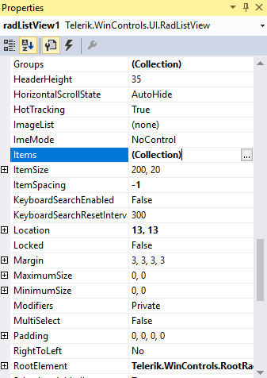
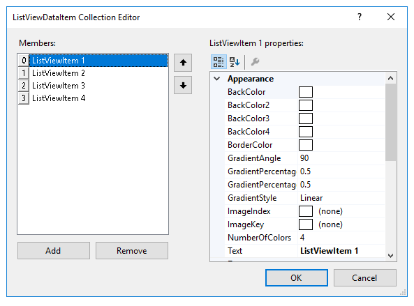
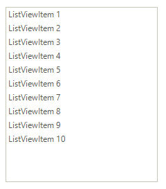

# Adding items

Adding items to **RadListView** at design time is possible through the __Items__  collection of the control. This collection is accessible by using the __Smart Tag__ or the __Items__ collection property in the property grid.

>caption Figure 1: Items collection in Smart tag

>caption Figure 2: Items collection in Properties section

Both of these will open __ListViewDataItem Collection Editor__, from where, by clicking the __Add__ button you can add items to the collection. Additionally, on the right hand side, you will see a property grid, where you can change the properties of each item individually.

>caption Figure 3: ListViewDataItem Collection Editor

Here is the result of the described approach:

# See Also

* [Design Time Basics]()	
* [Adding groups]()
* [Adding columns]()	