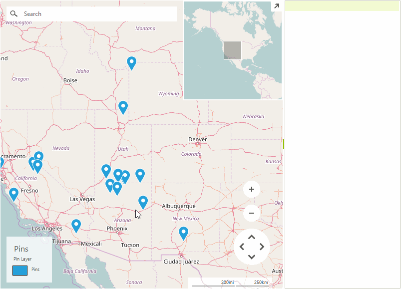

# OLE Drag and Drop

**RadMap** is capable of performing drag and drop operation using the native OLE drag and drop support. The example below handles a scenario in which pins are dragged from the map to a **RadListView** control.

>caption Figure 1: Drag and Drop Between RadMap and RadListView 



In order to achieve the desired result the MouseMove, MouseUp, and DragEnter events need to be handled by **RadMap**. The drag operation will be started in the handler of the MouseMove event. **RadListView** needs to be subscribed to the DragEnter and DragDrop events.

>note This example uses the [OpenStreetMapProvider]() and utilizes the MapPin objects added to a predefined [layer]().

>note RadMap allows panning out of the box. The built-in panning functionality will interfere with the custom drag and drop behavior and it needs to be disabled for the duration of the drag and drop operation.

#### Subscribe to Events

{{source=..\SamplesCS\Map\DragAndDropRadMapForm.cs region=SubscribeEvents}} 
{{source=..\SamplesVB\Map\DragAndDropRadMapForm.vb region=SubscribeEvents}}
````C#
public DragAndDropRadMapForm()
{
    InitializeComponent();
    this.SetupProviders();
    this.SetupLayer();
    this.SetupLegend();
    this.SetupData();
    this.radMap1.AllowDrop = true;
    this.radListView1.AllowDrop = true;
    this.radMap1.MouseMove += RadMap1_MouseMove;
    this.radMap1.DragEnter += RadMap1_DragEnter;
    this.radListView1.DragEnter += RadListView1_DragEnter;
    this.radListView1.DragDrop += RadListView1_DragDrop;
}

````
````VB.NET
Public Sub New()
    InitializeComponent()
    Me.SetupProviders()
    Me.SetupLayer()
    Me.SetupLegend()
    Me.SetupData()
    Me.radMap1.AllowDrop = True
    Me.radListView1.AllowDrop = True
    AddHandler Me.radMap1.MouseMove, AddressOf RadMap1_MouseMove
    AddHandler Me.radMap1.DragEnter, AddressOf RadMap1_DragEnter
    AddHandler Me.radListView1.DragEnter, AddressOf RadListView1_DragEnter
    AddHandler Me.radListView1.DragDrop, AddressOf RadListView1_DragDrop
End Sub

````


{{endregion}}

## Handling Events

The RadMapElement.**EnablePanning** property will be set in the MouseMove event handler. **RadListView** will read the Text property of the dragged pin and add a new member item in its **Items** collection.

#### Drag and Drop Events

{{source=..\SamplesCS\Map\DragAndDropRadMapForm.cs region=HandleEvents}} 
{{source=..\SamplesVB\Map\DragAndDropRadMapForm.vb region=HandleEvents}}
````C#
private void RadMap1_MouseMove(object sender, MouseEventArgs e)
{
    if (!(e.Button == MouseButtons.Left))
    {
        return;
    }

    PointL point = new PointL(e.X - this.radMap1.MapElement.PanOffset.Width, e.Y - this.radMap1.MapElement.PanOffset.Height);
    MapPin pin = this.radMap1.Layers.HitTest(point) as MapPin;
    if (pin != null)
    {
        this.radMap1.InputBehavior.OnMouseUp(e);
        ((RadMap)sender).DoDragDrop(pin, DragDropEffects.Move);
    }
}
private void RadMap1_DragEnter(object sender, DragEventArgs e)
{
	MapPin pin = e.Data.GetData(typeof(MapPin)) as MapPin;
	e.Effect = pin == null ? DragDropEffects.None : DragDropEffects.Move;
}

private void RadListView1_DragEnter(object sender, DragEventArgs e)
{
	MapPin pin = e.Data.GetData(typeof(MapPin)) as MapPin;
	e.Effect = pin == null ? DragDropEffects.None : DragDropEffects.Move;
}					
private void RadListView1_DragDrop(object sender, DragEventArgs e)
{
    MapPin pin = e.Data.GetData(typeof(MapPin)) as MapPin;
    this.radMap1.Layers["Pins"].Remove(pin);
    this.radListView1.Items.Add(pin.Text);
    this.radMap1.Refresh();
}

````
````VB.NET
Private Sub RadMap1_MouseMove(ByVal sender As Object, ByVal e As MouseEventArgs)
	If Not (e.Button = MouseButtons.Left) Then
		Return
	End If

	Dim point As PointL = New PointL(e.X - Me.radMap1.MapElement.PanOffset.Width, e.Y - Me.radMap1.MapElement.PanOffset.Height)
	Dim pin As MapPin = TryCast(Me.radMap1.Layers.HitTest(point), MapPin)

	If pin IsNot Nothing Then
		Me.radMap1.InputBehavior.OnMouseUp(e)
		(CType(sender, RadMap)).DoDragDrop(pin, DragDropEffects.Move)
	End If
End Sub

Private Sub RadMap1_DragEnter(ByVal sender As Object, ByVal e As DragEventArgs)
	Dim pin As MapPin = TryCast(e.Data.GetData(GetType(MapPin)), MapPin)
	e.Effect = If(pin Is Nothing, DragDropEffects.None, DragDropEffects.Move)
End Sub

Private Sub RadListView1_DragEnter(ByVal sender As Object, ByVal e As DragEventArgs)
	Dim pin As MapPin = TryCast(e.Data.GetData(GetType(MapPin)), MapPin)
	e.Effect = If(pin Is Nothing, DragDropEffects.None, DragDropEffects.Move)
End Sub

Private Sub RadListView1_DragDrop(ByVal sender As Object, ByVal e As DragEventArgs)
	Dim pin As MapPin = TryCast(e.Data.GetData(GetType(MapPin)), MapPin)
	Me.radMap1.Layers("Pins").Remove(pin)
	Me.radListView1.Items.Add(pin.Text)
	Me.radMap1.Refresh()
End Sub

````


{{endregion}}

# See Also

* [RadListView]()
* [Map Providers]()
* [Layers]()
