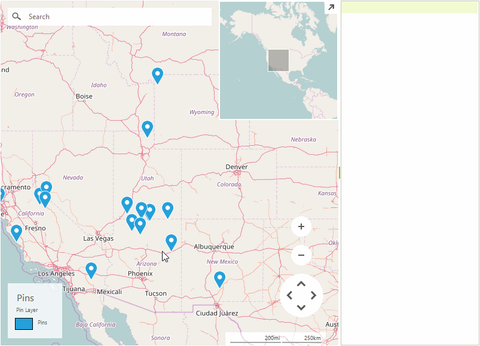

# OLE Drag and Drop

**RadMap** is capable of performing drag and drop operation using the native OLE drag and drop support. The example below handles a scenario in which pins are dragged from the map to a **RadListView** control.

>caption Figure 1: Drag and Drop Between RadMap and RadListView 

In order to achieve the desired result the MouseMove, MouseUp, and DragEnter events need to be handled by **RadMap**. The drag operation will be started in the handler of the MouseMove event. **RadListView** needs to be subscribed to the DragEnter and DragDrop events.

>note This example uses the [OpenStreetMapProvider]() and utilizes the MapPin objects added to a predefined [layer]().

>note RadMap allows panning out of the box. The built-in panning functionality will interfere with the custom drag and drop behavior and it needs to be disabled for the duration of the drag and drop operation.

#### Subscribe to Events

<snippet id='map-draganddropradmapform-subscribeevents-cs' />
<snippet id='map-draganddropradmapform-subscribeevents-vb' />

## Handling Events

The RadMapElement.**EnablePanning** property will be set in the MouseMove event handler. **RadListView** will read the Text property of the dragged pin and add a new member item in its **Items** collection.

#### Drag and Drop Events

<snippet id='map-draganddropradmapform-handleevents-cs' />
<snippet id='map-draganddropradmapform-handleevents-vb' />

# See Also

* [RadListView]()
* [Map Providers]()
* [Layers]()
