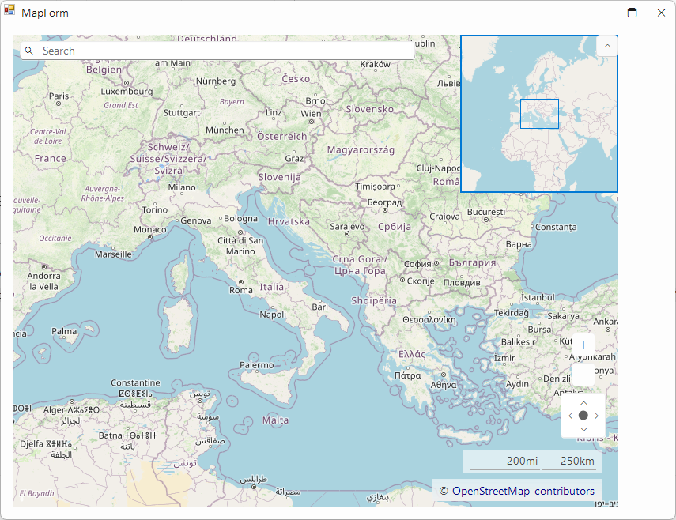
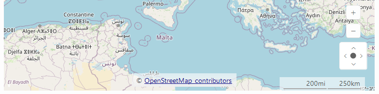
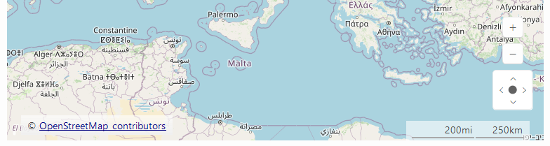

# Copyright Label

The __RadMap__ control displays a copyright label at the bottom of the control.

This label is represented by the __MapCopyrightLabelElement__. You can access it via the __CopyrightLabelElement__ property and set its __Text__ property to customize the displayed content.

>caption Figure 1: Copyright Label



## Set Copyright Label

````C#

this.radMap1.MapElement.CopyrightLabelElement.Text = "<html>© <a href=https://www.openstreetmap.org/copyright>OpenStreetMap</a> contributors";

````
````VB.NET

Me.RadMap1.MapElement.CopyrightLabelElement.Text = "<html>© <a href=https://www.openstreetmap.org/copyright>OpenStreetMap</a> contributors"

````

## Customization

The MapCopyrightLabelElement can be further customized to suit your specific requirements.

### Aligment

The element's Alignment property determines its position. While the ContentAlignment enumeration includes vertical options such as Top, Middle, and Bottom, these are not applicable here—the copyright label is always positioned at the bottom of the map. By default, the alignment is set to MiddleRight, as shown in the first image of the article. 

> Note that selecting TopRight or BottomRight produces the same visual result due to the fixed bottom placement of the label.

All three center alignments __ContentAlignment.MiddleCenter__, __ContentAlignment.TopCenter__, __ContentAlignment.BottomCenter__ result in the screenshot below:

````C#

this.radMap1.MapElement.CopyrightLabelElement.Alignment = ContentAlignment.MiddleCenter;

````
````VB.NET

Me.RadMap1.MapElement.CopyrightLabelElement.Alignment = ContentAlignment.MiddleCenter

````



All three left alignments __ContentAlignment.MiddleLeft__, __ContentAlignment.TopLeft__, __ContentAlignment.BottomLeft__ result in the screenshot below:




## See Also

* [Layers Overview]()
* [Mini Map]()
* [Navigation Controls]()
* [Scale Indicators]()
* [Legend]()
