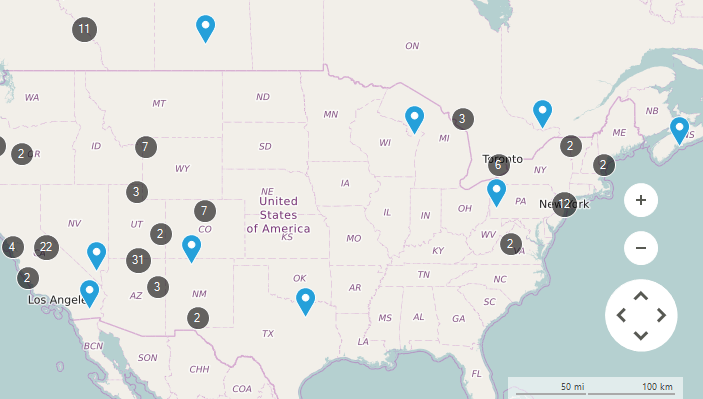
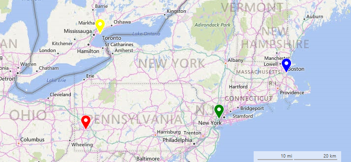
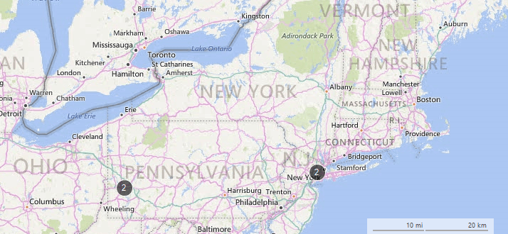
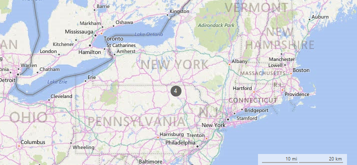

# Clusterization

__RadMap__ supports clusterization of its layers allowing grouping of their items. This feature is extremely useful when dealing with large collections having items located close to each other.

>caption Figure 1: Clustering

## Clusterization Modes

The __ClusterDistance__ property of a certain layer is responsible for setting a distance according to which each of the layer items will be evaluated to form a group. There are two types of clusters which can be assigned to the __ClusterStrategy__ property of the layer:

* __ElementClusterStrategy__: All of the layer items are evaluated and a cluster is being created on the exact coordinates of an item within the cluster.

* __DistanceClusterStrategy__: All of the layer items are evaluated and a cluster is being created on the geographic center of the items part of the cluster.

The example below creates a layer with four __MapPin__ elements and defines clusters using __ElementClusterStrategy__ and __DistanceClusterStrategy__ having the same __ClusterDistance__. 

#### Add Layer and Data

<snippet id='map-clusterizationform-setuplayersanddata-cs' />
<snippet id='map-clusterizationform-setuplayersanddata-vb' />

>caption Figure 2: Initial Result

#### ElementClusterStrategy

<snippet id='map-clusterizationform-elementclusterstrategy-cs' />
<snippet id='map-clusterizationform-elementclusterstrategy-vb' />

>caption Figure 3: ElementClusterStrategy

#### DistanceClusterStrategy

<snippet id='map-clusterizationform-distanceclusterstrategy-cs' />
<snippet id='map-clusterizationform-distanceclusterstrategy-vb' />

>caption Figure 4: DistanceClusterStrategy

# See Also

* [Layers Overview]()
* [Colorization]()
