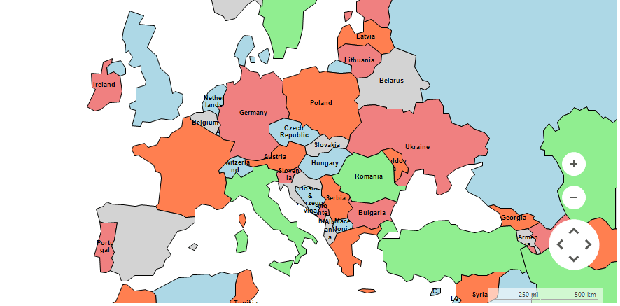
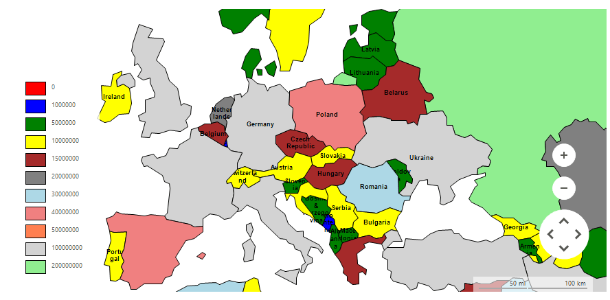
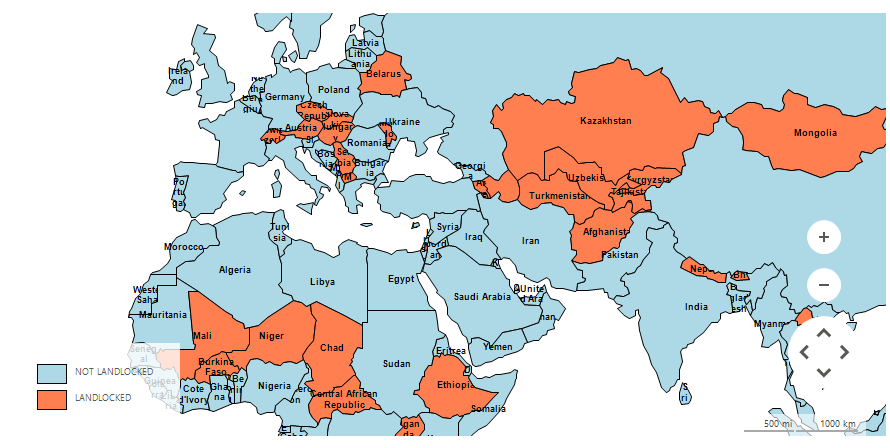

# Colorization

When used with a [shape]() file, the colorization feature of __RadMap__ allows the data objects to be easily colorized on the basis of a certain condition.

__RadMap__ utilizes three different colorization objects expecting a collection of colors which will be evaluated and assigned to the different shapes. 

* [GraphColorizationStrategy](#graph-colorization)
* [ChoroplethColorizationStrategy](#choropleth-colorization)
* [PropertyColorizationStrategy](#property-colorization)

# Graph Colorization

The __GraphColorizationStrategy__ internally arranges the predefined colors so that there are no shapes with the same color next to each other.

>caption Figure 1: Graph Colorization



#### Setting up GraphColorizationStrategy

{{source=..\SamplesCS\Map\MapColorizers.cs region=SetupGraphColorizationStrategy}} 
{{source=..\SamplesVB\Map\MapColorizers.vb region=SetupGraphColorizationStrategy}}
````C#
private void SetupGraphColorizationStrategy()
{
    GraphColorizationStrategy colorizer = new GraphColorizationStrategy();
    colorizer.Colors = new List<Color>() {
            Color.LightBlue,
            Color.LightCoral,
            Color.Coral,
            Color.LightGray,
            Color.LightGreen
    };
    this.radMap1.MapElement.Layers["World Layout"].ColorizationStrategy = colorizer;
}

````
````VB.NET
Private Sub SetupGraphColorizationStrategy()
    Dim colorizer As New GraphColorizationStrategy()
    colorizer.Colors = New List(Of Color)() From {
        Color.LightBlue,
        Color.LightCoral,
        Color.Coral,
        Color.LightGray,
        Color.LightGreen
    }
    Me.RadMap1.MapElement.Layers("World Layout").ColorizationStrategy = colorizer
End Sub

````


{{endregion}}

# Choropleth Colorization

The __ChoroplethColorizationStrategy__ arranges the predefined colors according to a collection range stops against which each of the shape objects will be evaluated.

>caption Figure 2: Choropleth Colorization



#### Setting up ChoroplethColorizationStrategy

{{source=..\SamplesCS\Map\MapColorizers.cs region=SetupChoroplethColorizationStrategy}} 
{{source=..\SamplesVB\Map\MapColorizers.vb region=SetupChoroplethColorizationStrategy}}
````C#
private void SetupChoroplethColorizationStrategy()
{
    ChoroplethColorizationStrategy colorizer = new ChoroplethColorizationStrategy();
    colorizer.Colors = new List<Color>() {
            Color.Red,
            Color.Blue,
            Color.Green,
            Color.Yellow,
            Color.Brown,
            Color.Gray,
            Color.LightBlue,
            Color.LightCoral,
            Color.Coral,
            Color.LightGray,
            Color.LightGreen
    };
    colorizer.ValueProvider = new MapGeometryPropertyValueProvider("POP_CNTRY");
    colorizer.ColorStops = new List<double>() { 0, 1000000, 5000000, 10000000, 15000000, 20000000, 30000000, 40000000, 50000000, 100000000, 200000000 };
    this.radMap1.MapElement.Layers["World Layout"].ColorizationStrategy = colorizer;
    this.radMap1.MapElement.LegendElement.LegendInfoProvider = colorizer;
}

````
````VB.NET
Private Sub SetupChoroplethColorizationStrategy()
    Dim colorizer As New ChoroplethColorizationStrategy()
    colorizer.Colors = New List(Of Color)() From {
        Color.Red,
        Color.Blue,
        Color.Green,
        Color.Yellow,
        Color.Brown,
        Color.Gray,
        Color.LightBlue,
        Color.LightCoral,
        Color.Coral,
        Color.LightGray,
        Color.LightGreen
    }
    colorizer.ValueProvider = New MapGeometryPropertyValueProvider("POP_CNTRY")
    colorizer.ColorStops = New List(Of Double)() From {
        0,
        1000000,
        5000000,
        10000000,
        15000000,
        20000000,
        30000000,
        40000000,
        50000000,
        100000000,
        200000000
    }
    Me.RadMap1.MapElement.Layers("World Layout").ColorizationStrategy = colorizer
    Me.RadMap1.MapElement.LegendElement.LegendInfoProvider = colorizer
End Sub

````


{{endregion}}

# Property Colorization

>caption Figure 3: Property Colorization

The __PropertyColorizationStrategy__ evaluates the values of a certain property defined in the shape file. Depending on the result the engine assigns one of the predefined colors.



#### Setting up PropertyColorizationStrategy

{{source=..\SamplesCS\Map\MapColorizers.cs region=SetupPropertyColorizationStrategy}} 
{{source=..\SamplesVB\Map\MapColorizers.vb region=SetupPropertyColorizationStrategy}}
````C#
private void SetupPropertyColorizationStrategy()
{
    PropertyColorizationStrategy colorizer = new PropertyColorizationStrategy();
    colorizer.Colors = new List<Color>() {
            Color.LightBlue,
            Color.Coral
    };
    colorizer.PropertyValues.Add(new PropertyColorizerItem("N", "NOT LANDLOCKED"));
    colorizer.PropertyValues.Add(new PropertyColorizerItem("Y", "LANDLOCKED"));
    colorizer.ValueProvider = new MapGeometryPropertyValueProvider("LANDLOCKED");
    this.radMap1.MapElement.Layers["World Layout"].ColorizationStrategy = colorizer;
    this.radMap1.MapElement.LegendElement.LegendInfoProvider = colorizer;
}

````
````VB.NET
Private Sub SetupPropertyColorizationStrategy()
    Dim colorizer As New PropertyColorizationStrategy()
    colorizer.Colors = New List(Of Color)() From {
        Color.LightBlue,
        Color.Coral
    }
    colorizer.PropertyValues.Add(New PropertyColorizerItem("N", "NOT LANDLOCKED"))
    colorizer.PropertyValues.Add(New PropertyColorizerItem("Y", "LANDLOCKED"))
    colorizer.ValueProvider = New MapGeometryPropertyValueProvider("LANDLOCKED")
    Me.RadMap1.MapElement.Layers("World Layout").ColorizationStrategy = colorizer
    Me.RadMap1.MapElement.LegendElement.LegendInfoProvider = colorizer
End Sub

````


{{endregion}}

Here is the required code to setup the provider and read the [sample shape file](http://www.telerik.com/docs/default-source/ui-for-winforms/world_data.zip?sfvrsn=2) used in the examples above. 

#### Setting up EmptyMapProvider

{{source=..\SamplesCS\Map\MapColorizers.cs region=SetupProvider}} 
{{source=..\SamplesVB\Map\MapColorizers.vb region=SetupProvider}}
````C#
private void SetupProvider()
{
    EmptyMapProvider emptyProvider = new EmptyMapProvider();
    emptyProvider.InitializationComplete += emptyProvider_InitializationComplete;
    this.radMap1.Providers.Add(emptyProvider);
}
private void emptyProvider_InitializationComplete(object sender, EventArgs e)
{
    List<PointG> locations = new List<PointG>();
    foreach (MapVisualElement el in this.radMap1.Layers["World Layout"].Overlays)
    {
        locations.Add(el.Location);
    }
    this.radMap1.BringIntoView(RectangleG.GetBoundingRectangle(locations));
}

````
````VB.NET
Private Sub SetupProvider()
    Dim emptyProvider As New EmptyMapProvider()
    AddHandler emptyProvider.InitializationComplete, AddressOf emptyProvider_InitializationComplete
    Me.RadMap1.Providers.Add(emptyProvider)
End Sub
Private Sub emptyProvider_InitializationComplete(sender As Object, e As EventArgs)
    Dim locations As New List(Of PointG)()
    For Each el As MapVisualElement In Me.RadMap1.Layers("World Layout").Overlays
        locations.Add(el.Location)
    Next
    Me.RadMap1.BringIntoView(RectangleG.GetBoundingRectangle(locations))
End Sub

````


{{endregion}}

#### Setting up Layer

{{source=..\SamplesCS\Map\MapColorizers.cs region=SetupLayer}} 
{{source=..\SamplesVB\Map\MapColorizers.vb region=SetupLayer}}
````C#
private void SetupLayer()
{
    MapLayer worldLayer = new MapLayer("World Layout");
    this.radMap1.Layers.Add(worldLayer);
}

````
````VB.NET
Private Sub SetupLayer()
    Dim worldLayer As New MapLayer("World Layout")
    Me.RadMap1.Layers.Add(worldLayer)
End Sub

````


{{endregion}}

#### Setting up Data

{{source=..\SamplesCS\Map\MapColorizers.cs region=SetupData}} 
{{source=..\SamplesVB\Map\MapColorizers.vb region=SetupData}}
````C#
private void SetupData()
{
    using (MemoryStream worldStream = new MemoryStream(Properties.Resources.world))
    using (MemoryStream worlDataStream = new MemoryStream(Properties.Resources.world_data))
    {
        ShapeFileReaderParameters parameters = new ShapeFileReaderParameters();
        parameters.ShapeStream = worldStream;
        parameters.DbfStream = worlDataStream;
        ShapeFileReader reader = new ShapeFileReader();
        List<MapVisualElement> elements = reader.Read(parameters);
        Font elementFont = new Font("Arial", 7f, FontStyle.Bold);
        foreach (MapGeometry element in elements)
        {
            element.Font = elementFont;
            element.ForeColor = Color.Black;
            element.Text = (string)element.ExtendedData.GetValue("CNTRY_NAME");
            element.BorderWidth = 1;
        }
        this.radMap1.Layers["World Layout"].AddRange(elements);
    }
}

````
````VB.NET
Private Sub SetupData()
    Using worldStream As New MemoryStream(My.Resources.world)
        Using worlDataStream As New MemoryStream(My.Resources.world_data)
            Dim parameters As New ShapeFileReaderParameters()
            parameters.ShapeStream = worldStream
            parameters.DbfStream = worlDataStream
            Dim reader As New ShapeFileReader()
            Dim elements As List(Of MapVisualElement) = reader.Read(parameters)
            Dim elementFont As New Font("Arial", 7.0F, FontStyle.Bold)
            For Each element As MapGeometry In elements
                element.Font = elementFont
                element.ForeColor = Color.Black
                element.Text = DirectCast(element.ExtendedData.GetValue("CNTRY_NAME"), String)
                element.BorderWidth = 1
            Next
            Me.RadMap1.Layers("World Layout").AddRange(elements)
        End Using
    End Using
End Sub

````


{{endregion}}

# See Also

* [Layers Overview]()
* [ESRI Shapefile Reader]()
* [Clusterization]()
 