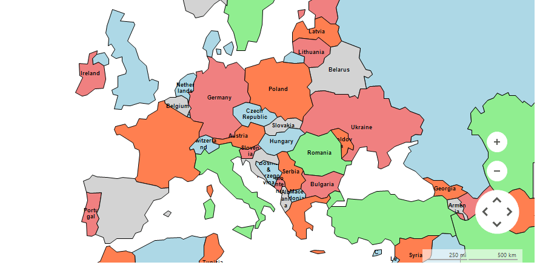
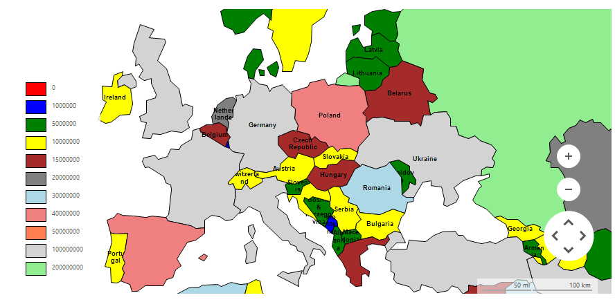
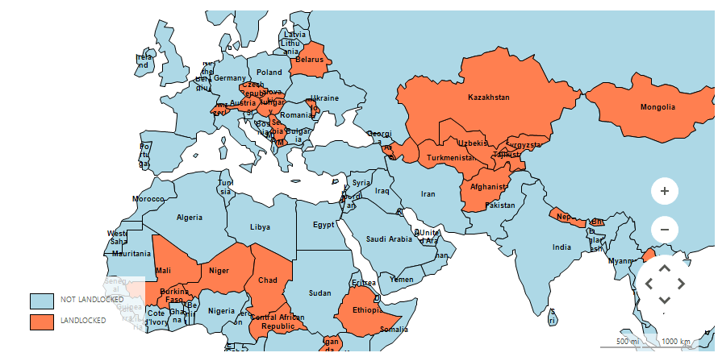

# Colorization

When used with a [shape]() file, the colorization feature of __RadMap__ allows the data objects to be easily colorized on the basis of a certain condition.

__RadMap__ utilizes three different colorization objects expecting a collection of colors which will be evaluated and assigned to the different shapes. 

* [GraphColorizationStrategy](#graph-colorization)
* [ChoroplethColorizationStrategy](#choropleth-colorization)
* [PropertyColorizationStrategy](#property-colorization)

## Graph Colorization

The __GraphColorizationStrategy__ internally arranges the predefined colors so that there are no shapes with the same color next to each other.

>caption Figure 1: Graph Colorization

#### Setting up GraphColorizationStrategy

<snippet id='map-mapcolorizers-setupgraphcolorizationstrategy-cs' />
<snippet id='map-mapcolorizers-setupgraphcolorizationstrategy-vb' />

## Choropleth Colorization

The __ChoroplethColorizationStrategy__ arranges the predefined colors according to a collection range stops against which each of the shape objects will be evaluated.

>caption Figure 2: Choropleth Colorization

#### Setting up ChoroplethColorizationStrategy

<snippet id='map-mapcolorizers-setupchoroplethcolorizationstrategy-cs' />
<snippet id='map-mapcolorizers-setupchoroplethcolorizationstrategy-vb' />

## Property Colorization

>caption Figure 3: Property Colorization

The __PropertyColorizationStrategy__ evaluates the values of a certain property defined in the shape file. Depending on the result the engine assigns one of the predefined colors.

#### Setting up PropertyColorizationStrategy

<snippet id='map-mapcolorizers-setuppropertycolorizationstrategy-cs' />
<snippet id='map-mapcolorizers-setuppropertycolorizationstrategy-vb' />

Here is the required code to setup the provider and read the [sample shape file](http://www.telerik.com/docs/default-source/ui-for-winforms/world_data.zip?sfvrsn=2) used in the examples above. 

#### Setting up EmptyMapProvider

<snippet id='map-mapcolorizers-setupprovider-cs' />
<snippet id='map-mapcolorizers-setupprovider-vb' />

#### Setting up Layer

<snippet id='map-mapcolorizers-setuplayer-cs' />
<snippet id='map-mapcolorizers-setuplayer-vb' />

#### Setting up Data

<snippet id='map-mapcolorizers-setupdata-cs' />
<snippet id='map-mapcolorizers-setupdata-vb' />

# See Also

* [Layers Overview]()
* [ESRI Shapefile Reader]()
* [Clusterization]()
 
