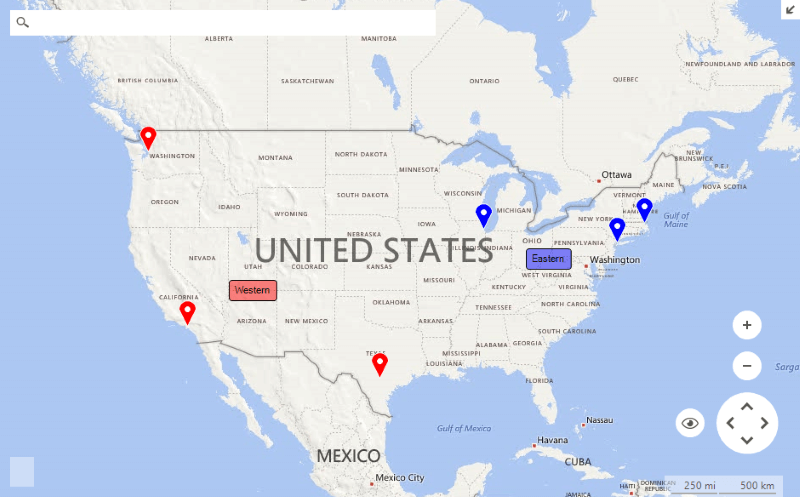

# Layers Overview

Layers provide an easy way to present meaningful information to the end user. A __RadMap__ control may have many layers each responsible for a different part of the presentation logic. The layer object represents a collection holding __MapVisualElements__. The __RadMap.Layers__ property is responsible for exposing the layers allowing easy access and manipulation.

>caption Figure 1: Map Layers 

The example below  uses the [BingRestMapProvider]() and adds pin and label elements to a couple of layers defined within the __RadMap__ control.

#### Setup Layers

<snippet id='map-maplayers-setuplayers-cs' />
<snippet id='map-maplayers-setuplayers-vb' />

#### Setup Data

<snippet id='map-maplayers-setupdata-cs' />
<snippet id='map-maplayers-setupdata-vb' />

# See Also

* [Colorization]()
* [Clusterization]()
