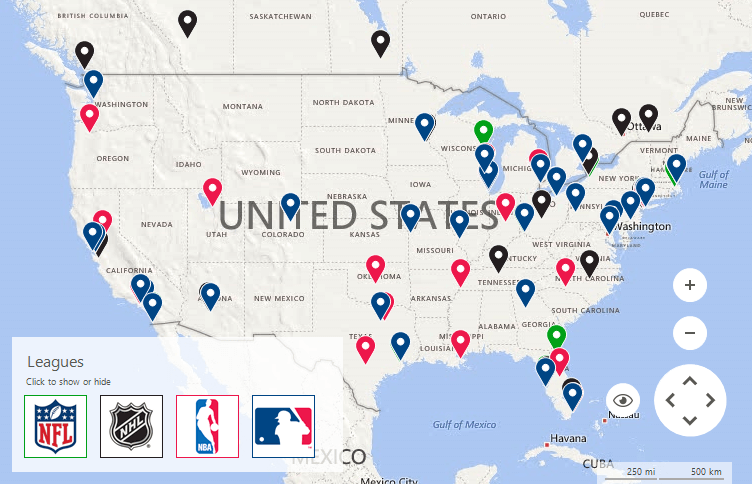
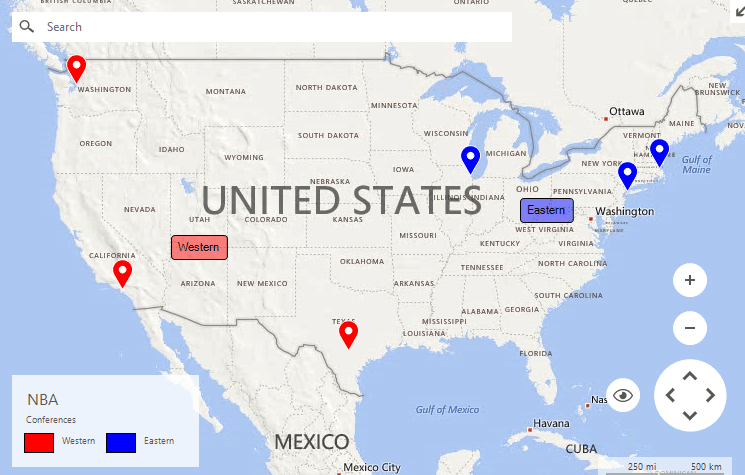

# Legend

The __RadMap__ control introduces the __MapLegendElement__ object. It allows displaying a legend for a particular layer inside the control.

>caption Figure 1: Map Legend



# Setup Legends

Legend items can be added by accessing the __Children__ collection of the legend stack element. The code fragment below extends the [Layers Overview]() example by adding two legends.

>caption Figure 2: Setup Legends



#### Customizing Appearance

{{source=..\SamplesCS\Map\MapLayers.cs region=SetLegends}} 
{{source=..\SamplesVB\Map\MapLayers.vb region=SetLegends}}
````C#
this.radMap1.MapElement.LegendElement.TitleElement.Text = "NBA";
this.radMap1.MapElement.LegendElement.SubtitleElement.Text = "Conferences";
this.radMap1.MapElement.LegendElement.Orientation = Orientation.Horizontal;
this.radMap1.MapElement.LegendElement.ItemStackElement.Children.Add(new MapLegendItemElement("Western", Color.Red));
this.radMap1.MapElement.LegendElement.ItemStackElement.Children.Add(new MapLegendItemElement("Eastern", Color.Blue));

````
````VB.NET
Me.RadMap1.MapElement.LegendElement.TitleElement.Text = "NBA"
Me.RadMap1.MapElement.LegendElement.SubtitleElement.Text = "Conferences"
Me.RadMap1.MapElement.LegendElement.Orientation = Orientation.Horizontal
Me.RadMap1.MapElement.LegendElement.ItemStackElement.Children.Add(New MapLegendItemElement("Western", Color.Red))
Me.RadMap1.MapElement.LegendElement.ItemStackElement.Children.Add(New MapLegendItemElement("Eastern", Color.Blue))

````


{{endregion}}

# See Also

* [Layers Overview]()
* [Mini Map]()
* [Navigation Controls]()
* [Scale Indicators]()
* [Pan and Zoom]()