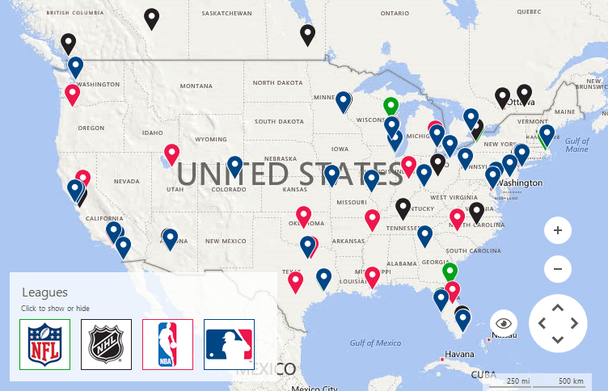
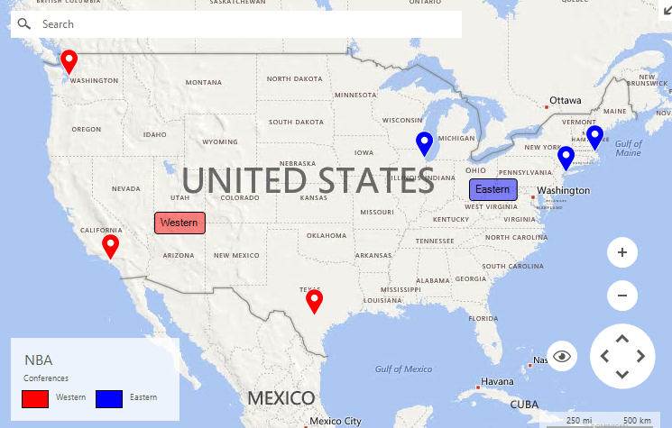

# Legend

The __RadMap__ control introduces the __MapLegendElement__ object. It allows displaying a legend for a particular layer inside the control.

>caption Figure 1: Map Legend

## Setup Legends

Legend items can be added by accessing the __Children__ collection of the legend stack element. The code fragment below extends the [Layers Overview]() example by adding two legends.

>caption Figure 2: Setup Legends

#### Customizing Appearance

<snippet id='map-maplayers-setlegends-cs' />
<snippet id='map-maplayers-setlegends-vb' />

# See Also

* [Layers Overview]()
* [Mini Map]()
* [Navigation Controls]()
* [Scale Indicators]()
* [Pan and Zoom]()
