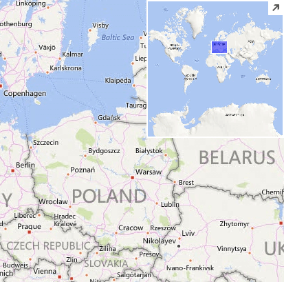
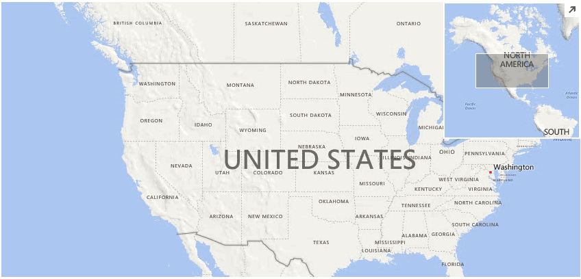

# Mini Map

The mini map feature is responsible for displaying a certain part of the world at a different zoom level compared to the main map control and thus allowing easier navigation. It is enabled by default and it is painted in the top right corner of the view port.

>caption Figure 1: MiniMap



The RadMap.__ShowMiniMap__ property is responsible for showing or hiding the mini map control.

#### Hide Mini Map

{{source=..\SamplesCS\Map\MapLayers.cs region=HideMiniMap}} 
{{source=..\SamplesVB\Map\MapLayers.vb region=HideMiniMap}}
````C#
this.radMap1.ShowMiniMap = false;

````
````VB.NET
Me.RadMap1.ShowMiniMap = False

````


{{endregion}}

The mini map can be also programmatically expanded or collapsed via its __IsCollapsed__ property or the __Expand__ and __Collapse__ methods.

#### Expand/Collapse

{{source=..\SamplesCS\Map\MapLayers.cs region=ExpandCollapse}} 
{{source=..\SamplesVB\Map\MapLayers.vb region=ExpandCollapse}}
````C#
if (this.radMap1.MapElement.MiniMapElement.IsCollapsed)
{
    this.radMap1.MapElement.MiniMapElement.Expand();
}
else
{
    this.radMap1.MapElement.MiniMapElement.Collapse();
}

````
````VB.NET
If Me.RadMap1.MapElement.MiniMapElement.IsCollapsed Then
    Me.RadMap1.MapElement.MiniMapElement.Expand()
Else
    Me.RadMap1.MapElement.MiniMapElement.Collapse()
End If

````


{{endregion}}


# Mini Map Modes

The mini map behavior can be altered by setting the __MiniMapMode__ property.

* __MiniMapMode__.*WholeWorld*: The mini map shows the whole world map.

>caption Figure 2: WholeWorld


* __MiniMapMode__.*StaticZoom*: The mini map will show a fixed zoom level at all times. Use the __BringIntoView__ method to position the map at the required location and zoom level.

>caption Figure 3: StaticZoom 


* __MiniMapMode__.*OffsetZoom*: The mini map will show a dynamic zoom level offset from the main map view. Use the __ZoomLevelOffset__ property to define the offset.

>caption Figure 4: OffsetZoom 



The __MiniMapElement__ can be easily accessed via the RadMap.__MapElement__ object. The table below lists the exposed properties and methods.

# Properties

|Property|Description|
|------|------|
|__MapElement__|Gets the map element.|
|__MiniMapMode__|Gets or sets the mini map mode.|
|__ZoomLevel__|Gets or sets the current zoom level.|
|__ZoomOffset__|Gets or sets the zoom offset. This property is used when the MiniMapMode is set to OffsetZoom.|
|__ToggleMiniMapButton__|Gets the toggle mini map button.|
|__MiniMapSize__|Gets or sets the size of the mini map.|
|__IsCollapsed__|Gets or sets a value indicating whether this instance is collapsed.|
|__ViewportControlBackColor__|Gets or sets the back color of the view port control.|
|__ViewportControlBorderColor__|Gets or sets the border color of the view port control.|

# Methods

|Method|Description|
|------|------|
|__Collapse__|Collapses the mini map.|
|__Expand__|Expands the mini map.|

# See Also

* [Layers Overview]()
* [Navigation Controls]()
* [Scale Indicators]()
* [Legend]()
* [Pan and Zoom]()
