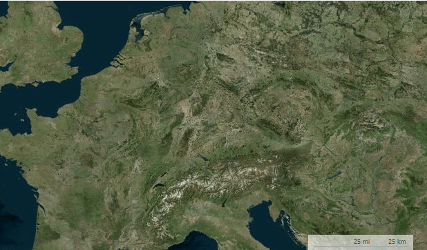
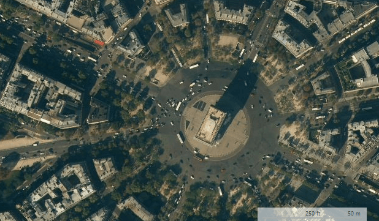
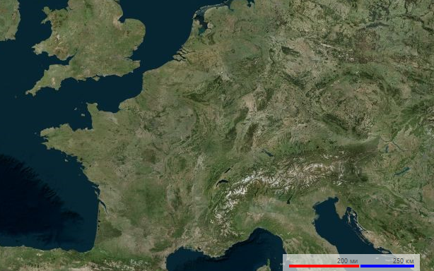

# Scale Indicators

The scale indicators use two measures - imperial and metric. Depending on the scale of the view port the indicators have two modes showing miles and kilometers or feet and meters.

>caption Figure 1: Large Scale

>caption Figure 2: Small Scale

# Customizing Appearance

The scaling indicators expose several properties allowing modification of the way the element is painted.

>caption Figure 3: Custom Text, Color and Bar Height 

#### Customizing Appearance

<snippet id='map-maplayers-customizescalingindicators-cs' />
<snippet id='map-maplayers-customizescalingindicators-vb' />

# See Also

* [Layers Overview]()
* [Mini Map]()
* [Navigation Controls]()
* [Legend]()
* [Pan and Zoom]()
