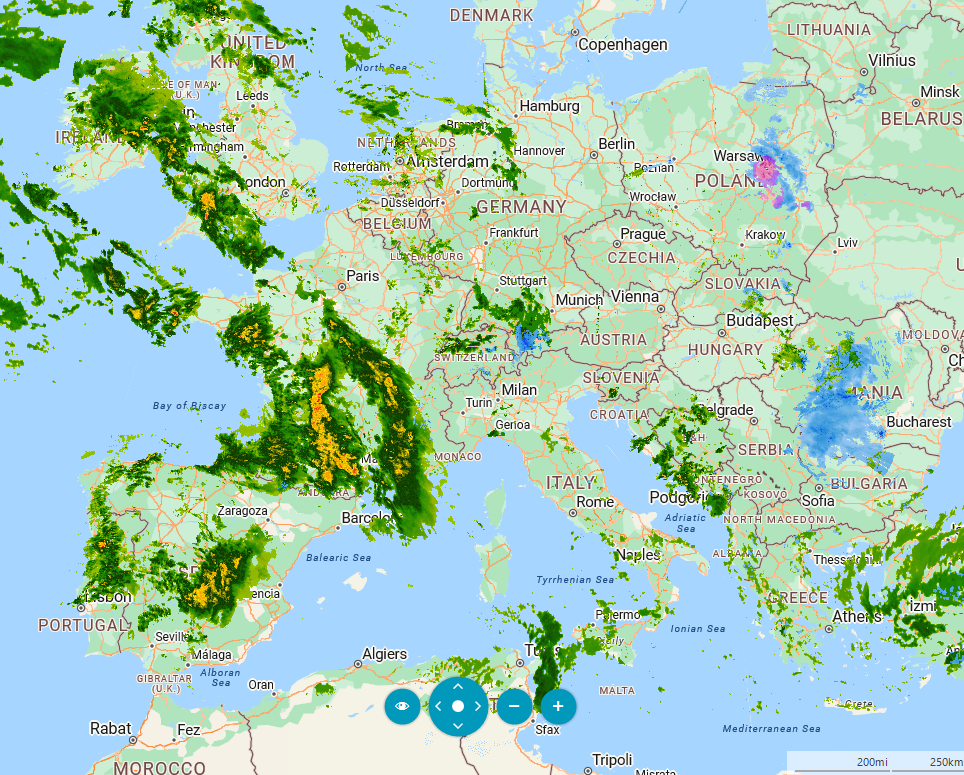

# Transparency Tiles

All RadMap tile providers support transparency configuration for map tiles through the `EnableTransparency` property in the `MapTileProviderSettings` class.

## EnableTransparency Property

The `EnableTransparency` property is a boolean setting that controls whether transparent tile rendering is enabled for the map provider. This property is part of the `MapTileProviderSettings` class and affects how tiles are rendered on the map.

>tip The default value of the Settings.EnableTransparency property is set to false.

````C#

AzureMapProvider azureProvider = new AzureMapProvider();
azureProvider.Settings.EnableTransparency = true;

BingRestMapProvider bingProvider = new BingRestMapProvider();
bingProvider.Settings.EnableTransparency = true;

OpenStreetMapProvider osmProvider = new OpenStreetMapProvider();
osmProvider.Settings.EnableTransparency = true;

````
````VB.NET

Dim azureProvider As AzureMapProvider = New AzureMapProvider()
azureProvider.Settings.EnableTransparency = True

Dim bingProvider As BingRestMapProvider = New BingRestMapProvider()
bingProvider.Settings.EnableTransparency = True

Dim osmProvider As OpenStreetMapProvider = New OpenStreetMapProvider()
osmProvider.Settings.EnableTransparency = True

```` 


When `EnableTransparency` is set to __true__ it enables transparent rendering of map tiles. This allows tiles to be rendered with transparency support, which can be useful when overlaying multiple map layers. In the following example, we will combine two AzureMapProviders. The first one will show the map, and the second one will show the weather.

````C#
private void SetupProviders()
{
    AzureMapProvider azureProvider = new AzureMapProvider();
    azureProvider.TileSetID = AzureTileSet.Road;
    azureProvider.AzureAPIKey = Properties.Resources.AzureKey;

    AzureMapProvider azureProviderWeather = new AzureMapProvider();
    azureProviderWeather.TileSetID = AzureTileSet.WeatherRadarMain;
    azureProviderWeather.AzureAPIKey = Properties.Resources.AzureKey;
    azureProviderWeather.Settings.EnableTransparency = true;

    this.radMap1.MapElement.Providers.Add(azureProvider);
    this.radMap1.MapElement.Providers.Add(azureProviderWeather);
}

````
````VB.NET

Private Sub SetupProviders()
    Dim azureProvider As AzureMapProvider = New AzureMapProvider()
    azureProvider.TileSetID = AzureTileSet.Road
    azureProvider.AzureAPIKey = Properties.Resources.AzureKey
	
    Dim azureProviderWeather As AzureMapProvider = New AzureMapProvider()
    azureProviderWeather.TileSetID = AzureTileSet.WeatherRadarMain
    azureProviderWeather.AzureAPIKey = Properties.Resources.AzureKey
    azureProviderWeather.Settings.EnableTransparency = True
	
    Me.radMap1.MapElement.Providers.Add(azureProvider)
    Me.radMap1.MapElement.Providers.Add(azureProviderWeather)
End Sub

```` 




