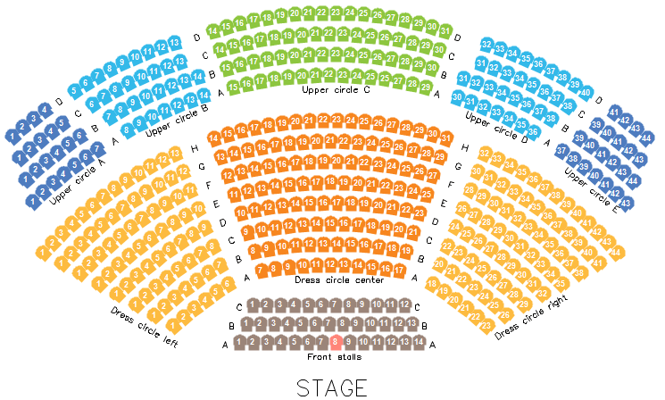

# ESRI Shapefile Reader

The ESRI Shapefiles or simply the shapefiles are popular format for storing geographical data. The files spatially describe geometries like lines, polylines and polygons. These geometries may represent different geographical objects such as countries, roads, rivers, lakes etc. Via a software that supports the format, the geometries can be translated properly on a map.

>caption Figure 1: ESRI Shapefile Reader 



To read your data you have to use a __ShapeFileReader__ which reads __ShapeFileReaderParameters__ where the __ShapeStream__ and __DbfStream__ are stored.

You can find the shape file for this example in our [demo application]().

#### Using ShapeFileReader

{{source=..\SamplesCS\Map\MapFileReaders.cs region=SetupESRIShapeReader}} 
{{source=..\SamplesVB\Map\MapFileReaders.vb region=SetupESRIShapeReader}}

````C#
        
private Font seatsFont = new Font("Arial", 7f, FontStyle.Bold);
    
public void SetupESRIShapeReader()
{
    MapLayer pinsLayer = new MapLayer("Hall Layout");
    this.radMap1.Layers.Add(pinsLayer);
    EmptyMapProvider emptyProvider = new EmptyMapProvider();
    emptyProvider.MinZoomLevel = 15;
    emptyProvider.MaxZoomLevel = 16;
    emptyProvider.InitializationComplete += emptyProvider_ESRIInitializationComplete;
    
    radMap1.Providers.Add(emptyProvider);
    using (MemoryStream seatsStream = new MemoryStream(Properties.Resources.theatre_seats_pol))
    {
        using (MemoryStream seatsDataStream = new MemoryStream(Properties.Resources.theatre_seats_pol_data))
        {
            using (MemoryStream aisleStream = new MemoryStream(Properties.Resources.theatre_aisle_labels))
            {
                ShapeFileReaderParameters parameters = new ShapeFileReaderParameters();
                parameters.ShapeStream = seatsStream;
                parameters.DbfStream = seatsDataStream;
                ShapeFileReader reader = new ShapeFileReader();
                List<MapVisualElement> elements = reader.Read(parameters);
                    
                foreach (MapGeometry element in elements)
                {
                    element.Font = this.seatsFont;
                    element.ForeColor = Color.White;
                    element.Text = "$[CAPTION]";
                    element.BackColor = Color.FromArgb(
                        Convert.ToInt32(element.ExtendedData.GetValue("RGB0")),
                        Convert.ToInt32(element.ExtendedData.GetValue("RGB1")),
                        Convert.ToInt32(element.ExtendedData.GetValue("RGB2")));
                    element.BorderWidth = 0;
                }
                
                this.radMap1.Layers["Hall Layout"].AddRange(elements);
                
                parameters = new ShapeFileReaderParameters();
                parameters.ShapeStream = aisleStream;
                elements = reader.Read(parameters);
                this.radMap1.Layers["Hall Layout"].AddRange(elements);
            }
        }
    }
}
    
private void emptyProvider_ESRIInitializationComplete(object sender, EventArgs e)
{
    List<Telerik.WinControls.UI.Map.PointG> locations = new List<Telerik.WinControls.UI.Map.PointG>();
        
    foreach (MapVisualElement el in this.radMap1.Layers["Hall Layout"].Overlays)
    {
        locations.Add(el.Location);
    }
        
    this.radMap1.BringIntoView(Telerik.WinControls.UI.Map.RectangleG.GetBoundingRectangle(locations));
}

````
````VB.NET
Private seatsFont As New Font("Arial", 7.0F, FontStyle.Bold)
Public Sub SetupESRIShapeReader()
    Dim pinsLayer As New MapLayer("Hall Layout")
    Me.radMap1.Layers.Add(pinsLayer)
    Dim emptyProvider As New EmptyMapProvider()
    emptyProvider.MinZoomLevel = 15
    emptyProvider.MaxZoomLevel = 16
    AddHandler emptyProvider.InitializationComplete, AddressOf emptyProvider_ESRIInitializationComplete
    radMap1.Providers.Add(emptyProvider)
    Using seatsStream As New MemoryStream(My.Resources.theatre_seats_pol)
        Using seatsDataStream As New MemoryStream(My.Resources.theatre_seats_pol_data)
            Using aisleStream As New MemoryStream(My.Resources.theatre_aisle_labels)
                Dim parameters As New ShapeFileReaderParameters()
                parameters.ShapeStream = seatsStream
                parameters.DbfStream = seatsDataStream
                Dim reader As New ShapeFileReader()
                Dim elements As List(Of MapVisualElement) = reader.Read(parameters)
                For Each element As MapGeometry In elements
                    element.Font = Me.seatsFont
                    element.ForeColor = Color.White
                    element.Text = "$[CAPTION]"
                    element.BackColor = Color.FromArgb(Convert.ToInt32(element.ExtendedData.GetValue("RGB0")), _
                                                       Convert.ToInt32(element.ExtendedData.GetValue("RGB1")), Convert.ToInt32(element.ExtendedData.GetValue("RGB2")))
                    element.BorderWidth = 0
                Next
                Me.radMap1.Layers("Hall Layout").AddRange(elements)
                parameters = New ShapeFileReaderParameters()
                parameters.ShapeStream = aisleStream
                elements = reader.Read(parameters)
                Me.radMap1.Layers("Hall Layout").AddRange(elements)
            End Using
        End Using
    End Using
End Sub
Private Sub emptyProvider_ESRIInitializationComplete(sender As Object, e As EventArgs)
    Dim locations As New List(Of Telerik.WinControls.UI.Map.PointG)()
    For Each el As MapVisualElement In Me.radMap1.Layers("Hall Layout").Overlays
        locations.Add(el.Location)
    Next
    Me.radMap1.BringIntoView(Telerik.WinControls.UI.Map.RectangleG.GetBoundingRectangle(locations))
End Sub

````

{{endregion}} 

# See Also
* [Shapefile](https://en.wikipedia.org/wiki/Shapefile)

 