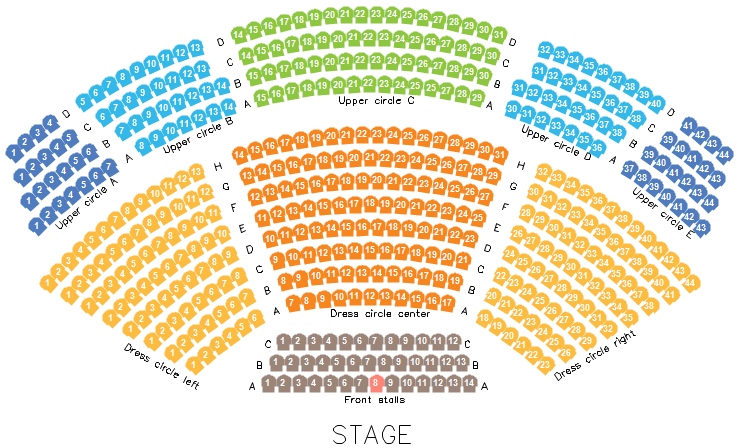

# ESRI Shapefile Reader

The ESRI Shapefiles or simply the shapefiles are popular format for storing geographical data. The files spatially describe geometries like lines, polylines and polygons. These geometries may represent different geographical objects such as countries, roads, rivers, lakes etc. Via a software that supports the format, the geometries can be translated properly on a map.

>caption Figure 1: ESRI Shapefile Reader 

To read your data you have to use a __ShapeFileReader__ which reads __ShapeFileReaderParameters__ where the __ShapeStream__ and __DbfStream__ are stored.

You can find the shape file for this example in our [demo application](https://telerik-winforms-demos.s3.amazonaws.com/TelerikWinFormsExamplesLauncher.exe).

#### Using ShapeFileReader

<snippet id='map-mapfilereaders-setupesrishapereader-cs' />
<snippet id='map-mapfilereaders-setupesrishapereader-vb' />

# See Also
* [Shapefile](https://en.wikipedia.org/wiki/Shapefile)

 
