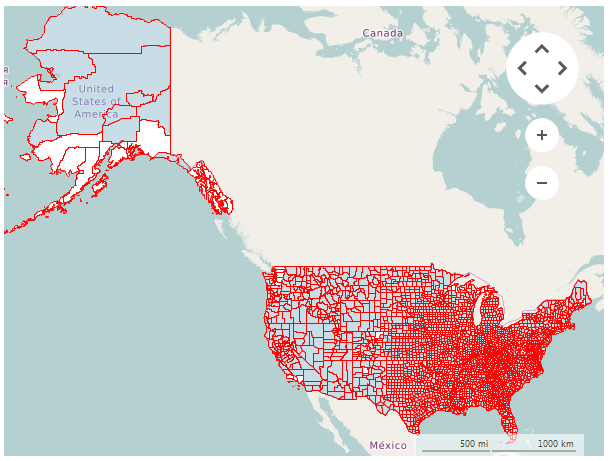

# KML Reader

__RadMap__ provides support for stunning map overlays through its KML-import feature. Once you have the desired set of features (place marks, images, polygons, textual descriptions, etc.) encoded in KML, you can easily import the data and visualize it through the __RadMap__ control. In this way you can easily visualize complex shapes like country's borders on the map and fill the separate shapes with different colors in order to achieve a sort of grouping.

>caption Figure 1: KML Reader

To read your data you have to use a __KmlReader__.

#### Using KmlReader

<snippet id='map-mapfilereaders-setupkmlreader-cs' />
<snippet id='map-mapfilereaders-setupkmlreader-vb' />

# Using local images

The __KmlReader__ supports loading images from a local folder. The KmlReader class has two static properties that controls this functionality:

* __UseLocalImages:__ A boolean property which enables the local image loading.
* __LocalImagesFolder:__ The folder that contains all images. 

# See Also
* [KML](https://developers.google.com/kml/documentation/?csw=1)

 

 
