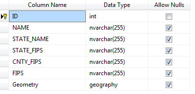

# SQL Geospatial Reader

__SqlGeospatialDataReader__ allows generating map shapes from any IEnumerable instance (for example a row collection) which contains a property with geospatial data in *Wkt* (Well known text) or *Wkb* (Well known binary) format. The __Source__ property and the __GeospatialPropertyName__ property are used to specify the IEnumerable instance and the name of the property which contains Geospatial data.

>caption Figure 1: SQL Geospatial Reader


#### Using SqlGeospatialDataReader

{{source=..\SamplesCS\Map\MapFileReaders.cs region=SetupSQLGeospatialReader}} 
{{source=..\SamplesVB\Map\MapFileReaders.vb region=SetupSQLGeospatialReader}}

````C#
            
OpenStreetMapProvider osmProvider = new OpenStreetMapProvider();
this.radMap1.Providers.Add(osmProvider);
MapLayer layer = new MapLayer("Capitals");
this.radMap1.Layers.Add(layer);
            
BindingSource source = new BindingSource();
source.DataSource = dt;
            
SqlGeospatialDataReader datareader = new SqlGeospatialDataReader();
datareader.Source = source;
datareader.GeospatialPropertyName = "Geometry";
            
List<MapVisualElement> elements = datareader.Read(source, "Geometry", true, null);
foreach (var item in elements)
{
    item.BorderColor = Color.YellowGreen;
}
            
this.radMap1.Layers["Capitals"].AddRange(elements);

````
````VB.NET
Dim osmProvider As New OpenStreetMapProvider()
Me.radMap1.Providers.Add(osmProvider)
Dim layer As New MapLayer("Capitals")
Me.radMap1.Layers.Add(layer)
Dim source As New BindingSource()
source.DataSource = dt
Dim datareader As New SqlGeospatialDataReader()
datareader.Source = source
datareader.GeospatialPropertyName = "Geometry"
Dim elements As List(Of MapVisualElement) = datareader.Read(source, "Geometry", True, Nothing)
For Each item As MapVisualElement In elements
    item.BorderColor = Color.YellowGreen
Next
Me.radMap1.Layers("Capitals").AddRange(elements)

````

{{endregion}} 

>caption Figure 2: Sample data table



 
