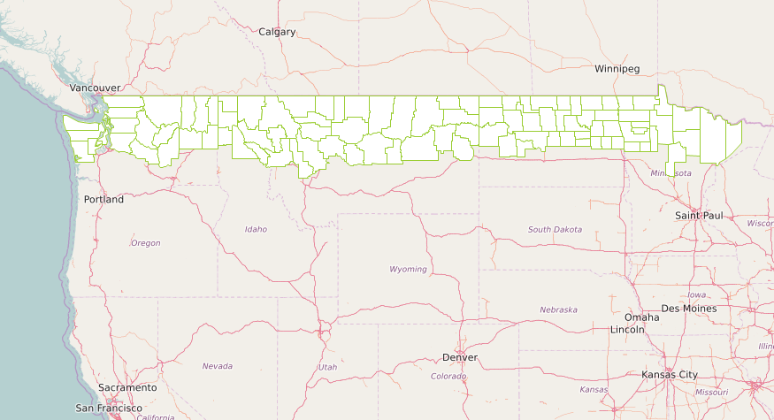
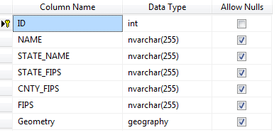

# SQL Geospatial Reader

__SqlGeospatialDataReader__ allows generating map shapes from any IEnumerable instance (for example a row collection) which contains a property with geospatial data in *Wkt* (Well known text) or *Wkb* (Well known binary) format. The __Source__ property and the __GeospatialPropertyName__ property are used to specify the IEnumerable instance and the name of the property which contains Geospatial data.

>caption Figure 1: SQL Geospatial Reader

#### Using SqlGeospatialDataReader

<snippet id='map-mapfilereaders-setupsqlgeospatialreader-cs' />
<snippet id='map-mapfilereaders-setupsqlgeospatialreader-vb' />

>caption Figure 2: Sample Data Table

 
