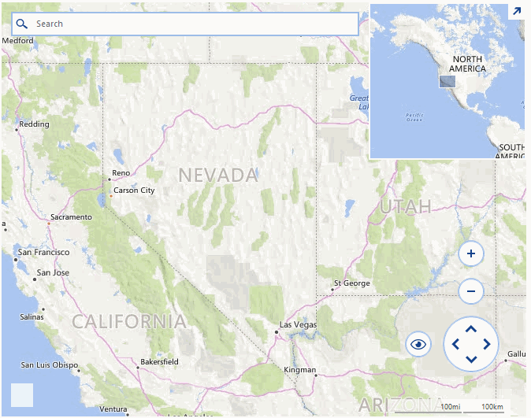

# Drawing Markers and Regions

>important Please note that [Bing Maps](https://www.bingmapsportal.com/) __will be deprecated effective June 30, 2025__. As an alternative, users can refer to the [SDK example available in our GitHub repository](https://github.com/telerik/winforms-sdk/tree/master/Map/Custom%20Azure%20Provider), which demonstrates how to create a __custom provider__ using the __Azure Maps API__. A __valid Azure Maps subscription key__ is required to use this functionality.

A common requirement for applications utilizing a map control is to allow the end users add pins on the map and draw regions on it. **RadMap** exposes the necessary API and it can be easily extended with such functionalities. The example in this how-to article will handle a scenario in which pins are being added on the map after double clicking on it. As soon as the count of the markers increases to three so that they form a figure a region will be created. 

>caption Figure 1: RadMap Pins and Regions 

**RadMap** is handling the mouse, keyboard, and gestures by a special input behavior class. This class can be inherited and further extended to handle custom scenarios. In our example we will override its **OnDoubleClick** method and execute our special logic for adding the pins and the regions. The custom provider class can be assigned to the map by simply setting its **InputBehavior** property.

>note This example uses the **BingRestMapProvider** and the control is initially setup according to [this]() article.

#### Setup Provider

<snippet id='map-drawregionsform-setupprovider-cs' />
<snippet id='map-drawregionsform-setupprovider-vb' />

In our custom implementation, we will add pins as long as their count is less than three, from then on each double click on the map while holding the *Ctrl* key will result in drawing a region enclosing all of the added points. 

#### CustomMapInputBehavior Implementation

<snippet id='map-drawregionsform-custommapinputbehaviorimplementation-cs' />
<snippet id='map-drawregionsform-custommapinputbehaviorimplementation-vb' />

# See Also

* [Layers]()
* [BingRestMapProvider]()
* [How to Create Rectangle and Ellipse Shapes in RadMap]()
