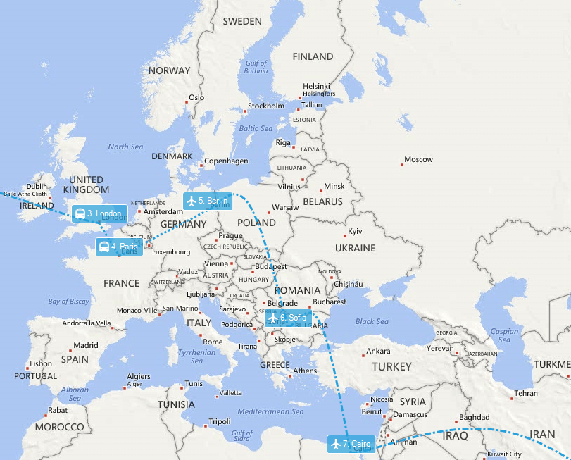
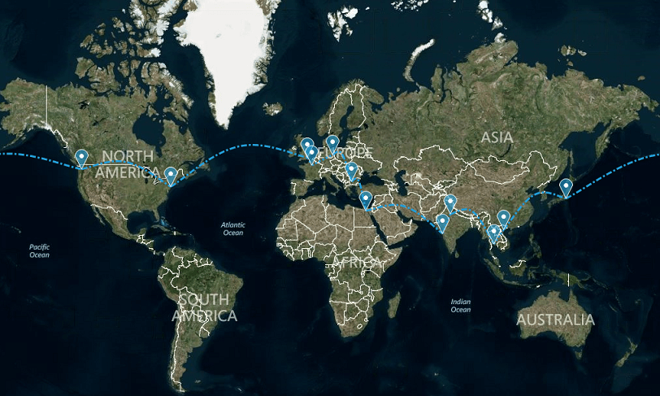

# Map

__RadMap__ can visualize tile data from the [Bing Maps](https://www.bingmapsportal.com/) and the [OpenStreetMaps](http://wiki.openstreetmap.org/wiki/API) REST services as well as from the local file system. 





# Key Features

* Pan and Zoom
* Bing Maps and OpenStreetMaps imagery services
* Bing Maps Search, Route and Elevation services
* Layers
* Visualizes data from ESRI shapefiles, KML files and SQL Geospatial data
* Clusterization
* Colorization
* Navigation bar
* Search bar
* Scale indicator
* Mini map
* Legend
* Built-in pins, callouts, routes, air routes, labels, paths

>important RadMap control does not license right of use to any map provider. You must obtain and/or follow the licensing requirements set forth by each map provider. 
>

# See Also 
* [Structure]()
* [Getting Started]()
