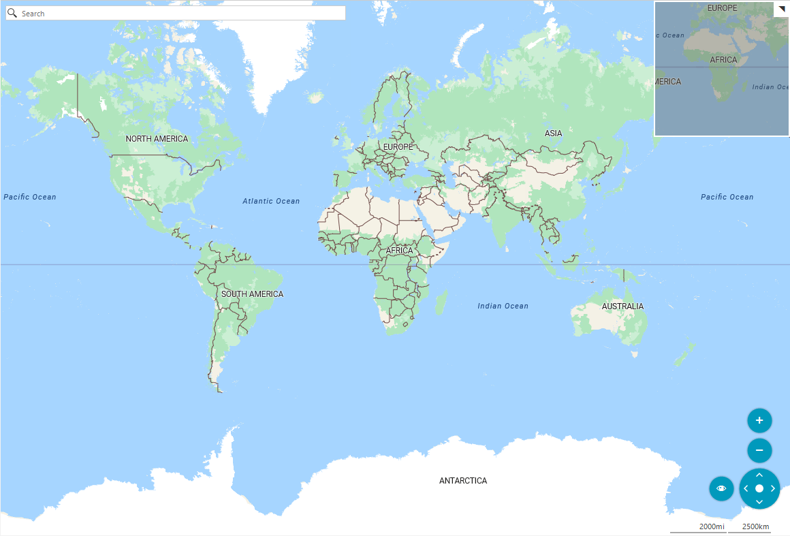
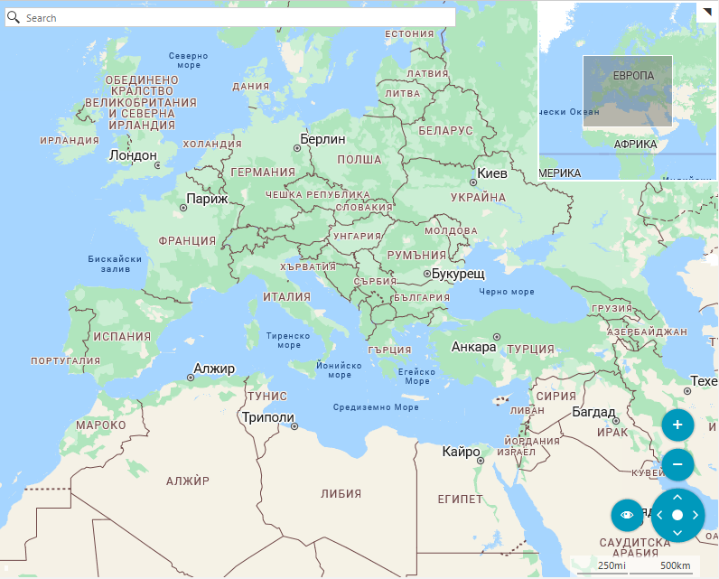

# Azure Map Provider

The RadMap control supports visualizing tile data using the Azure Maps services. This is done via the AzureMapProvider class. This provider supports both raster and vector sources.

>important The AzureMapProvider class is introduced with the Q3 2025 official version of our controls.

 

## Setting the AzureMapProvider

To use this provider, create a new AzureMapProvider instance and add it to the `Providers` collection of the RadMap control. After that, you will need to set the subscription key of the user's Azure account to the `AzureAPIKey` property of the AzureMapProvider instance. To obtain a key, you can review the [Manage authentication in Azure Maps](https://learn.microsoft.com/en-gb/azure/azure-maps/how-to-manage-authentication#view-authentication-details/) article.

#### Using AzureMapProvider

````C#

string cacheFolder = @"..\..\cache";
AzureMapProvider provider = new AzureMapProvider();
provider.TileSetID = AzureTileSet.Road;
provider.AzureAPIKey = AzureAPIKey;            
LocalFileCacheProvider cache = new LocalFileCacheProvider(cacheFolder);
provider.CacheProvider = cache;
this.radMap1.Providers.Add(provider);

````
````VB.NET

Dim cacheFolder As String = "..\..\cache"
Dim provider As New AzureMapProvider()
provider.TileSetID = AzureTileSet.Road
provider.AzureAPIKey = AzureAPIKey
Dim cache As New LocalFileCacheProvider(cacheFolder)
provider.CacheProvider = cache
Me.radMap1.Providers.Add(provider)

````

{{endregion}} 


## Language

The Azure Maps services provide a culture parameter in its URL address and the AzureMapProvider allows you to utilize it. To do so, set the `LanguageCulture` property to the desired culture string.

````C#

provider.LanguageCulture = new CultureInfo("bg-BG");

````
````VB.NET

provider.LanguageCulture = new CultureInfo("bg-BG")

````

 


## Azure API Version

The AzureMapProvider provides the functionality to specify the [Render](https://learn.microsoft.com/en-us/rest/api/maps/render?view=rest-maps-2025-01-01) Rest API version of the Azure Maps services. This is done via the `AzureAPIVersion` property of the provider. The lastest version of the Render Rest API is __2024-04-01__ and the AzureMapProvider uses it.


