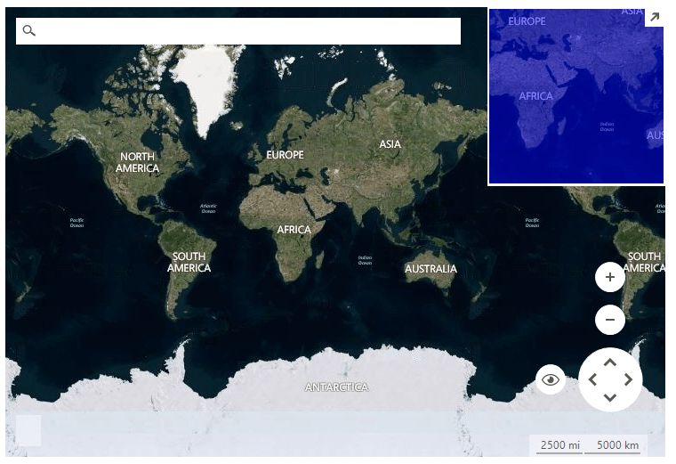
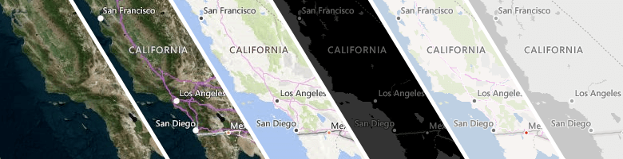

# BingRestMapProvider

__RadMap__ can visualize tile data from the [Bing Maps](https://www.bingmapsportal.com/) REST service. You can enable tile caching to a local folder by setting a new __LocalFileCacheProvider__ to the BingRestMapProvider.__CacheProvider__ property.

>caption Figure 1: BingRestMapProvider 



>note You must provide a Bing Maps Key to the provider for it to work. To get your free Bing Maps Key, please refer to the following link: [Getting a Bing Maps Key](https://msdn.microsoft.com/en-us/library/ff428642.aspx).

>note Only billable transactions count towards the free-use limits for Basic keys, and Enterprise keys are only charged for billable transactions. Non-billable transactions do not incur charges and do not count towards free-use limits. You can find additional information in the following link:  [Billable versus non-billable transactions](https://msdn.microsoft.com/en-us/library/ff859477.aspx).

#### Using BingRestMapProvider

{{source=..\SamplesCS\Map\MapGettingStarted.cs region=GettingStarted}} 
{{source=..\SamplesVB\Map\MapGettingStarted.vb region=GettingStarted}}

````C#
string cacheFolder = @"..\..\cache";
BingRestMapProvider bingProvider = new Telerik.WinControls.UI.BingRestMapProvider();
bingProvider.UseSession = true;
bingProvider.BingKey = bingKey;
LocalFileCacheProvider cache = new LocalFileCacheProvider(cacheFolder);
bingProvider.CacheProvider = cache;
this.radMap1.Providers.Add(bingProvider);

````
````VB.NET
Dim cacheFolder As String = "..\..\cache"
Dim bingProvider As BingRestMapProvider = New Telerik.WinControls.UI.BingRestMapProvider()
bingProvider.UseSession = True
bingProvider.BingKey = bingKey
Dim cache As New LocalFileCacheProvider(cacheFolder)
bingProvider.CacheProvider = cache
Me.radMap1.Providers.Add(bingProvider)

````

{{endregion}} 

>note If you use __RadMap__ with .Net Framework 2.0 and you don't have an installation of the Telerik UI for WinForms suite on the current machine, it is necessary to add a reference to the Newtonsoft.Json assembly which can be found in the \Bin folder of the *Telerik_UI_For_WinForms_[version]_Dev_dlls.zip*. If you are using .Net Framework 4.0 this is not required.

# Properties

|Property|Description|
|----|----|
|__BingKey__|Gets or sets the Bing key.|
|__UseSession__|Gets or sets a value indicating whether to use session key.|
|__SessionId__|Gets the session identifier.|
|__ImagerySet__|Gets or sets the imagery set. The possible values are: *Aerial*, *AerialWithLabels*, *AerialWithLabelsOnDemand*,*Road*, *RoadOnDemand*, *CanvasDark*, *CanvasLight*, *CanvasGray*, *OrdnanceSurvey*. |
|__Initializing__|Gets or sets a value indicating whether this __BingRestMapProvider__ is currently in the initialization process.|
|__Initialized__|Gets or sets a value indicating whether this __BingRestMapProvider__ is initialized.|
|__MaxZoomLevel__|Gets or sets the maximum zoom level.|
|__MinZoomLevel__|Gets or sets the minimum zoom level.|
|__TileSize__|Gets the tile size.|
|__CacheProvider__|Gets or sets the provider used for data caching.|
|__EnableCaching__|Gets or set a value whether the caching is enabled.|
|__TileDownloader__|Gets or sets the tile downloader.|

>note The **ImagerySet**.*OrdnanceSurvey* is only visible in the Great Britain area and in between zoom levels of 10 and 17. 

# Methods 

|Method|Description|
|----|----|
|__Initialize__|Initializes this provider.|
|__GetTile__|Gets the tile uri.|
|__GetTileImage__|Gets the tile image.|
|__CalculateRouteAsync__|Calculates the route asynchronously.|
|__SearchAsync__|Performs search request asynchronously.|
|__CalculateElevationAsync__|Calculates the elevation asynchronously.|
|__GetSupportedViews__|Gets the supported views. BingRestMapProvider supports *Aerial* and *Road* MapViewInfo.|
|__SetView__|Sets the view in the BingRestMapProvider.|

# Events

|Event|Description|
|----|----|
|__InitializationComplete__|Fires when the initialization is completed.|
|__InitializationError__|Fires when an error during the initialization occurs.|
|__ProviderUpdated__|Fires when the provider has been updated, e.g. when a tile is downloaded.|
|__CalculateRouteCompleted__|Fires when the route calculation is completed.|
|__CalculateRouteError__|Fires when an error occurs during route calculating.|
|__SearchCompleted__|Fires when the search request has completed.|
|__SearchError__|Fires when an error|
|__CalculateElevationCompleted__|Fires when the elevation calculations is completed.|
|__CalculateElevationError__|Fire when an error occurs duriong elevation calculating.|


# See Also
* [Search]()
* [Route]()
* [Elevation]()
