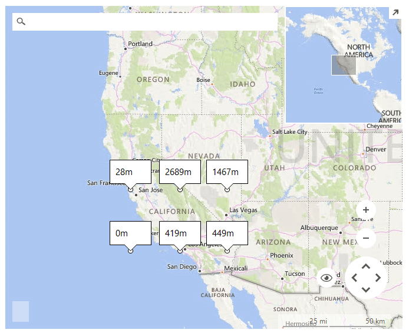

# Bounds ElevationType

ElevationType.*Bounds* __ElevationRequest__ gets elevations at equally-spaced locations within an area on the Earth defined as a bounding box.

>caption Figure 1: Bounds ElevationRequest 



#### Bounds ElevationType request

{{source=..\SamplesCS\Map\BingProvider.cs region=BoundsElevationRequest}} 
{{source=..\SamplesVB\Map\BingProvider.vb region=BoundsElevationRequest}}

````C#
ElevationRequest boundsRequest = new ElevationRequest();
        
public void SetupElevationRequest()
{
    //add pins to the map 
    Telerik.WinControls.UI.Map.PointG point1 = new Telerik.WinControls.UI.Map.PointG(36.114647, -115.172813);
    Telerik.WinControls.UI.Map.PointG point2 = new Telerik.WinControls.UI.Map.PointG(34.05223, -118.24368);
    Telerik.WinControls.UI.Map.PointG point3 = new Telerik.WinControls.UI.Map.PointG(37.77493, -122.41942);
    MapPin pin1 = new MapPin(point1);
    MapPin pin2 = new MapPin(point2);
    MapPin pin3 = new MapPin(point3);
    
    MapLayer pinsLayer = new MapLayer("Pins");
    this.radMap1.Layers.Add(pinsLayer);
    
    MapLayer calloutsLayer = new MapLayer("Callouts");
    this.radMap1.Layers.Add(calloutsLayer);
    this.radMap1.Layers["Pins"].Add(pin1);
    this.radMap1.Layers["Pins"].Add(pin2);
    this.radMap1.Layers["Pins"].Add(pin3);
    
    boundsRequest.ElevationType = ElevationType.Bounds;
    boundsRequest.Bounds = Telerik.WinControls.UI.Map.RectangleG.GetBoundingRectangle(new List<Telerik.WinControls.UI.Map.PointG>()
    {
        point1,
        point2,
        point3
    });
    boundsRequest.Rows = 2;
    boundsRequest.Columns = 3;
    
    BingRestMapProvider bingProvider = this.radMap1.Providers[0] as BingRestMapProvider;
    bingProvider.CalculateElevationCompleted += BingProviderBounds_CalculateBoundsElevationCompleted;
    bingProvider.CalculateElevationAsync(boundsRequest);
}
        
private void BingProviderBounds_CalculateBoundsElevationCompleted(object sender, ElevationCompletedEventArgs e)
{
    List<Telerik.WinControls.UI.Map.PointG> points = new List<Telerik.WinControls.UI.Map.PointG>();
    
    for (int i = 0; i < this.radMap1.Layers["Pins"].Overlays.Count; i++)
    {
        MapPin pin = this.radMap1.Layers["Pins"].Overlays[i] as MapPin;
        
        if (pin != null)
        {
            points.Add(pin.Location);
        }
    }
    this.radMap1.Layers["Pins"].Clear();
    
    Telerik.WinControls.UI.Map.RectangleG rect = Telerik.WinControls.UI.Map.RectangleG.GetBoundingRectangle(points);
    Telerik.WinControls.UI.Map.PointG[,] p = this.CalculateEquidistantPointsInRectangle(rect, this.radMap1.MapElement.ZoomLevel,
        boundsRequest.Rows, boundsRequest.Columns);
    
    int rows = p.GetLength(0);
    int flatIndex = 0;
    
    for (int i = p.GetLength(0) - 1; i >= 0; i--)
    {
        for (int j = 0; j < p.GetLength(1); j++)
        {
            MapPoint point = new MapPoint(p[i, j]);
            this.radMap1.Layers["Callouts"].Add(point);
            
            MapCallout callout = new MapCallout(point);
            callout.MaxWidth = 50;
            callout.Text = e.Elevations[0].Elevations[flatIndex++].ToString() + "m";
            this.radMap1.Layers["Callouts"].Add(callout);
        }
    }
}
        
private Telerik.WinControls.UI.Map.PointG[,] CalculateEquidistantPointsInRectangle(Telerik.WinControls.UI.Map.RectangleG rect, int zoomLevel, int rows, int columns)
{
    Telerik.WinControls.UI.Map.PointL topLeft = MapTileSystemHelper.LatLongToPixelXY(rect.North, rect.West, zoomLevel);
    Telerik.WinControls.UI.Map.PointL bottomRight = MapTileSystemHelper.LatLongToPixelXY(rect.South, rect.East, zoomLevel);
    Telerik.WinControls.UI.Map.RectangleL rectangle = new Telerik.WinControls.UI.Map.RectangleL(topLeft,
        new Telerik.WinControls.UI.Map.SizeL(bottomRight.X - topLeft.X, bottomRight.Y - topLeft.Y));
    
    Telerik.WinControls.UI.Map.PointG[,] result = new Telerik.WinControls.UI.Map.PointG[rows, columns];
    double xStep = (double)rectangle.Width / (columns - 1);
    double yStep = (double)rectangle.Height / (rows - 1);
    
    for (int i = 0; i < rows; i++)
    {
        for (int j = 0; j < columns; j++)
        {
            Telerik.WinControls.UI.Map.PointL point = new Telerik.WinControls.UI.Map.PointL((long)Math.Round(rectangle.X + j * xStep, MidpointRounding.AwayFromZero),
                (long)Math.Round(rectangle.Y + i * yStep, MidpointRounding.AwayFromZero));
            result[i, j] = MapTileSystemHelper.PixelXYToLatLong(point, zoomLevel);
        }
    }
        
    return result;
}

````
````VB.NET
Private boundsRequest As New ElevationRequest()
Public Sub SetupElevationRequest()
    'add pins to the map 
    Dim point1 As New Telerik.WinControls.UI.Map.PointG(36.114647, -115.172813)
    Dim point2 As New Telerik.WinControls.UI.Map.PointG(34.05223, -118.24368)
    Dim point3 As New Telerik.WinControls.UI.Map.PointG(37.77493, -122.41942)
    Dim pin1 As New MapPin(point1)
    Dim pin2 As New MapPin(point2)
    Dim pin3 As New MapPin(point3)
    Dim pinsLayer As New MapLayer("Pins")
    Me.radMap1.Layers.Add(pinsLayer)
    Dim calloutsLayer As New MapLayer("Callouts")
    Me.radMap1.Layers.Add(calloutsLayer)
    Me.radMap1.Layers("Pins").Add(pin1)
    Me.radMap1.Layers("Pins").Add(pin2)
    Me.radMap1.Layers("Pins").Add(pin3)
    boundsRequest.ElevationType = ElevationType.Bounds
    boundsRequest.Bounds = Telerik.WinControls.UI.Map.RectangleG.GetBoundingRectangle(New List(Of Telerik.WinControls.UI.Map.PointG)() From { _
        point1, _
        point2, _
        point3 _
    })
    boundsRequest.Rows = 2
    boundsRequest.Columns = 3
    Dim bingProvider As BingRestMapProvider = TryCast(Me.radMap1.Providers(0), BingRestMapProvider)
    AddHandler bingProvider.CalculateElevationCompleted, AddressOf BingProviderBounds_CalculateBoundsElevationCompleted
    bingProvider.CalculateElevationAsync(boundsRequest)
End Sub
Private Sub BingProviderBounds_CalculateBoundsElevationCompleted(sender As Object, e As ElevationCompletedEventArgs)
    Dim points As New List(Of Telerik.WinControls.UI.Map.PointG)()
    For i As Integer = 0 To Me.radMap1.Layers("Pins").Overlays.Count - 1
        Dim pin As MapPin = TryCast(Me.radMap1.Layers("Pins").Overlays(i), MapPin)
        If pin IsNot Nothing Then
            points.Add(pin.Location)
        End If
    Next
    Me.radMap1.Layers("Pins").Clear()
    Dim rect As Telerik.WinControls.UI.Map.RectangleG = Telerik.WinControls.UI.Map.RectangleG.GetBoundingRectangle(points)
    Dim p As Telerik.WinControls.UI.Map.PointG(,) = Me.CalculateEquidistantPointsInRectangle(rect, Me.radMap1.MapElement.ZoomLevel, boundsRequest.Rows, boundsRequest.Columns)
    Dim rows As Integer = p.GetLength(0)
    Dim flatIndex As Integer = 0
    For i As Integer = p.GetLength(0) - 1 To 0 Step -1
        For j As Integer = 0 To p.GetLength(1) - 1
            Dim point As New MapPoint(p(i, j))
            Me.radMap1.Layers("Callouts").Add(point)
            Dim callout As New MapCallout(point)
            callout.MaxWidth = 50
            callout.Text = e.Elevations(0).Elevations(System.Math.Max(System.Threading.Interlocked.Increment(flatIndex), flatIndex - 1)).ToString() + "m"
            Me.radMap1.Layers("Callouts").Add(callout)
        Next
    Next
End Sub
Private Function CalculateEquidistantPointsInRectangle(rect As Telerik.WinControls.UI.Map.RectangleG, zoomLevel As Integer, rows As Integer, columns As Integer) As Telerik.WinControls.UI.Map.PointG(,)
    Dim topLeft As Telerik.WinControls.UI.Map.PointL = MapTileSystemHelper.LatLongToPixelXY(rect.North, rect.West, zoomLevel)
    Dim bottomRight As Telerik.WinControls.UI.Map.PointL = MapTileSystemHelper.LatLongToPixelXY(rect.South, rect.East, zoomLevel)
    Dim rectangle As New Telerik.WinControls.UI.Map.RectangleL(topLeft, New Telerik.WinControls.UI.Map.SizeL(bottomRight.X - topLeft.X, bottomRight.Y - topLeft.Y))
    Dim result As Telerik.WinControls.UI.Map.PointG(,) = New Telerik.WinControls.UI.Map.PointG(rows - 1, columns - 1) {}
    Dim xStep As Double = CDbl(rectangle.Width) / (columns - 1)
    Dim yStep As Double = CDbl(rectangle.Height) / (rows - 1)
    For i As Integer = 0 To rows - 1
        For j As Integer = 0 To columns - 1
            Dim point As New Telerik.WinControls.UI.Map.PointL(CLng(Math.Round(rectangle.X + j * xStep, MidpointRounding.AwayFromZero)), CLng(Math.Round(rectangle.Y + i * yStep, MidpointRounding.AwayFromZero)))
            result(i, j) = MapTileSystemHelper.PixelXYToLatLong(point, zoomLevel)
        Next
    Next
    Return result
End Function

````

{{endregion}} 

# See Also
* [Bing Elevation](https://msdn.microsoft.com/en-us/library/jj158961.aspx)
* [BingRestMapProvider]()
* [Elevation]()