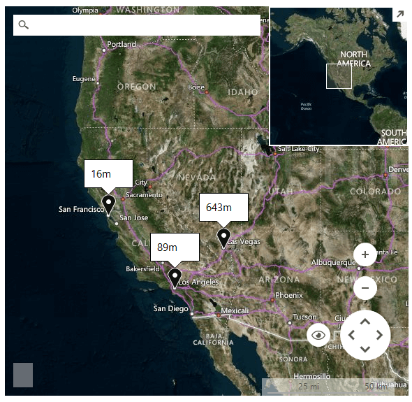

# List ElevationType

ElevationType.*List* __ElevationRequest__ gets elevations for latitude and longitude coordinates. Elevations are returned for each set of coordinates.

>caption Figure 1: List ElevationRequest 



#### List ElevationType request

{{source=..\SamplesCS\Map\BingProvider.cs region=ListElevationRequest}} 
{{source=..\SamplesVB\Map\BingProvider.vb region=ListElevationRequest}}

````C#
        
public void SetupListElevationRequest()
{
    //add pins to the map 
    Telerik.WinControls.UI.Map.PointG point1 = new Telerik.WinControls.UI.Map.PointG(36.114647, -115.172813);
    Telerik.WinControls.UI.Map.PointG point2 = new Telerik.WinControls.UI.Map.PointG(34.05223, -118.24368);
    Telerik.WinControls.UI.Map.PointG point3 = new Telerik.WinControls.UI.Map.PointG(37.77493, -122.41942);
    MapPin pin1 = new MapPin(point1);
    MapPin pin2 = new MapPin(point2);
    MapPin pin3 = new MapPin(point3);
    
    MapLayer pinsLayer = new MapLayer("Pins");
    this.radMap1.Layers.Add(pinsLayer);
    
    MapLayer calloutsLayer = new MapLayer("Callouts");
    this.radMap1.Layers.Add(calloutsLayer);
    this.radMap1.Layers["Pins"].Add(pin1);
    this.radMap1.Layers["Pins"].Add(pin2);
    this.radMap1.Layers["Pins"].Add(pin3);
    
    ElevationRequest request = new ElevationRequest();
    request.ElevationType = ElevationType.List;
    request.Points = new List<Telerik.WinControls.UI.Map.PointG>()
    {
        point1,
        point2,
        point3
    };
    BingRestMapProvider bingProvider = this.radMap1.Providers[0] as BingRestMapProvider;
    bingProvider.CalculateElevationCompleted += BingProvider_CalculateElevationCompleted;
    bingProvider.CalculateElevationAsync(request);
}
        
private void BingProvider_CalculateElevationCompleted(object sender, ElevationCompletedEventArgs e)
{
    for (int i = 0; i < this.radMap1.Layers["Pins"].Overlays.Count; i++)
    {
        MapPin pin = this.radMap1.Layers["Pins"].Overlays[i] as MapPin;
        if (pin != null)
        {
            MapCallout callout = new MapCallout(pin);
            callout.MaxWidth = 50;
            callout.Text = e.Elevations[0].Elevations[i].ToString() + "m";
            this.radMap1.Layers["Callouts"].Add(callout);
        }
    }
}

````
````VB.NET
Public Sub SetupListElevationRequest()
    'add pins to the map 
    Dim point1 As New Telerik.WinControls.UI.Map.PointG(36.114647, -115.172813)
    Dim point2 As New Telerik.WinControls.UI.Map.PointG(34.05223, -118.24368)
    Dim point3 As New Telerik.WinControls.UI.Map.PointG(37.77493, -122.41942)
    Dim pin1 As New MapPin(point1)
    Dim pin2 As New MapPin(point2)
    Dim pin3 As New MapPin(point3)
    Dim pinsLayer As New MapLayer("Pins")
    Me.radMap1.Layers.Add(pinsLayer)
    Dim calloutsLayer As New MapLayer("Callouts")
    Me.radMap1.Layers.Add(calloutsLayer)
    Me.radMap1.Layers("Pins").Add(pin1)
    Me.radMap1.Layers("Pins").Add(pin2)
    Me.radMap1.Layers("Pins").Add(pin3)
    Dim request As New ElevationRequest()
    request.ElevationType = ElevationType.List
    request.Points = New List(Of Telerik.WinControls.UI.Map.PointG)() From { _
        point1, _
        point2, _
        point3 _
    }
    Dim bingProvider As BingRestMapProvider = TryCast(Me.radMap1.Providers(0), BingRestMapProvider)
    AddHandler bingProvider.CalculateElevationCompleted, AddressOf BingProvider_CalculateElevationCompleted
    bingProvider.CalculateElevationAsync(request)
End Sub
Private Sub BingProvider_CalculateElevationCompleted(sender As Object, e As ElevationCompletedEventArgs)
    For i As Integer = 0 To Me.radMap1.Layers("Pins").Overlays.Count - 1
        Dim pin As MapPin = TryCast(Me.radMap1.Layers("Pins").Overlays(i), MapPin)
        If pin IsNot Nothing Then
            Dim callout As New MapCallout(pin)
            callout.MaxWidth = 50
            callout.Text = e.Elevations(0).Elevations(i).ToString() + "m"
            Me.radMap1.Layers("Callouts").Add(callout)
        End If
    Next
End Sub

````

{{endregion}} 

# See Also
* [Bing Elevation](https://msdn.microsoft.com/en-us/library/jj158961.aspx)
* [BingRestMapProvider]()
* [Elevation]()
