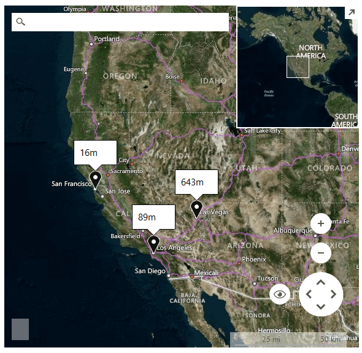

# List ElevationType

>important Please note that [Bing Maps](https://www.bingmapsportal.com/) __will be deprecated effective June 30, 2025__. As an alternative, users can refer to the [SDK example available in our GitHub repository](https://github.com/telerik/winforms-sdk/tree/master/Map/Custom%20Azure%20Provider), which demonstrates how to create a __custom provider__ using the __Azure Maps API__. A __valid Azure Maps subscription key__ is required to use this functionality.

ElevationType.*List* __ElevationRequest__ gets elevations for latitude and longitude coordinates. Elevations are returned for each set of coordinates.

>caption Figure 1: List ElevationRequest 

#### List ElevationType request

<snippet id='map-bingprovider-listelevationrequest-cs' />
<snippet id='map-bingprovider-listelevationrequest-vb' />

# See Also
* [Bing Elevation](https://msdn.microsoft.com/en-us/library/jj158961.aspx)
* [BingRestMapProvider]()
* [Elevation]()
