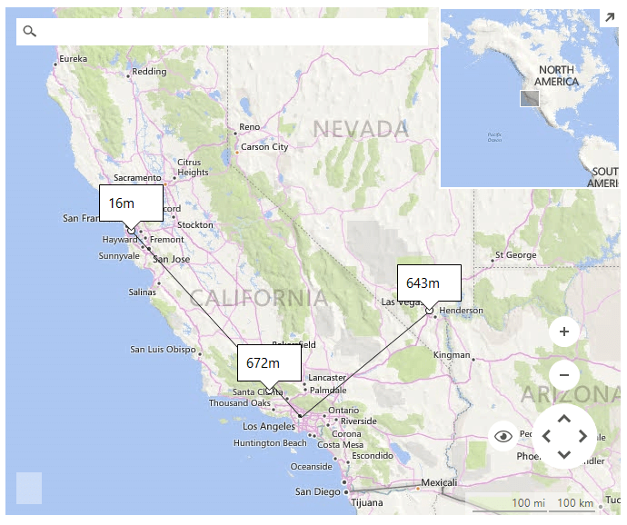

# Polyline ElevationType

ElevationType.*Polyline* __ElevationRequest__ gets elevations at equally-spaced locations along a polyline path. A polyline path is computed from the coordinates, and then elevation values at both endpoints and equally-spaced locations along the polyline are returned. The samples parameter specifies the number of elevations to return.

>caption Figure 1: Polyline ElevationRequest 



#### Polyline ElevationType request

{{source=..\SamplesCS\Map\BingProvider.cs region=PolylineElevationRequest}} 
{{source=..\SamplesVB\Map\BingProvider.vb region=PolylineElevationRequest}}

````C#
        
public void SetupPolylineElevationRequest()
{
    //add pins to the map 
    Telerik.WinControls.UI.Map.PointG point1 = new Telerik.WinControls.UI.Map.PointG(36.114647, -115.172813);
    Telerik.WinControls.UI.Map.PointG point2 = new Telerik.WinControls.UI.Map.PointG(34.05223, -118.24368);
    Telerik.WinControls.UI.Map.PointG point3 = new Telerik.WinControls.UI.Map.PointG(37.77493, -122.41942);
    MapPin pin1 = new MapPin(point1);
    MapPin pin2 = new MapPin(point2);
    MapPin pin3 = new MapPin(point3);
    
    MapLayer pinsLayer = new MapLayer("Pins");
    this.radMap1.Layers.Add(pinsLayer);
    
    MapLayer calloutsLayer = new MapLayer("Callouts");
    this.radMap1.Layers.Add(calloutsLayer);
    this.radMap1.Layers["Pins"].Add(pin1);
    this.radMap1.Layers["Pins"].Add(pin2);
    this.radMap1.Layers["Pins"].Add(pin3);
    
    ElevationRequest request = new ElevationRequest();
    request.ElevationType = ElevationType.Polyline;
    request.Samples = 3;
    request.Points = new List<Telerik.WinControls.UI.Map.PointG>()
    {
        point1,
        point2,
        point3
    };
    BingRestMapProvider bingProvider = this.radMap1.Providers[0] as BingRestMapProvider;
    bingProvider.CalculateElevationCompleted += BingProviderPolyline_CalculateElevationCompleted;
    bingProvider.CalculateElevationAsync(request);
}
        
private void BingProviderPolyline_CalculateElevationCompleted(object sender, ElevationCompletedEventArgs e)
{
    List<Telerik.WinControls.UI.Map.PointG> points = new List<Telerik.WinControls.UI.Map.PointG>();
    
    for (int i = 0; i < this.radMap1.Layers["Pins"].Overlays.Count; i++)
    {
        MapPin pin = this.radMap1.Layers["Pins"].Overlays[i] as MapPin;
        
        if (pin != null)
        {
            points.Add(pin.Location);
        }
    }
    this.radMap1.Layers["Pins"].Clear();
    
    MapPolyline polyline = new MapPolyline(points);
    this.radMap1.Layers["Callouts"].Add(polyline);
        
    List<Telerik.WinControls.UI.Map.PointG> p = this.CalculateEquidistantPointsAlongPolyline(polyline,
        this.radMap1.MapElement.ZoomLevel, e.Elevations[0].Elevations.Length);
    
    for (int i = 0; i < p.Count; i++)
    {
        MapPoint point = new MapPoint(p[i]);
        this.radMap1.Layers["Callouts"].Add(point);
        
        MapCallout callout = new MapCallout(point);
        callout.MaxWidth = 50;
        callout.Text = e.Elevations[0].Elevations[i].ToString() + "m";
        this.radMap1.Layers["Callouts"].Add(callout);
    }
}
        
private List<Telerik.WinControls.UI.Map.PointG> CalculateEquidistantPointsAlongPolyline(MapPolyline polyline, int zoomLevel, int numberOfPoints)
{
    List<Telerik.WinControls.UI.Map.PointL> points = new List<Telerik.WinControls.UI.Map.PointL>();
    
    foreach (Telerik.WinControls.UI.Map.PointG point in polyline.Points)
    {
        points.Add(MapTileSystemHelper.LatLongToPixelXY(point, zoomLevel));
    }
    
    int totalDistance = 0;
    List<double> distances = new List<double>();
    
    for (int i = 0; i < points.Count - 1; i++)
    {
        totalDistance += (int)Math.Sqrt(Math.Pow(points[i + 1].X - points[i].X, 2) + Math.Pow(points[i + 1].Y - points[i].Y, 2));
        distances.Add(totalDistance);
    }
    
    List<Telerik.WinControls.UI.Map.PointL> equidistantPoints = new List<Telerik.WinControls.UI.Map.PointL>();
    double step = (double)totalDistance / (numberOfPoints - 1);
    double currentDistance = 0;
    
    while (currentDistance < totalDistance - 1)
    {
        int index = distances.BinarySearch(currentDistance);
        
        if (index < 0)
        {
            index = ~index;
        }
        
        Telerik.WinControls.UI.Map.PointL p1 = points[index];
        Telerik.WinControls.UI.Map.PointL p2 = points[index + 1];
        double distance = index == 0 ? distances[index] : distances[index] - distances[index - 1];
        double dt = index == 0 ? currentDistance : currentDistance - distances[index - 1];
        
        double t = (double)dt / distance;
        double x = ((1d - t) * p1.X + t * p2.X);
        double y = ((1d - t) * p1.Y + t * p2.Y);
            
        equidistantPoints.Add(new Telerik.WinControls.UI.Map.PointL((long)Math.Round(x, MidpointRounding.AwayFromZero),
            (long)Math.Round(y, MidpointRounding.AwayFromZero)));
        currentDistance += step;
    }
    equidistantPoints.Add(points[points.Count - 1]);
    List<Telerik.WinControls.UI.Map.PointG> result = new List<Telerik.WinControls.UI.Map.PointG>();
    
    foreach (Telerik.WinControls.UI.Map.PointL point in equidistantPoints)
    {
        result.Add(MapTileSystemHelper.PixelXYToLatLong(point, zoomLevel));
    }
        
    return result;
}

````
````VB.NET
Public Sub SetupPolylineElevationRequest()
    'add pins to the map 
    Dim point1 As New Telerik.WinControls.UI.Map.PointG(36.114647, -115.172813)
    Dim point2 As New Telerik.WinControls.UI.Map.PointG(34.05223, -118.24368)
    Dim point3 As New Telerik.WinControls.UI.Map.PointG(37.77493, -122.41942)
    Dim pin1 As New MapPin(point1)
    Dim pin2 As New MapPin(point2)
    Dim pin3 As New MapPin(point3)
    Dim pinsLayer As New MapLayer("Pins")
    Me.radMap1.Layers.Add(pinsLayer)
    Dim calloutsLayer As New MapLayer("Callouts")
    Me.radMap1.Layers.Add(calloutsLayer)
    Me.radMap1.Layers("Pins").Add(pin1)
    Me.radMap1.Layers("Pins").Add(pin2)
    Me.radMap1.Layers("Pins").Add(pin3)
    Dim request As New ElevationRequest()
    request.ElevationType = ElevationType.Polyline
    request.Samples = 3
    request.Points = New List(Of Telerik.WinControls.UI.Map.PointG)() From { _
        point1, _
        point2, _
        point3 _
    }
    Dim bingProvider As BingRestMapProvider = TryCast(Me.radMap1.Providers(0), BingRestMapProvider)
    AddHandler bingProvider.CalculateElevationCompleted, AddressOf BingProviderPolyline_CalculateElevationCompleted
    bingProvider.CalculateElevationAsync(request)
End Sub
Private Sub BingProviderPolyline_CalculateElevationCompleted(sender As Object, e As ElevationCompletedEventArgs)
    Dim points As New List(Of Telerik.WinControls.UI.Map.PointG)()
    For i As Integer = 0 To Me.radMap1.Layers("Pins").Overlays.Count - 1
        Dim pin As MapPin = TryCast(Me.radMap1.Layers("Pins").Overlays(i), MapPin)
        If pin IsNot Nothing Then
            points.Add(pin.Location)
        End If
    Next
    Me.radMap1.Layers("Pins").Clear()
    Dim polyline As New MapPolyline(points)
    Me.radMap1.Layers("Callouts").Add(polyline)
    Dim p As List(Of Telerik.WinControls.UI.Map.PointG) = Me.CalculateEquidistantPointsAlongPolyline(polyline, _
                                                                                                     Me.radMap1.MapElement.ZoomLevel, e.Elevations(0).Elevations.Length)
    For i As Integer = 0 To p.Count - 1
        Dim point As New MapPoint(p(i))
        Me.radMap1.Layers("Callouts").Add(point)
        Dim callout As New MapCallout(point)
        callout.MaxWidth = 50
        callout.Text = e.Elevations(0).Elevations(i).ToString() + "m"
        Me.radMap1.Layers("Callouts").Add(callout)
    Next
End Sub
Private Function CalculateEquidistantPointsAlongPolyline(polyline As MapPolyline, zoomLevel As Integer, _
numberOfPoints As Integer) As List(Of Telerik.WinControls.UI.Map.PointG)
    Dim points As New List(Of Telerik.WinControls.UI.Map.PointL)()
    For Each point As Telerik.WinControls.UI.Map.PointG In polyline.Points
        points.Add(MapTileSystemHelper.LatLongToPixelXY(point, zoomLevel))
    Next
    Dim totalDistance As Integer = 0
    Dim distances As New List(Of Double)()
    For i As Integer = 0 To points.Count - 2
        totalDistance += CInt(Math.Sqrt(Math.Pow(points(i + 1).X - points(i).X, 2) + Math.Pow(points(i + 1).Y - points(i).Y, 2)))
        distances.Add(totalDistance)
    Next
    Dim equidistantPoints As New List(Of Telerik.WinControls.UI.Map.PointL)()
    Dim [step] As Double = CDbl(totalDistance) / (numberOfPoints - 1)
    Dim currentDistance As Double = 0
    While currentDistance < totalDistance - 1
        Dim index As Integer = distances.BinarySearch(currentDistance)
        If index < 0 Then
            index = Not index
        End If
        Dim p1 As Telerik.WinControls.UI.Map.PointL = points(index)
        Dim p2 As Telerik.WinControls.UI.Map.PointL = points(index + 1)
        Dim distance As Double = If(index = 0, distances(index), distances(index) - distances(index - 1))
        Dim dt As Double = If(index = 0, currentDistance, currentDistance - distances(index - 1))
        Dim t As Double = CDbl(dt) / distance
        Dim x As Double = ((1.0 - t) * p1.X + t * p2.X)
        Dim y As Double = ((1.0 - t) * p1.Y + t * p2.Y)
        equidistantPoints.Add(New Telerik.WinControls.UI.Map.PointL(CLng(Math.Round(x, MidpointRounding.AwayFromZero)), _
                                                                    CLng(Math.Round(y, MidpointRounding.AwayFromZero))))
        currentDistance += [step]
    End While
    equidistantPoints.Add(points(points.Count - 1))
    Dim result As New List(Of Telerik.WinControls.UI.Map.PointG)()
    For Each point As Telerik.WinControls.UI.Map.PointL In equidistantPoints
        result.Add(MapTileSystemHelper.PixelXYToLatLong(point, zoomLevel))
    Next
    Return result
End Function

````

{{endregion}} 

# See Also
* [Bing Elevation](https://msdn.microsoft.com/en-us/library/jj158961.aspx)
* [BingRestMapProvider]()
* [Elevation]()
