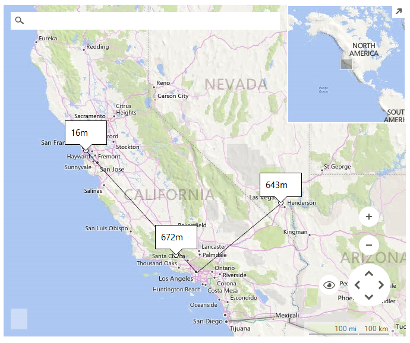

# Polyline ElevationType

>important Please note that [Bing Maps](https://www.bingmapsportal.com/) __will be deprecated effective June 30, 2025__. As an alternative, users can refer to the [SDK example available in our GitHub repository](https://github.com/telerik/winforms-sdk/tree/master/Map/Custom%20Azure%20Provider), which demonstrates how to create a __custom provider__ using the __Azure Maps API__. A __valid Azure Maps subscription key__ is required to use this functionality.

ElevationType.*Polyline* __ElevationRequest__ gets elevations at equally-spaced locations along a polyline path. A polyline path is computed from the coordinates, and then elevation values at both endpoints and equally-spaced locations along the polyline are returned. The samples parameter specifies the number of elevations to return.

>caption Figure 1: Polyline ElevationRequest 

#### Polyline ElevationType request

<snippet id='map-bingprovider-polylineelevationrequest-cs' />
<snippet id='map-bingprovider-polylineelevationrequest-vb' />

# See Also
* [Bing Elevation](https://msdn.microsoft.com/en-us/library/jj158961.aspx)
* [BingRestMapProvider]()
* [Elevation]()
