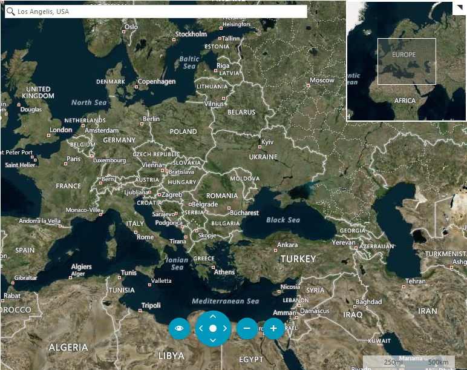
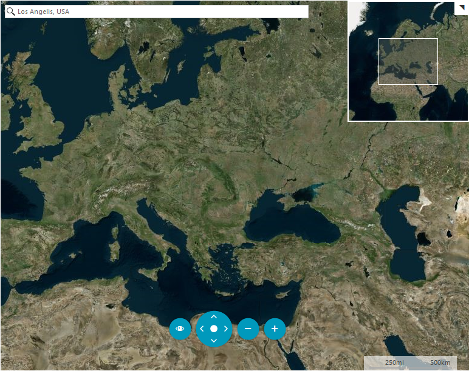
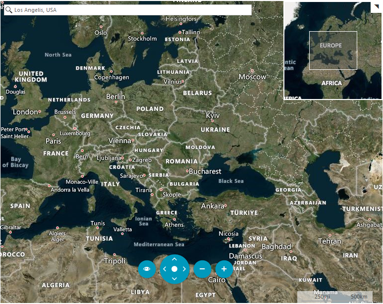
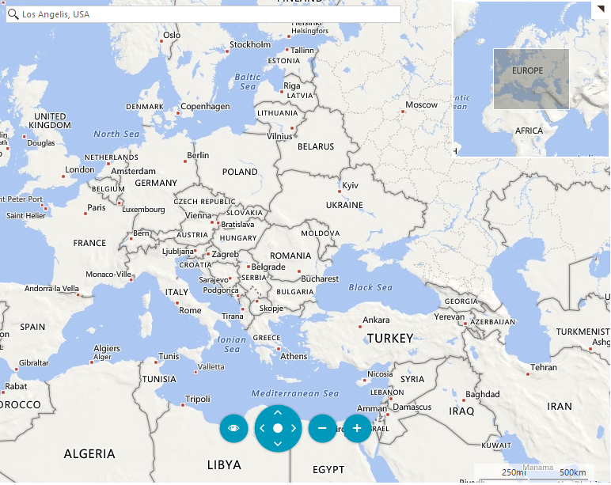
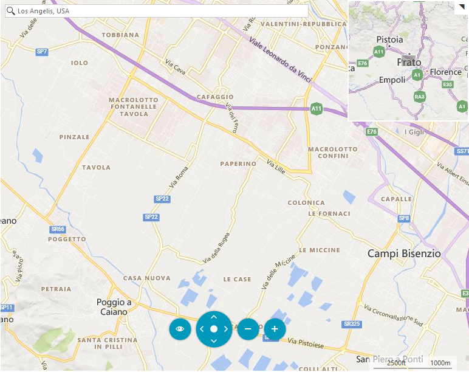
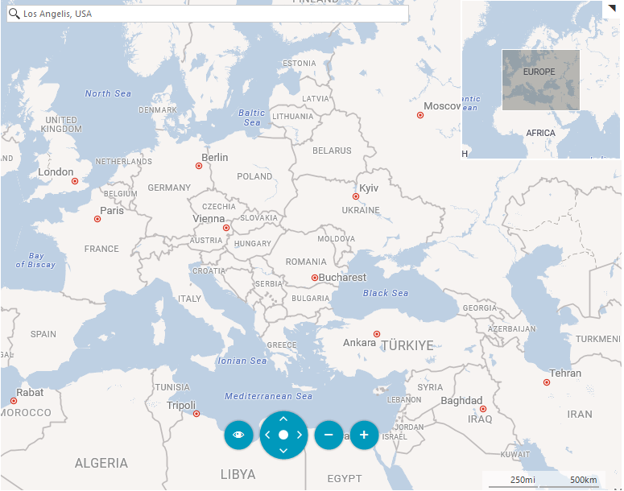
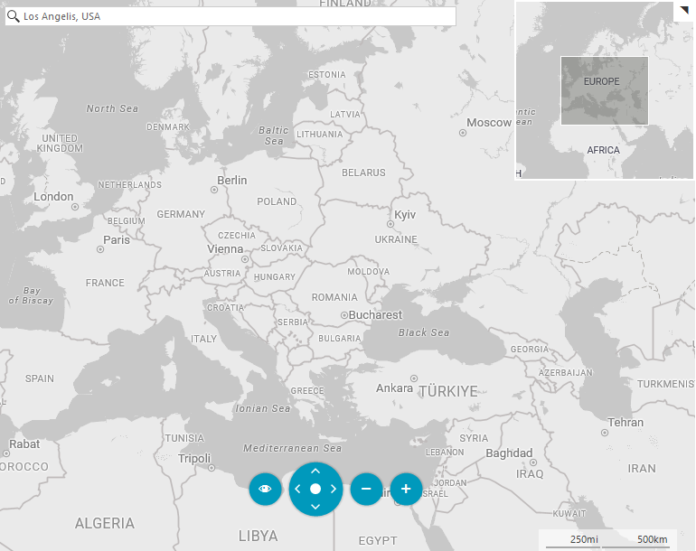
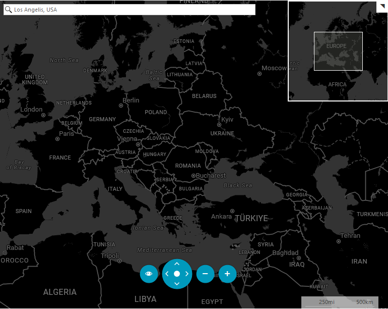

# Imagery sets

The Bind Maps Rest Provider imagery service supports different types of visualization. The possible imagery sets which can be used are:

* [__Aerial with Labels__](#aerial-with-labels)
* [__Aerial without Labels__](#aerial-without-labels)
* [__AerialOnDemand__](#aerialondemand)
* [__Road__](#road)
* [__RoadOnDemand__](#roadondemand)
* [__CanvasLight__](#canvaslight)
* [__CanvasGray__](#canvasgray)
* [__CanvasDark__](#canvasdark)
 
To choose an imagery set, you can set the **ImagerySet** property of the BingRestMapProvider.

## AerialWithLabels

This mode offers worldwide orthographic aerial and satellite imagery. The labels in this mode are enabled by default.

#### __Figure 1: Aerial mode with labels__
	
	

## Aerial

__Figure 2__ is a snapshot of the Aerial mode for Bing Map Rest Provider when the labels are not visible.

#### __Figure 2: Aerial mode without labels__

## AerialWithLabelsOnDemand

This imagery set represent Aerial imagery with on-demand road overlay.

#### __Figure 3: AerialOnDemand mode__

## Road

The road imagery type is a set of static tile server. The tiles are generated ahead of time and then stored and served. For this mode the labels are displayed always. __Figure 4__ is an example of the __Road Mode__ definition.

#### __Figure 4: Road mode__
	

## RoadOnDemand

The road on demand imagery type provides the same map tiles used in the latest Bing maps controls. These tiles are generated on the fly as needed and are the most up to date road maps. 

#### __Figure 5: RoadOnDemand mode__

## CanvasLight

A light version of the road maps which provides neutral background  with minimal colors, labels and features.

#### __Figure 6: CanvasLight mode__

## CanvasGray

A gray version of the road maps which provides neutral background with minimal colors, labels and features.

#### __Figure 7: CanvasGray mode__

## CanvasDark

A dark version of the road maps which provides neutral background with minimal colors, labels and features.

#### __Figure 7: CanvasDark mode__	

# See Also 

* [Bing Maps Tile System](https://msdn.microsoft.com/en-us/library/bb259689.aspx)
