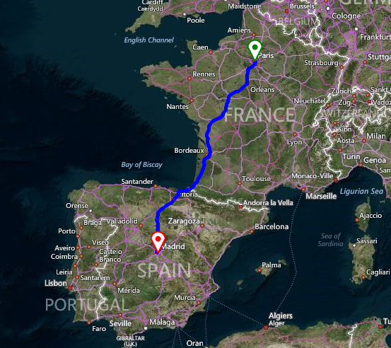

# Route

>important Please note that [Bing Maps](https://www.bingmapsportal.com/) __will be deprecated effective June 30, 2025__. As an alternative, users can refer to the [SDK example available in our GitHub repository](https://github.com/telerik/winforms-sdk/tree/master/Map/Custom%20Azure%20Provider), which demonstrates how to create a __custom provider__ using the __Azure Maps API__. A __valid Azure Maps subscription key__ is required to use this functionality.

__RadMap__ provides a unified route search architecture which uses functionality of the different routing services. This allows you to calculate a route between different locations on the map. The routing is achieved by an __IMapRouteProvider__. The __BingRestMapProvider__ implements the __IMapRouteProvider__ interface.

>caption Figure 1: Bing routing

The whole information that is necessary for calculating the route, like start/end points, the distance unit, mode, optimization etc., is stored in a __RouteRequest__. Subscribe to the IMapRouteProvider.__CalculateRouteCompleted__ event where you can add __MapPins__ and __MapRoute__ to the __MapLayer__ for the route results.

### RouteRequest

The **RouteRequest** offers the following public properties:

* **Options** - represents the **RouteOptions** used to define the route request.
* **Waypoints** - required parameter which represents a collection where each element represents a stop in the route. 
*  **RoutePoints** - represents a collection where each element represents a stop in the route.

### RouteOptions

The **RouteOptions** contains properties used to define a route service request:

* **Mode** - type of directions to return. The default value is TravelMode.*Driving*.
* **Optimization** - represents the calculation method to use. The default value is RouteOptimization.*MinimizeTime*.
* **RouteAttributes** - specifies whether to include or exclude parts of the routes response. The default value is RouteAttributes.*ExcludeItinerary*. 
* **RouteAvoidance** - represents the value specifying how traffic information is used in the route calculation. The default value is TrafficUsage.*None*.
* **DistanceBeforeFirstTurn** - specifies the distance before the first turn is allowed in the route. This option only applies to the driving travel mode.
* **Heading** - an integer value between 0 and 359 that represents degrees from north where north is 0 degrees and the heading is specified clockwise from north.
* **Tolerances** - specifies a series of tolerance values. Each value produces a subset of points that approximates the route that is described by the full set of points.
* **DateTime** - when specified and the route is optimized for *timeWithTraffic*, predictive traffic data is used to calculate the best route for the specified date time.
* **MaxSolutions** - specifies the maximum number of driving routes to return.

The following code snippet demonstrates how to build a route from Madrid to Paris. 

#### Bing routing

<snippet id='map-bingprovider-bingrouterequest-cs' />
<snippet id='map-bingprovider-bingrouterequest-vb' />

The **RouteRequest** class also supports *ViaWayPoints* objects. These route points allow a particular leg to be divided into separate sub legs. The [Bing REST Serivices documentation](https://msdn.microsoft.com/en-us/library/ff701717.aspx) provides additional information what a *waypoint* and a *viaWayPoint* represents.

#### Creating a Route with ViaWayPoints

<snippet id='map-bingprovider-viawaypointsexample-cs' />
<snippet id='map-bingprovider-viawaypointsexample-vb' />

# See Also
* [BingRestMapProvider]()
* [Truck Route]()
