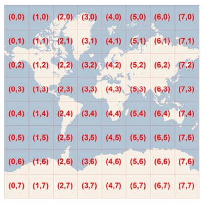
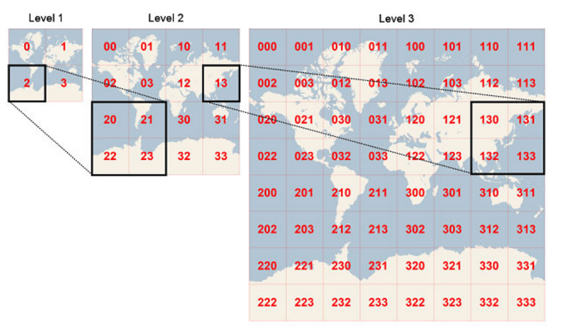

# Tiles

[Bing Maps](https://www.bingmapsportal.com/) provide a world map that users can easily pan and zoom. In order to achieve smooth users interaction, the map is pre-rendered at many detailed levels where each level is cut into tiles of 256 x 256 pixels each. Each tile is given XY coordinates ranging from (0, 0) in the upper left to (2level–1, 2level–1) in the lower right. For example, at level 3 the tile coordinates range from (0, 0) to (7, 7) as follows:

>caption Figure 1: Tile XY coordinates at level 3

In order to optimize the tiles indexing, the two-dimensional tile XY coordinates are combined into one-dimensional strings called quadtree keys, or “quadkeys” for short. Each quadkey uniquely identifies a tile and it can be used as a key in common database B-tree indexes. To convert tile coordinates into a quadkey, the bits of the Y and X coordinates are interleaved, and the result is interpreted as a base-4 number (with leading zeros maintained) and converted into a string. For instance, given tile XY coordinates of (3, 5) at level 3, the quadkey is determined as follows:

tileX = 3 = 0112

tileY = 5 = 1012

quadkey = 1001112 = 2134 = “213”

>caption Figure 2: Tile Quadkeys 

Finally, tiles that are close to each other have quadkeys that are relatively close together. This is important for optimizing performance, because neighboring tiles are usually requested in groups.

# See Also 

* [Bing Maps Tile System](https://msdn.microsoft.com/en-us/library/bb259689.aspx)