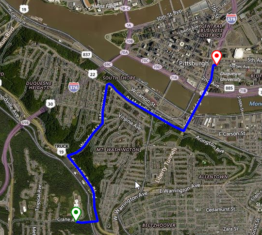

# Truck Route

As of **R1 2020** **RadMap** supports the [Bing Maps Truck Routing API](https://docs.microsoft.com/en-us/bingmaps/rest-services/routes/calculate-a-truck-route). It provides travel routes which take truck attributes such as size, weight and type of cargo. This is important as not all trucks can travel the same routes as other vehicles.
 
The whole information that is necessary for calculating the route, is stored in the **TruckRouteRequest**. It 
contains a collection of **TruckWaypoints** defining the start/end points of the route. The **TruckRouteOptions** allows you to specify the vehicle specifications, border restrictions, distance units, etc. Once the route calculation is completed, the **TruckRoutingCompleted** event is fired. There you can define a **MapRoute** and start/end **MapPins** on a **MapLayer** for a better illustration of the found path.

>caption Figure 1: Truck route



## TruckRouteRequest

The **TruckRouteRequest** offers two important public properties:

* **Options** - stores options used to define the route request.
* **RoutePoints** - represents a collection of **TruckWaypoints** where each element represents a stop in the route.

## TruckRouteOptions

The **TruckRouteOptions** class offers the following settings:

* **Avoid** - Specifies the road types to minimize or avoid when a route is created for the driving travel mode.
* **BorderRestrictions** - Specifies the border crossing preference with respect to countries, dependent territories, special areas of geographical interest, states, subdivision, or provinces.
* **DistanceBeforeFirstTurn** - Specifies the distance before the first turn is allowed in the route. An integer distance specified in meters. Use this parameter to make sure that the moving vehicle has enough distance to make the first turn.
* **Heading** - Specifies the initial heading for the route. An integer value between 0 and 359 that represents degrees from north where north is 0 degrees and the heading is specified clockwise from north. For example, setting the heading of 270 degrees creates a route that initially heads west.
* **Optimize** - Specifies what parameters to use to optimize the route.
* **OptimizeWaypoints** - Instructs the API to rearrange the route waypoints and reduce the route cost specified with the optimize parameter. The route first waypoint and last waypoint order is not changed, their position is considered fixed.
* **RouteAttributes** - Specifies to include or exclude parts of the routes response.
* **DistanceUnit** - The units to use for distance in the response.
* **DateTime** - When specified and the route is optimized for timeWithTraffic, predictive traffic data is used to calculate the best route for the specified date time of departure.
* **Tolerances** - A set of double values. Each value specifies a tolerance that is used to reduce the number of points needed to display a route on a map and still maintain the route shape. If a point is removed and the new route still falls within the specified tolerance of the old route, then the point is not included in the subset of points returned for that tolerance.
* **VehicleSpec** - The attributes that describe a vehicle.

>note Since **R2 2020** the **TruckRouteOptions** offer specifying multiple **HazardousMaterials** and multiple **HazardousPermits** in the BingRestTruckRouteRequest.
**VehicleHazardousPermits** = HazardousPermit.Gas | HazardousPermit.Explosive | HazardousPermit.Corrosive;
**VehicleHazardousMaterials** = HazardousMaterial.Gas | HazardousMaterial.Explosive | HazardousMaterial.Corrosive
> 

## Calculating the Truck route

The following code snippet demonstrates how to calculate a route considering the defined truck options:

#### Truck Route

{{source=..\SamplesCS\Map\BingTruckRoute.cs region=BingTruckRouteRequest}} 
{{source=..\SamplesVB\Map\BingTruckRoute.vb region=BingTruckRouteRequest}}

````C#

 public BingTruckRoute()
{
    InitializeComponent();
    
    BingRestMapProvider bingProvider = new BingRestMapProvider();
    bingProvider.UseSession = true;
    bingProvider.BingKey = bingKey;
    
    LocalFileCacheProvider cache = new LocalFileCacheProvider(@"..\..\Cache");
    bingProvider.CacheProvider = cache;
    
    this.radMap1.MapElement.Providers.Add(bingProvider);
    this.radMap1.MapElement.Layers.Add(new MapLayer());
    
    TruckRouteOptions options = new TruckRouteOptions();
    options.Avoid = TruckRouteAvoidance.BorderCrossing;
    options.DateTime = DateTime.Now;
    options.OptimizeWaypoints = true;
    options.RouteAttributes = TruckRouteAttributes.RoutePath;
    
    options.VehicleSpec = new VehicleSpec()
    {
        DimensionUnit = DimensionUnit.Meter,
        VehicleLength = 32,
        VehicleHeight = 4,
        VehicleSemi = true,
        VehicleHazardousMaterials = HazardousMaterial.Flammable
    };
    
    List<TruckWaypoint> wp = new List<TruckWaypoint>()
    {
        new TruckWaypoint("590 Crane Ave, Pittsburgh, PA"),
        new TruckWaypoint("600 Forbes Ave, Pittsburgh, PA")
    };
    
    Telerik.WinControls.UI.Map.Bing.TruckRouteRequest request = new TruckRouteRequest();
    request.RoutePoints = wp;
    request.Options = options;
    
    bingProvider.CalculateTruckRouteCompleted += BingProvider_TruckRoutingCompleted;
    bingProvider.CalculateTruckRouteError += BingProvider_CalculateRouteError;
    bingProvider.CalculateTruckRouteAsync(request);
}

private void BingProvider_CalculateRouteError(object sender, CalculateRouteErrorEventArgs e)
{
    RadMessageBox.Show(e.Error.Message);
}

private void BingProvider_TruckRoutingCompleted(object sender, RoutingCompletedEventArgs e)
{
    List<Telerik.WinControls.UI.Map.PointG> points = new List<PointG>();
    
    foreach (double[] coordinatePair in e.Route.RoutePath.Line.Coordinates)
    {
        PointG point = new PointG(coordinatePair[0], coordinatePair[1]);
        points.Add(point);
    }
    
    RectangleG boundingRectangle = new RectangleG(e.Route.BBox[2], e.Route.BBox[1], 
        e.Route.BBox[0], e.Route.BBox[3]);
    MapRoute routeElement = new MapRoute(points, boundingRectangle);
    routeElement.BorderColor = Color.Blue;
    routeElement.BorderWidth = 5;
    MapPin start = new MapPin(new PointG(e.Route.RouteLegs[0].ActualStart.Coordinates[0], 
        e.Route.RouteLegs[0].ActualStart.Coordinates[1]));
    start.BackColor = Color.White;
    start.BorderColor = Color.Green;
    start.BorderWidth = 2f;
    MapPin end = new MapPin(new PointG(e.Route.RouteLegs[e.Route.RouteLegs.Length - 1].ActualEnd.Coordinates[0], 
        e.Route.RouteLegs[e.Route.RouteLegs.Length - 1].ActualEnd.Coordinates[1]));
    end.BackColor = Color.White;
    end.BorderColor = Color.Red;
    end.BorderWidth = 2f;
    
    this.radMap1.MapElement.Layers[0].Add(routeElement);
    this.radMap1.MapElement.Layers[0].Add(start);
    this.radMap1.MapElement.Layers[0].Add(end);
}


````
````VB.NET

 Public Sub New()
    InitializeComponent()
    Dim bingProvider As BingRestMapProvider = New BingRestMapProvider()
    bingProvider.UseSession = True
    bingProvider.BingKey = bingKey
    Dim cache As LocalFileCacheProvider = New LocalFileCacheProvider("..\..\Cache")
    bingProvider.CacheProvider = cache
    Me.RadMap1.MapElement.Providers.Add(bingProvider)
    Me.RadMap1.MapElement.Layers.Add(New MapLayer())
    Dim options As TruckRouteOptions = New TruckRouteOptions()
    options.Avoid = TruckRouteAvoidance.BorderCrossing
    options.DateTime = DateTime.Now
    options.OptimizeWaypoints = True
    options.RouteAttributes = TruckRouteAttributes.RoutePath
    options.VehicleSpec = New VehicleSpec() With {
        .DimensionUnit = DimensionUnit.Meter,
        .VehicleLength = 32,
        .VehicleHeight = 4,
        .VehicleSemi = True,
        .VehicleHazardousMaterials = HazardousMaterial.Flammable
    }
    Dim wp As List(Of TruckWaypoint) = New List(Of TruckWaypoint)() From {
        New TruckWaypoint("590 Crane Ave, Pittsburgh, PA"),
        New TruckWaypoint("600 Forbes Ave, Pittsburgh, PA")
    }
    Dim request As Telerik.WinControls.UI.Map.Bing.TruckRouteRequest = New TruckRouteRequest()
    request.RoutePoints = wp
    request.Options = options
    AddHandler bingProvider.CalculateTruckRouteCompleted, AddressOf BingProvider_TruckRoutingCompleted
    AddHandler bingProvider.CalculateTruckRouteError, AddressOf BingProvider_CalculateRouteError
    bingProvider.CalculateTruckRouteAsync(request)
End Sub

Private Sub BingProvider_CalculateRouteError(ByVal sender As Object, ByVal e As CalculateRouteErrorEventArgs)
    RadMessageBox.Show(e.[Error].Message)
End Sub

Private Sub BingProvider_TruckRoutingCompleted(ByVal sender As Object, ByVal e As RoutingCompletedEventArgs)
    Dim points As List(Of Telerik.WinControls.UI.Map.PointG) = New List(Of PointG)()

    For Each coordinatePair As Double() In e.Route.RoutePath.Line.Coordinates
        Dim point As PointG = New PointG(coordinatePair(0), coordinatePair(1))
        points.Add(point)
    Next

    Dim boundingRectangle As RectangleG = New RectangleG(e.Route.BBox(2), e.Route.BBox(1), _
                                                         e.Route.BBox(0), e.Route.BBox(3))
    Dim routeElement As MapRoute = New MapRoute(points, boundingRectangle)
    routeElement.BorderColor = Color.Blue
    routeElement.BorderWidth = 5
    Dim start As MapPin = New MapPin(New PointG(e.Route.RouteLegs(0).ActualStart.Coordinates(0), _
                                                e.Route.RouteLegs(0).ActualStart.Coordinates(1)))
    start.BackColor = Color.White
    start.BorderColor = Color.Green
    start.BorderWidth = 2.0F
    Dim [end] As MapPin = New MapPin(New PointG(e.Route.RouteLegs(e.Route.RouteLegs.Length - 1).ActualEnd.Coordinates(0), _
                                                e.Route.RouteLegs(e.Route.RouteLegs.Length - 1).ActualEnd.Coordinates(1)))
    [end].BackColor = Color.White
    [end].BorderColor = Color.Red
    [end].BorderWidth = 2.0F
    Me.RadMap1.MapElement.Layers(0).Add(routeElement)
    Me.RadMap1.MapElement.Layers(0).Add(start)
    Me.RadMap1.MapElement.Layers(0).Add([end])
End Sub


````

{{endregion}} 

# See Also
* [BingRestMapProvider]()
* [Route]()