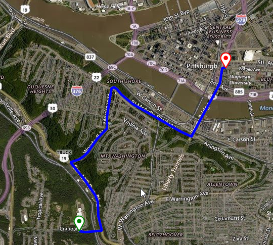

# Truck Route

>important Please note that [Bing Maps](https://www.bingmapsportal.com/) __will be deprecated effective June 30, 2025__. As an alternative, users can refer to the [SDK example available in our GitHub repository](https://github.com/telerik/winforms-sdk/tree/master/Map/Custom%20Azure%20Provider), which demonstrates how to create a __custom provider__ using the __Azure Maps API__. A __valid Azure Maps subscription key__ is required to use this functionality.

As of **R1 2020** **RadMap** supports the [Bing Maps Truck Routing API](https://docs.microsoft.com/en-us/bingmaps/rest-services/routes/calculate-a-truck-route). It provides travel routes which take truck attributes such as size, weight and type of cargo. This is important as not all trucks can travel the same routes as other vehicles.
 
The whole information that is necessary for calculating the route, is stored in the **TruckRouteRequest**. It 
contains a collection of **TruckWaypoints** defining the start/end points of the route. The **TruckRouteOptions** allows you to specify the vehicle specifications, border restrictions, distance units, etc. Once the route calculation is completed, the **TruckRoutingCompleted** event is fired. There you can define a **MapRoute** and start/end **MapPins** on a **MapLayer** for a better illustration of the found path.

>caption Figure 1: Truck route

## TruckRouteRequest

The **TruckRouteRequest** offers two important public properties:

* **Options** - stores options used to define the route request.
* **RoutePoints** - represents a collection of **TruckWaypoints** where each element represents a stop in the route.

## TruckRouteOptions

The **TruckRouteOptions** class offers the following settings:

* **Avoid** - Specifies the road types to minimize or avoid when a route is created for the driving travel mode.
* **BorderRestrictions** - Specifies the border crossing preference with respect to countries, dependent territories, special areas of geographical interest, states, subdivision, or provinces.
* **DistanceBeforeFirstTurn** - Specifies the distance before the first turn is allowed in the route. An integer distance specified in meters. Use this parameter to make sure that the moving vehicle has enough distance to make the first turn.
* **Heading** - Specifies the initial heading for the route. An integer value between 0 and 359 that represents degrees from north where north is 0 degrees and the heading is specified clockwise from north. For example, setting the heading of 270 degrees creates a route that initially heads west.
* **Optimize** - Specifies what parameters to use to optimize the route.
* **OptimizeWaypoints** - Instructs the API to rearrange the route waypoints and reduce the route cost specified with the optimize parameter. The route first waypoint and last waypoint order is not changed, their position is considered fixed.
* **RouteAttributes** - Specifies to include or exclude parts of the routes response.
* **DistanceUnit** - The units to use for distance in the response.
* **DateTime** - When specified and the route is optimized for timeWithTraffic, predictive traffic data is used to calculate the best route for the specified date time of departure.
* **Tolerances** - A set of double values. Each value specifies a tolerance that is used to reduce the number of points needed to display a route on a map and still maintain the route shape. If a point is removed and the new route still falls within the specified tolerance of the old route, then the point is not included in the subset of points returned for that tolerance.
* **VehicleSpec** - The attributes that describe a vehicle.

>note Since **R2 2020** the **TruckRouteOptions** offer specifying multiple **HazardousMaterials** and multiple **HazardousPermits** in the BingRestTruckRouteRequest.
**VehicleHazardousPermits** = HazardousPermit.Gas | HazardousPermit.Explosive | HazardousPermit.Corrosive;
**VehicleHazardousMaterials** = HazardousMaterial.Gas | HazardousMaterial.Explosive | HazardousMaterial.Corrosive
> 

## Calculating the Truck route

The following code snippet demonstrates how to calculate a route considering the defined truck options:

#### Truck Route

<snippet id='map-bingtruckroute-bingtruckrouterequest-cs' />
<snippet id='map-bingtruckroute-bingtruckrouterequest-vb' />

# See Also
* [BingRestMapProvider]()
* [Route]()
