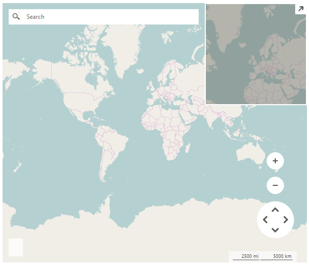

# LocalMapProvider

__RadMap__ can visualize data from local image files by using a __LocalMapProvider__.

>caption Figure 1: LocalMapProvider 



#### Using LocalMapProvider

{{source=..\SamplesCS\Map\MapLocalMapProvider.cs region=SetupLocalMapProvider}} 
{{source=..\SamplesVB\Map\MapLocalMapProvider.vb region=SetupLocalMapProvider}}

````C#
            
string mapFolder = @"..\..\World";
LocalMapProvider provider = new LocalMapProvider();
provider.DirectoryPath = mapFolder;
provider.FileFormat = "os_{0}_{1}_{2}.png";
provider.MinZoomLevel = 1;
provider.MaxZoomLevel = 9;
radMap1.Providers.Add(provider);

````
````VB.NET
Dim mapFolder As String = "..\..\World"
Dim provider As New LocalMapProvider()
provider.DirectoryPath = mapFolder
provider.FileFormat = "os_{0}_{1}_{2}.png"
provider.MinZoomLevel = 1
provider.MaxZoomLevel = 9
radMap1.Providers.Add(provider)

````

{{endregion}} 

>note The __FileFormat__ property specifies what is the exact format of the image files stored in the local folder. The parameters needed are the tile X *{0}* and Y *{1}* numbers and the Zoom level *{2}*. In the code snippet above, each file image's name is built by using x,y,z values: "os_X_Y_Z.png".

# Properties

|Property|Description|
|----|----|
|__DirectoryPath__|Specifies the folder path.|
|__FileFormat__|Specifies the file format.|
|__NoImageAvailable__|Gets or sets an image that will be displayed when a tile image cannot be retrieved or does not exist.|
|__TileSize__|Gets the tile size.|
|__Initialized__|Gets or sets a value indicating whether this LocalMapProvider is initialized.|

# Methods

|Method|Description|
|----|----|
|__LoadTile__|Loads the tile image by x,y, zoom.|

