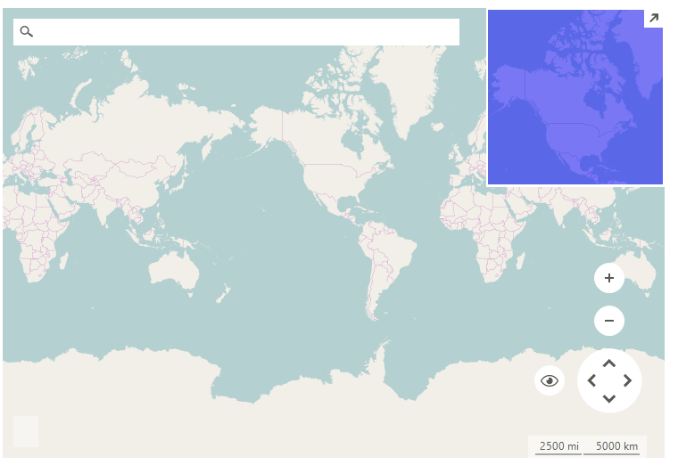

# OpenStreetMapProvider

__RadMap__ can visualize data from the [OpenStreetMaps](http://wiki.openstreetmap.org/wiki/API) REST services.  You can enable tile caching to a local folder setting a new __LocalFileCacheProvider__ to the OpenStreetMapProvider.__CacheProvider__ property.

>caption Figure 1: OpenStreetMapProvider 



#### Using OpenStreetMapProvider

{{source=..\SamplesCS\Map\OSMProvider.cs region=UseOSMProvider}} 
{{source=..\SamplesVB\Map\OSMProvider.vb region=UseOSMProvider}}

````C#
string cacheFolder = @"..\..\cache";
OpenStreetMapProvider osmProvider = new OpenStreetMapProvider();
LocalFileCacheProvider cache = new LocalFileCacheProvider(cacheFolder);
osmProvider.CacheProvider = cache;
this.radMap1.MapElement.Providers.Add(osmProvider);

````
````VB.NET
Dim cacheFolder As String = "..\..\cache"
Dim osmProvider As New OpenStreetMapProvider()
Dim cache As New LocalFileCacheProvider(cacheFolder)
osmProvider.CacheProvider = cache
Me.radMap1.MapElement.Providers.Add(osmProvider)

````

{{endregion}} 

## Using Encrypted HTTP Version

A __TLS 1.2 SecurityProtocol__ will be required when modifying the RadMap URL to use __https:\\__ while using OpenStreetMapProvider. This protocol automatically comes with .NET Framework 4.7.  For older .NET Frameworks, or because of some other Windows settings, it may be necessary to explicitly choose TLS 1.2 for your application by setting the __System.Net.ServicePointManager.SecurityProtocol__ property to __SecurityProtocolType.Tls12__. Otherwise the tiles won't be donwload while using __https://__. This is further described in the [Transport Layer Security (TLS) best practices with the .NET Framework](https://learn.microsoft.com/en-us/dotnet/framework/network-programming/tls) MSDN article.

{{source=..\SamplesCS\Map\OSMProvider.cs region=SecurityProtocol}} 
{{source=..\SamplesVB\Map\OSMProvider.vb region=SecurityProtocol}}

````C#
private void RadForm1_Load(object sender, EventArgs e)
{
	System.Net.ServicePointManager.SecurityProtocol = System.Net.SecurityProtocolType.Tls12;
	OpenStreetMapProvider osmProvider = new OpenStreetMapProvider();
	osmProvider.TileDownloader = new CustomMapTileDownloader();
	MapTileDownloader tileDownloader = osmProvider.TileDownloader as MapTileDownloader;
	tileDownloader.WebHeaders.Add(System.Net.HttpRequestHeader.UserAgent, "your application name");
	osmProvider.EnableCaching = false;
	this.radMap1.MapElement.Providers.Add(osmProvider);
}

public class CustomMapTileDownloader : MapTileDownloader
{
	public override void BeginDownloadTile(Uri uri, TileInfo tileInfo)
	{
		Uri myUri = new Uri(uri.AbsoluteUri.Replace("http:", "https:"));
		base.BeginDownloadTile(myUri, tileInfo);
	}
}

````
````VB.NET
Private Sub RadForm1_Load(sender As Object, e As EventArgs) Handles MyBase.Load
	System.Net.ServicePointManager.SecurityProtocol = System.Net.SecurityProtocolType.Tls12
	Dim osmProvider As OpenStreetMapProvider = New OpenStreetMapProvider()
	osmProvider.TileDownloader = New CustomMapTileDownloader()
	Dim tileDownloader As MapTileDownloader = TryCast(osmProvider.TileDownloader, MapTileDownloader)
	tileDownloader.WebHeaders.Add(System.Net.HttpRequestHeader.UserAgent, "your application name")
	osmProvider.EnableCaching = False 
	Me.radMap1.MapElement.Providers.Add(osmProvider)
End Sub

Public Class CustomMapTileDownloader
	Inherits MapTileDownloader

	Public Overrides Sub BeginDownloadTile(ByVal uri As Uri, ByVal tileInfo As TileInfo)
		Dim myUri As Uri = New Uri(uri.AbsoluteUri.Replace("http:", "https:"))
		MyBase.BeginDownloadTile(myUri, tileInfo)
	End Sub
End Class


````


{{endregion}}


